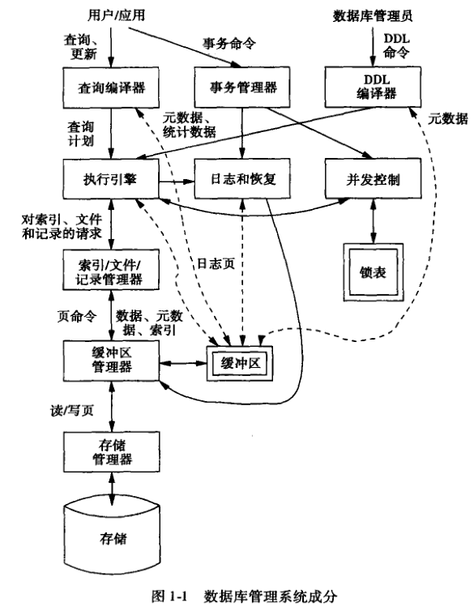
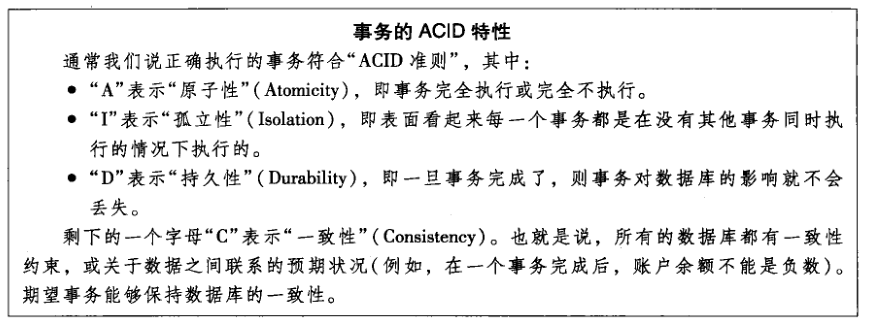
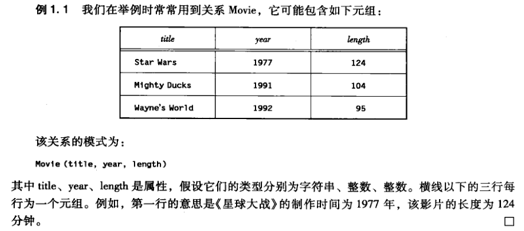

# DBMS 系统概述

DML（数据操纵语言）语句被两个分离的子系统处理：
1. 查询响应，由查询编译器对查询进行分析和优化。
2. 事务处理，事务是组成一组的若干个查询和其他运作，是必须作为一个原子被孤立地执行的单位。

事务处理器分成两个主要部分：
1. 并发控制管理器或调度器，它负责事务的原子性和孤立性。
2. 日志和恢复管理器，它负责事务的持久性。

DBMS（数据库管理系统） 成分所需要的信息的类型：
1. 数据：数据库自身的内容。
2. 元数据：描述数据库的结构及其约束的数据库模式。
3. 日志记录：关于最近对数据库所做改变的信息，这些信息支持数据库的持久性。
4. 统计信息：DBMS 收集和存储的关于数据库中的各个关系或其他成分的大小、取值等信息。
5. 索引：支持对数据进行高效存取的数据结构。

## 数据库模型和语言回顾

关系是元组的集合，而元组是值的列表。

数据库模式是关系模式的集合。