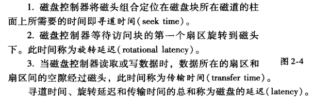
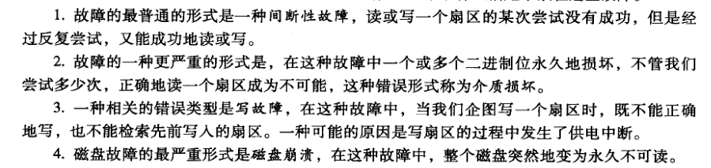
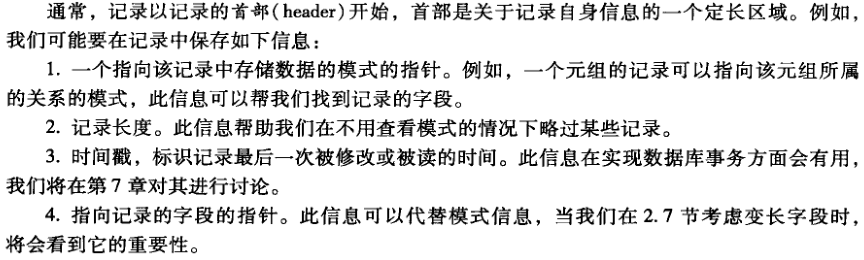
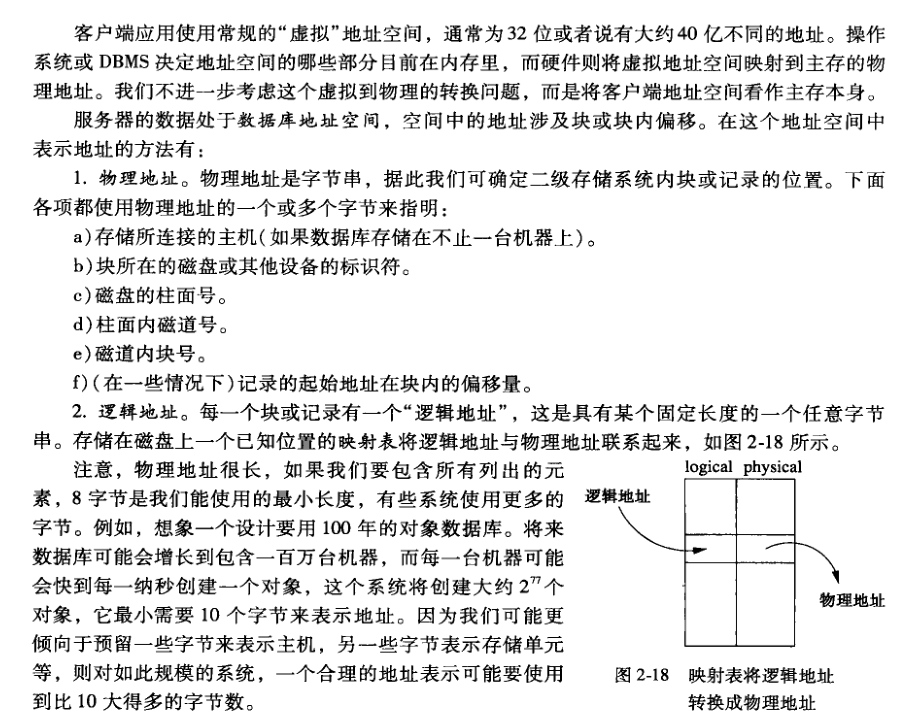
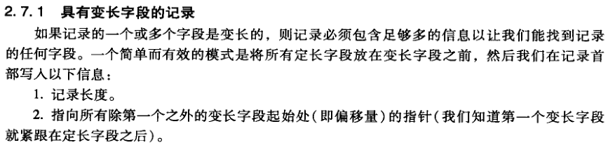
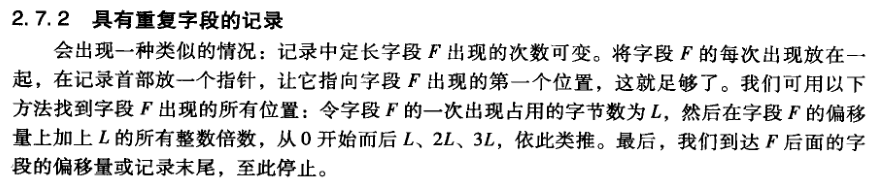

# 辅助存储管理
读写一个磁盘块需要 3 步：

## 加速对辅助存储器的访问
加速数据库访问磁盘的技术：
1. 将一起要访问的块放在同一柱面上，可以避免寻道时间和旋转延迟。
2. 将数据分隔存储在几个相对较小的磁盘上，而不是放在一个大磁盘上。让更多的磁盘组设备分别去访问磁盘块可增加在单位时间内的磁盘块访问量。
3. 镜像磁盘——将两个或更多的数据副本放在不同的磁盘上。这样就可以一次访问多个磁盘块。
4. 在操作系统、DBMS 或磁盘控制器中，使用磁盘调度算法选择读写所请求的块的顺序（例如电梯调度算法）。
5. 将要访问的磁盘块预先存储在内存中。

## 磁盘故障

## 组织磁盘上的数据
用一个记录表示一个数据元素（例如元组或对象），在磁盘块中的连续字节存放。
### 定长记录
最简单的记录是定长记录，元组的每个属性对应一个字段。

## 块和记录地址的表示

每一个块、记录、对象或其他可引用的数据项都有两种地址形式：它在服务器的数据库地址空间中的**数据库地址**和**内存地址**。
如果该数据项被拷贝到虚拟内存中，则使用内存地址；当数据项在二级存储器中，则使用数据库地址。但是，如果数据项在内存中，通过两种地址都能找该数据项。

### 变长数据和记录

* 可变格式的记录
* 不能装入一个块中的记录
* BLOG，存储二进制大对象
* 列存储

## 记录的修改
* 插入
* 删除
* 修改