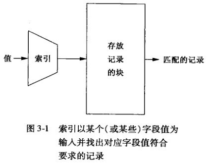
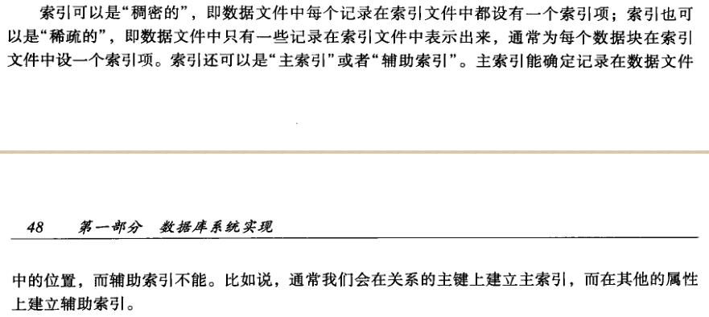
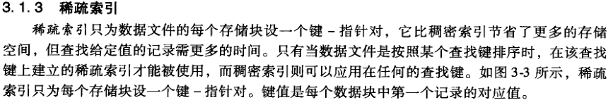
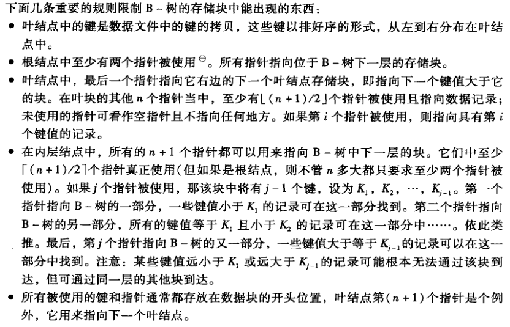
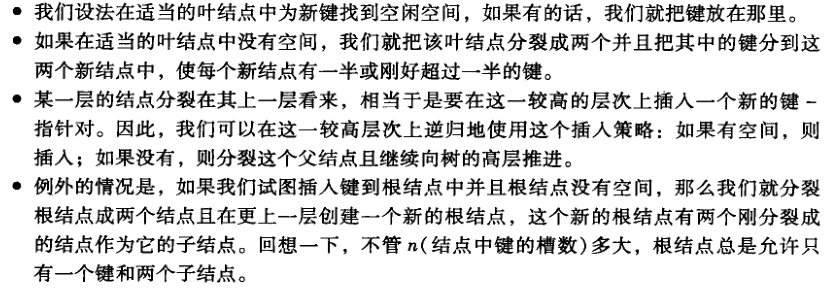
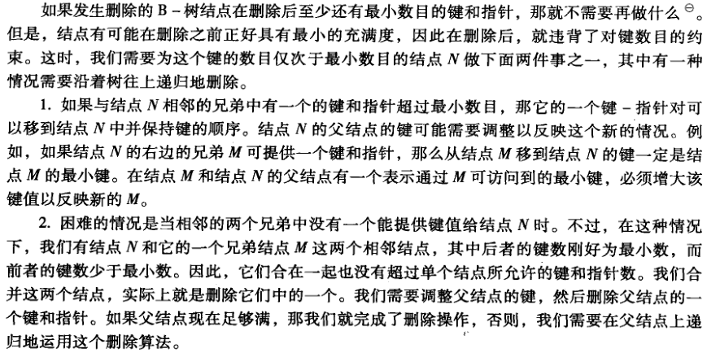
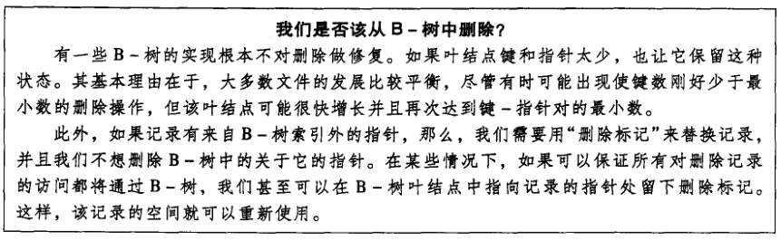
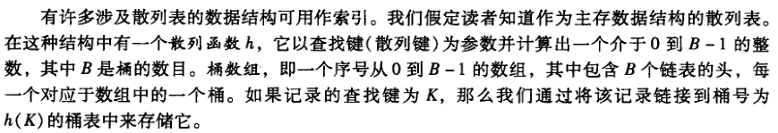
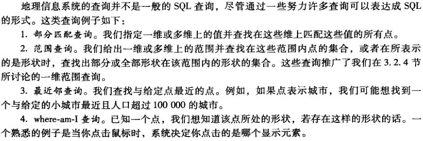

# 索引结构
索引是这样的一种数据结构：它以一个或多个字段的值为输入，并能快速地找出具有该值的记录。

## 索引结构基础

### 顺序文件
顺序文件是对关系中的元组按主键进行排序而生成的文件。关系中的元组按照这个次序分布在多个数据块。

## B- 树
B- 树把它的存储结构组织成一棵树。这棵树是平衡的，即从树根到树叶的所有路径都一样长。

### B- 树的一些应用

### B- 树的查找
支持单个查找和范围查找

### B- 树的插入

### B- 树的删除

### B- 树的效率
B- 树到底有多少层？对于典型的键、指针和块大小来说，三层就足够了，除非数据库极大。因此，我们一般取 3 作为 B- 树的层数。

## 散列表

## 多维索引
多维索引的一个重要应用就是对地理数据的处理。

## 多维数据的散列结构
1. 在涉及多维数据的查询中，通常比单维索引性能要好的最简单的数据结构之一是网络文件。
2. 分段散列

## 多维数据的树结构
1. 多键索引
2. kd- 树
3. 四叉树
4. R- 树