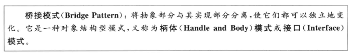
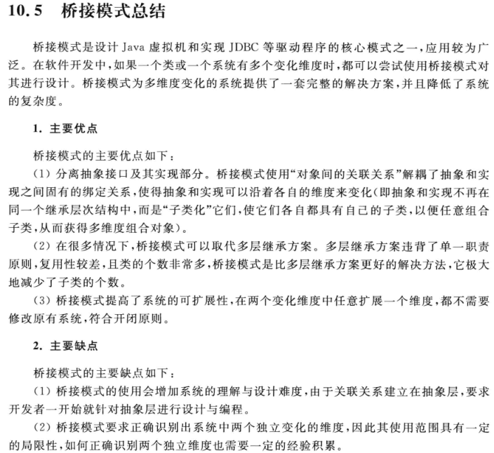
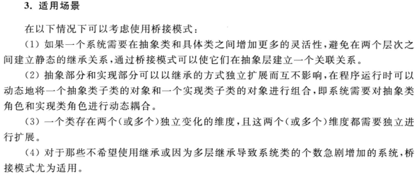

# 处理多维度变化——桥接模式

桥接模式的结构与其名称一样，存在一条连接两个继承等级结构的桥。

下面引用自 https://design-patterns.readthedocs.io/zh_CN/latest/structural_patterns/bridge.html

>设想如果要绘制矩形、圆形、椭圆、正方形，我们至少需要4个形状类，但是如果绘制的图形需要具有不同的颜色，如红色、绿色、蓝色等，此时至少有如下两种设计方案：

>第一种设计方案是为每一种形状都提供一套各种颜色的版本。
>第二种设计方案是根据实际需要对形状和颜色进行组合

>对于有两个变化维度（即两个变化的原因）的系统，采用方案二来进行设计系统中类的个数更少，且系统扩展更为方便。设计方案二即是桥接模式的应用。桥接模式将继承关系转换为关联关系，从而降低了类与类之间的耦合，减少了代码编写量。

