# 预备知识——UML 类图与面向对象设计原则
## UML 概述
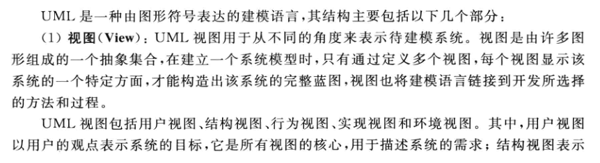

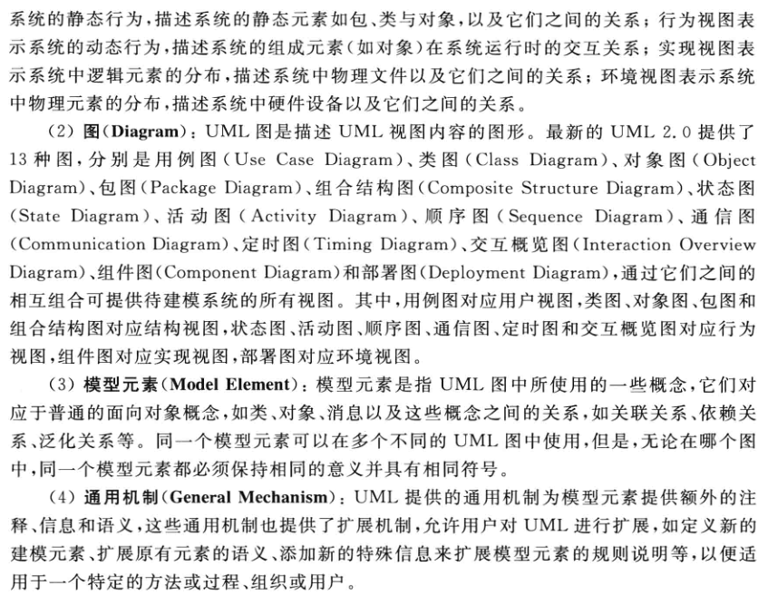

## 类与类的 UML 图示
### 类
类封装了数据和行为，是面向对象的重要组成部分，它是具有相同属性、操作、关系的对象集合的总称。一个类可以有多个职责，但设计得好的类往往只有一个职责。

类图用来描述系统的静态结构，描述不同的类以及它们之间的关系。

### 类的 UML 图示
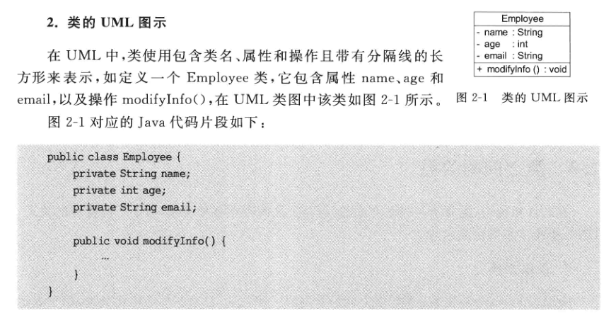

## 类之间的关系
### 关联关系
关联关系是类与类之间的一种结构化关系，用于表示一类对象与另一类对象之间有联系。在 UML 类图中，用实线连接有关联关系的对象所对应的类。

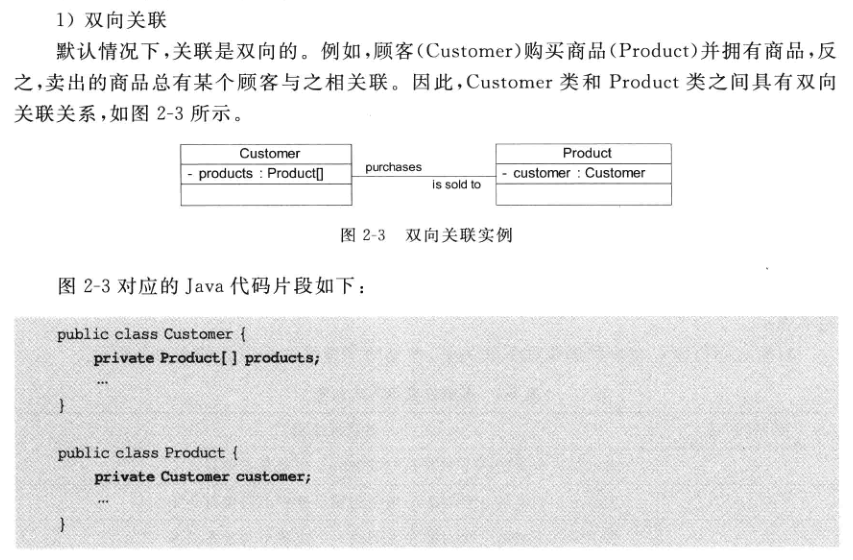

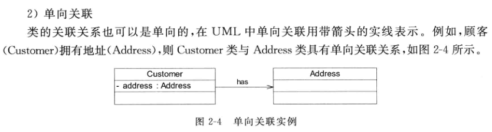

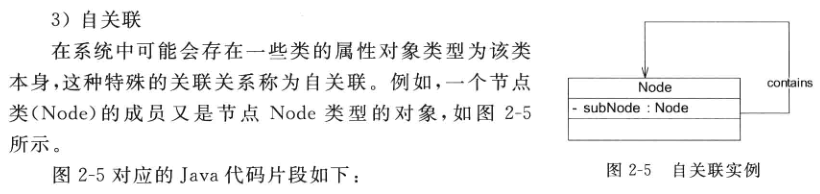

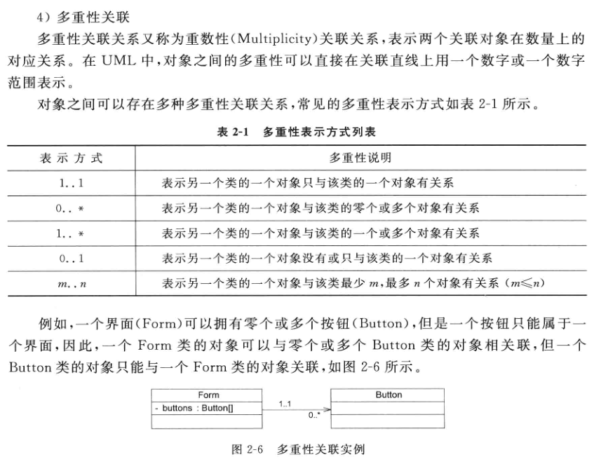

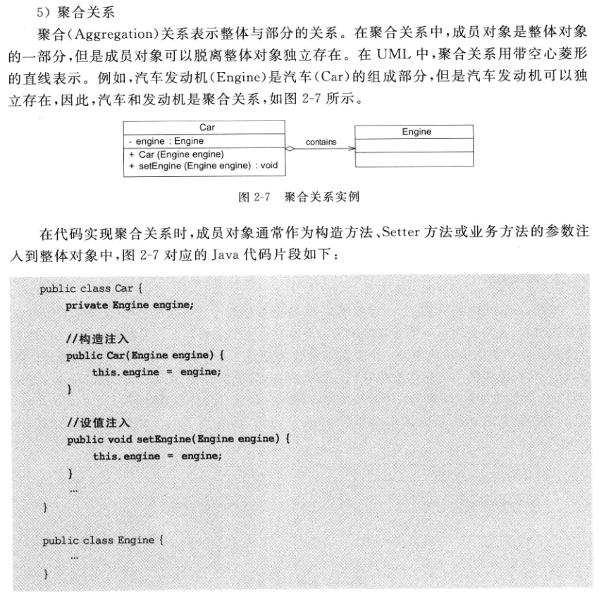

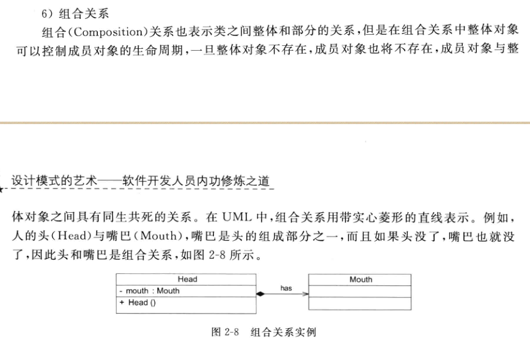

### 依赖关系
依赖关系是一种使用关系，表示一个事物使用另一个事物。在 UML 中，依赖关系使用带箭头的虚线表示，从依赖的一方指向被依赖的一方。

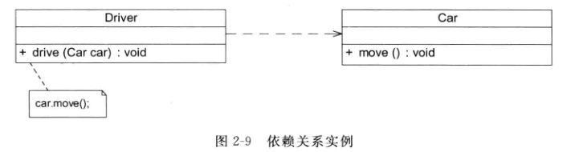

### 泛化关系
泛化关系也就是继承关系，用于描述父类与子类之间的关系。在 UML 中，使用空心三角形的直线来表示泛化关系。

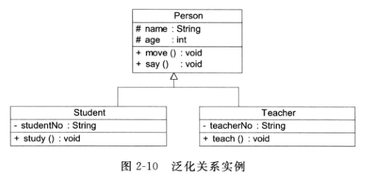

### 接口与实现关系
在 UML 中，类与接口之间的实现关系用带空心三角形的虚线表示。

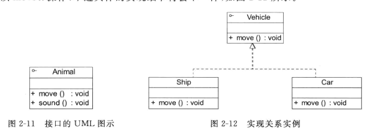

## 面向对象设计原则概述
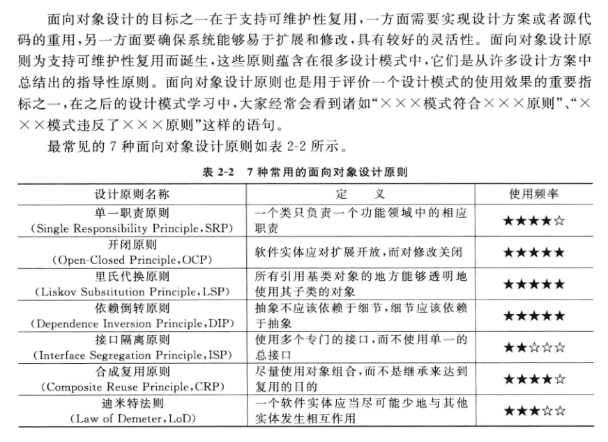

## 单一职责原则
一个类只负责一个功能领域中的相应职责，一个类不能做太多的事情。

## 开闭原则
一个软件实体应当对扩展开放，对修改关闭。即软件实体应尽量在不修改源码的情况下进行扩展。

## 里氏代换原则
所有引用基类（父类）的地方必须能透明地使用其子类的对象。

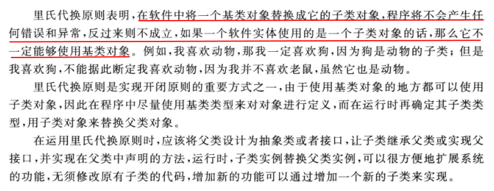

## 依赖倒换原则
抽象不应该依赖于细节，细节应当依赖于抽象。换言之，要针对接口编程，而不是针对实现编程。

1. 高层次的模块不应该依赖于低层次的模块，两者都应该依赖于抽象接口。
2. 抽象接口不应该依赖于具体实现。而具体实现则应该依赖于抽象接口。

在传统的应用架构中，低层次的组件设计用于被高层次的组件使用，这一点提供了逐步的构建一个复杂系统的可能。在这种结构下，高层次的组件直接依赖于低层次的组件去实现一些任务。这种对于低层次组件的依赖限制了高层次组件被重用的可行性。

依赖反转原则的目的是把高层次组件从对低层次组件的依赖中解耦出来，这样使得重用不同层级的组件实现变得可能。把高层组件和低层组件划分到不同的包/库（在这些包/库中拥有定义了高层组件所必须的行为和服务的接口，并且存在高层组件的包）中的方式促进了这种解耦。由于低层组件是对高层组件接口的具体实现，因此低层组件包的编译是依赖于高层组件的，这颠倒了传统的依赖关系。众多的设计模式，比如插件，服务定位器或者依赖反转，则被用来在运行时把指定的低层组件实现提供给高层组件。

应用依赖反转原则同样被认为是应用了适配器模式，例如：高层的类定义了它自己的适配器接口（高层类所依赖的抽象接口）。被适配的对象同样依赖于适配器接口的抽象（这是当然的，因为它实现了这个接口），同时它的实现则可以使用它自身所在低层模块的代码。通过这种方式，高层组件则不依赖于低层组件，因为它（高层组件）仅间接的通过调用适配器接口多态方法使用了低层组件，而这些多态方法则是由被适配对象以及它的低层模块所实现的。

## 接口隔离原则
使用多个专门的接口，而不使用单一的总接口，即客户端不应该依赖那些它不需要的接口。在使用接口隔离原则时，需要注意控制接口的粒度，接口不能太小，如果太小会导致接口泛滥，不利于维护；接口也不能太大，太大的接口将违背接口隔离原则，灵活性较差，使用起来不方便。

## 合成复用原则
尽量使用对象组合，而不是继承来达到复用目的。合成复用原则就是在一个对象里通过关联关系（包含组合和聚合）来使用一些已有的对象。总而言之：复用时多用组合/聚合关系（关联关系），少用继承。

## 迪米特法则
一个软件实体应当尽可能少地与其他实体发生相互作用。

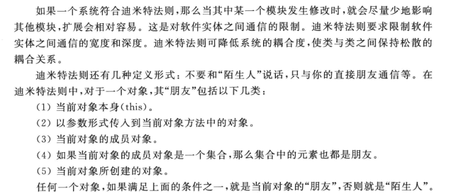
