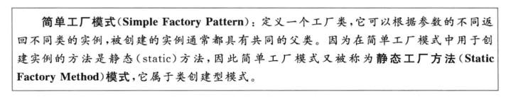
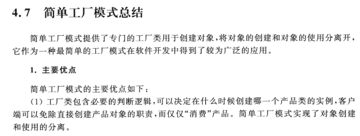
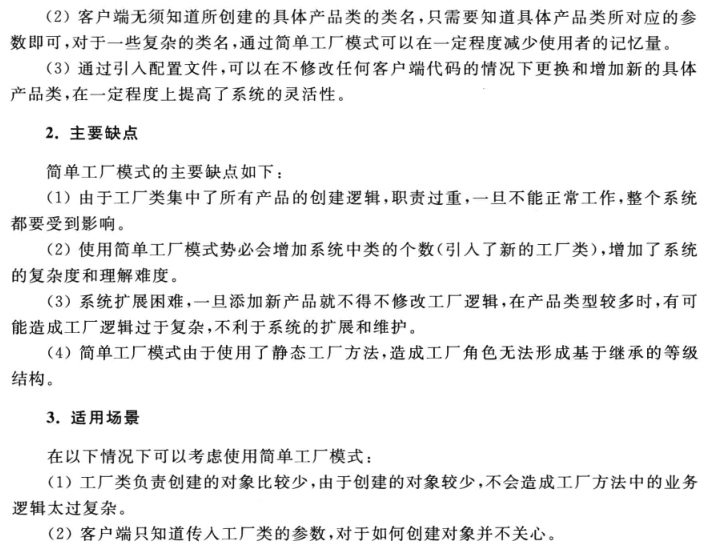

# 集中式工厂的实现——简单工厂模式







```js
// 未使用工厂模式
const apple = new Apple()
const orange = new Orange()
const banana = new Banana()

// 使用工厂模式
function createFruit(fruit) {
    switch (fruit) {
        case 'apple':
            return new Apple()
        case 'orange':
            return new Orange()
        case 'banana':
            return new Banana()
    }

    return null
}

const apple = createFruit('apple')
const orange = createFruit('orange')
const banana = createFruit('banana')
```