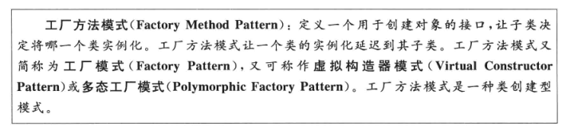
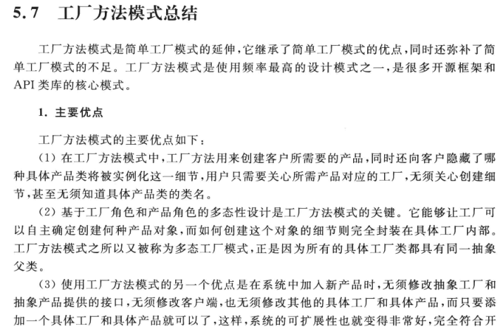
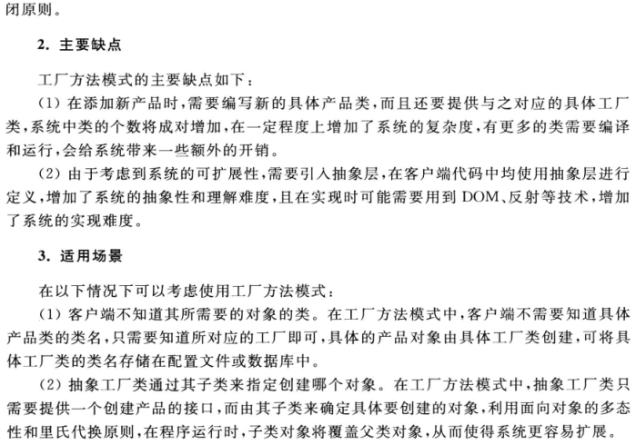

# 多态工厂的实现——工厂方法模式






```js
// 使用简单工厂模式
function createFruit(fruit) {
    switch (fruit) {
        case 'apple':
            return new Apple()
        case 'orange':
            return new Orange()
        case 'banana':
            return new Banana()
    }

    return null
}

const apple = createFruit('apple')
const orange = createFruit('orange')
const banana = createFruit('banana')

// 使用工厂模式
// 具体实例由具体的工厂函数创建
const apple = createApple()
const orange = createOranget()
const banana = createBanana()
```