# [自己动手写 CPU](https://book.douban.com/subject/25960657/)——学习笔记
## 一、流水线相关
### 1. 数据相关
指的是在流水线中执行的几条指令中，一条指令依赖于前面指令的执行结果。

#### 三种相关
1. 先写后读相关
2. 先读后写相关
3. 写后写相关

#### 解决方法
1. 插入暂停周期：当检测到相关时，在流水线中插入一些暂停周期。
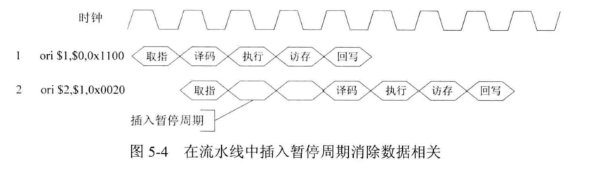

2. 编译器调度：编译器检测到相关后，可以改变部分指令的执行顺序。
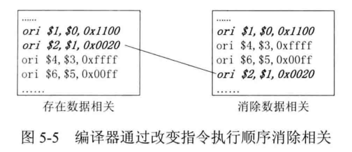

3. 数据前推：将计算结果从其产生处直接送到其他指令需要处或所有需要的功能单元处，避免流水线暂停执行。将执行、访存的结果前推到译码阶段。
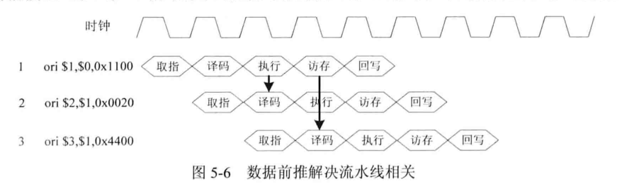

### 2. 结构相关
当指令在执行的过程中，硬件资源满足不了指令执行的要求，发生硬件资源冲突而产生的相关。例如指令和数据都共享一个存储器，在某个时钟周期，流水线既要完成指令对存储器中数据的访问操作，又要完成后续的取指令操作，这样就会发生存储器访问冲突，产生结构相关。

### 3. 控制相关
当流水线遇到分支指令和其他会改变 PC值 的指令时造成的相关。这些指令导致后面已经进入流水线的几条指令失效。

#### 解决方法
1. 延迟槽：为了减少损失，规定转移指令后面的指令位置为延迟槽。延迟槽中的指令称为延迟指令，这些指令总是被执行，与转移是否发生没有关系。
2. 提前判断：在译码阶段进行转移判断。

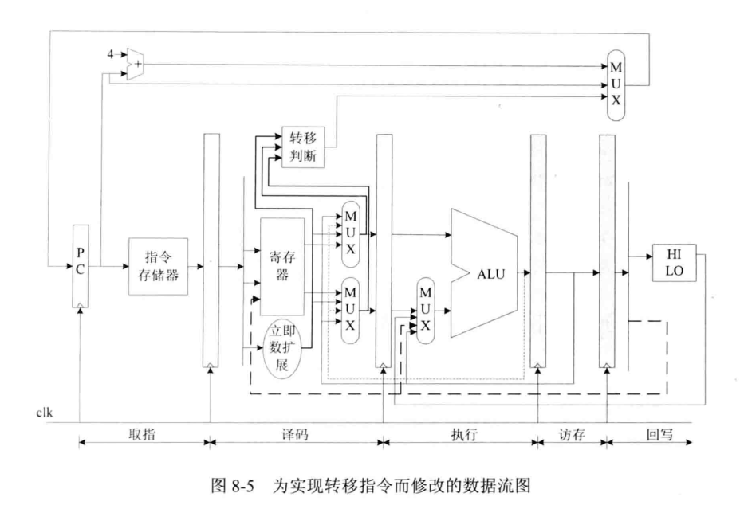

### 4. load 相关
```mipsasm
lw $1, 0x0($0) // 从 0x0 处加载数据到寄存器 $1
beq $1, $2, Label // 将寄存器 $1 和 $2 比较，相等则转移到 Label 处
```
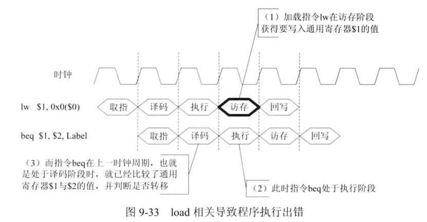

第一条指令在访存阶段才读取数据，而下一条指令已经到了执行阶段，即使采用数据前推也来不及了。因为 beq 在译码阶段就已经比较了 $1 和 $2 的值，并判断是否转移。这种情况被称为 load 相关。

#### 解决方法
在译码阶段检查当前指令与上一条指令是否存在 load 相关，如果存在 load 相关，则让流水线的取指、译码阶段暂停执行，后面的阶段继续执行。当上一条指令执行到访存阶段时，将加载的数据前推到译码阶段，然后流水线就可以继续运行。


## 二、流水线暂停机制
暂停流水线，保持取指令地址 PC 的值不变，同时保持流水线各个阶段的寄存器不变。

OpenMIPS 采用一种改进的方法：假设位于流水线第 N 阶段的指令需要多个时钟周期，进而请求流水线暂停。那么需保持 PC 的值不变，同时保持第 N 及之前的阶段的值不变，第 N 阶段后面的指令继续运行。

## 三、数据大小端存储方式
1. 大端：高位存储在低地址
2. 小端：低位存储在低地址

## 四、协处理器 CP0 功能
1. 配置 CPU 工作状态，改变内部寄存器的值从而改变 CPU 特性（例如将字节次序从大端改成小端）
2. 高速缓存控制
3. 异常控制
4. 存储管理单元控制（主要对 MMU、TLB 的一些配置、管理、访问）
5. 其他（例如时钟、时间计数器、奇偶校验错误检测等）

TLB：转译后备缓冲器，也被翻译为页表缓存、转址旁路缓存，为 CPU 的一种缓存，由存储器管理单元用于改进虚拟地址到物理地址的转译速度。

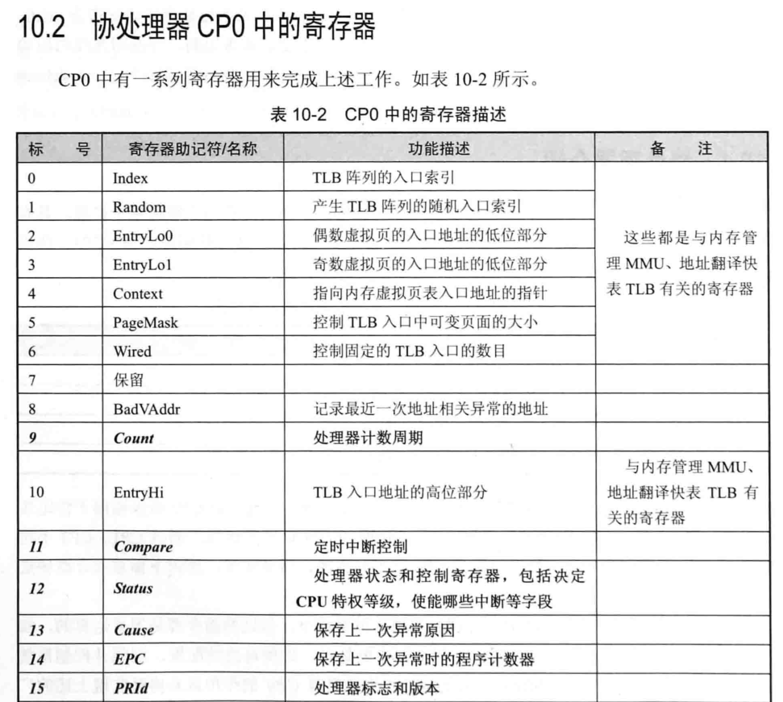

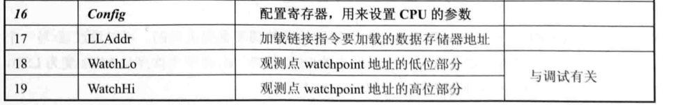

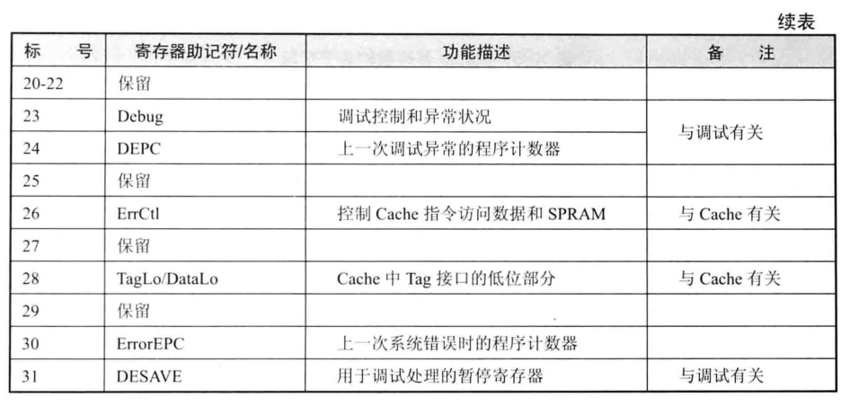

## 五、异常
### 精确异常
异常发生时，异常指令及后面的指令被取消，就像从没有执行一样；而在异常指令前面的指令继续执行。
按指令执行的顺序处理异常，而不是按异常发生的顺序处理异常。例如下图，先处理地址未对齐异常。

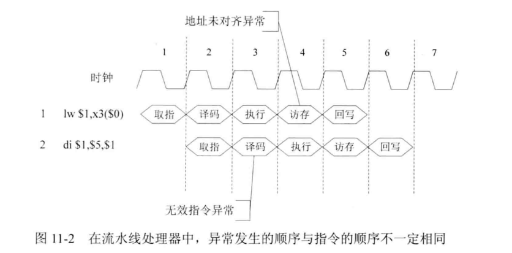

### 异常处理过程
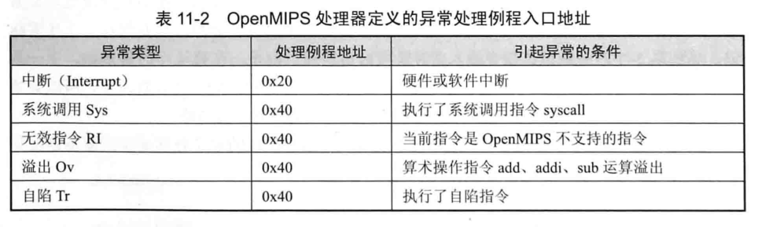

在异常处理结束后，需要返回到异常发生前的状态继续执行，这个操作通过异常返回指令 eret 来完成。

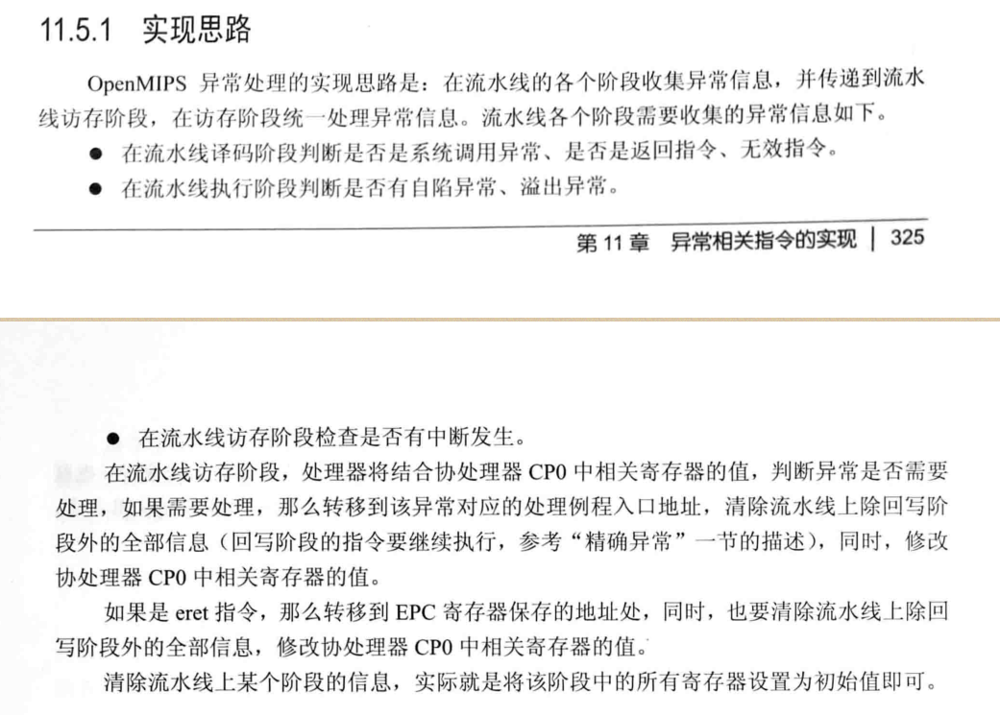