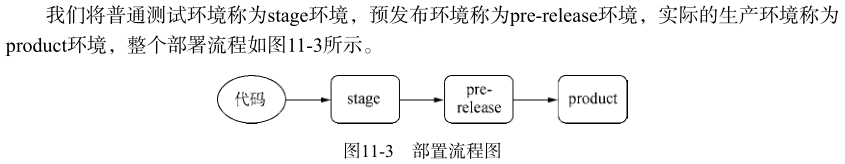
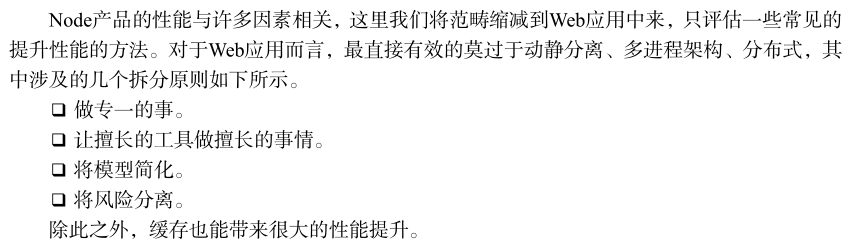
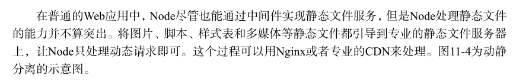
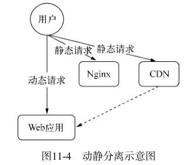
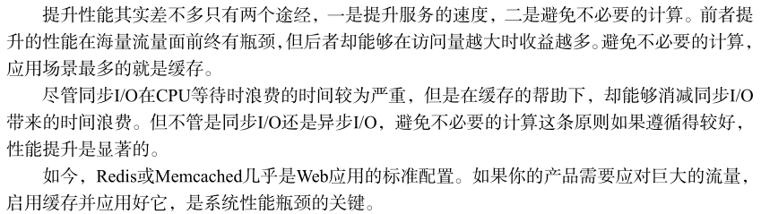
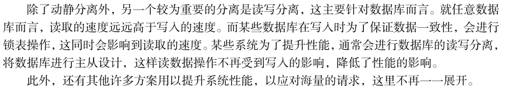

# 产品化
## 项目工程化
在项目工程化过程中，最基本的几步是目录结构、构建工具、编码规范和代码审查等。
### 目录结构
目前，主要的两类项目为 Web 应用和模块应用。
### 构建工具
通过构建工具可以将合并静态文件、压缩文件大小、打包应用、编译模块等操作通过命令行来自动完成。
### 编码规范
代码是否具备良好的可维护性是最能体现团队素质的地方。
### 代码审查
需要审查的功能点有功能是否正确完成、编码风格是否符合规范、单元测试是否有同步添加等。

## 部署流程
代码在完成开发、审查、合并后，才会进入部署流程。

## 性能

### 动静分离

### 启用缓存

### 多进程架构

### 读写分离

## 日志
在健全的系统中，完善的日志记录最能够还原问题现场。建议异常尽量由最上层的调用者捕获记录，底层调用或中间层调用出现异常时只要正常传递给上层的调用方即可。

## 监控
应用的监控主要有两类，一种是业务逻辑型的监控，一种是硬件型的监控。监控主要通过定时采样来进行记录。监控可对这几方面进行监控：
1. 日志监控
2. 响应时间
3. 进程监控
4. 磁盘监控
5. 内存监控
6. CPU 监控
7. CPU load 监控
8. I/O 负载
9. 网络监控
10. 应用状态监控
11. DNS 监控

### 报警的实现
一般有邮件报警、IM 报警适合在线工作状态、短信或电话报警适合非在线状态。