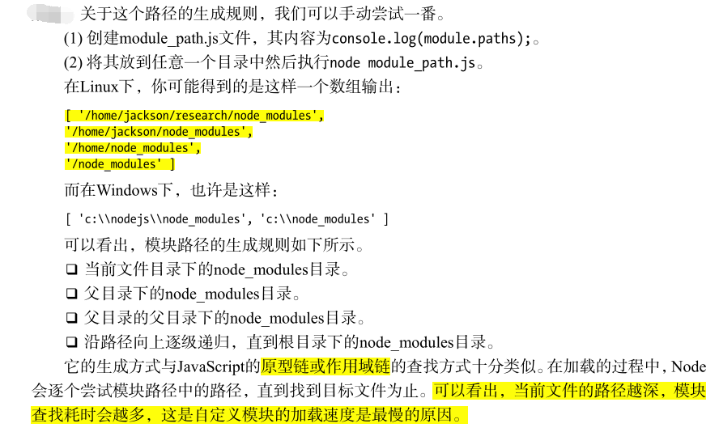

# 模块机制
## CommonJS 规范
CommonJS 主要分为模块引用、模块定义、模块标识 3 个部分。

### 模块引用
```
var math = require('math');
```

### 模块定义
exports 对象用于导出当前模块的方法或者变量，并且它是唯一的出口。module 对象代表模块自身，exports 是 module 的属性。
在 Node 中，一个文件就是一个模块。
```js
// math.js
exports.add = function () {
    var sum = 0,
    i = 0,
    args = arguments,
    l = args.length;
    while (i < l) {
        sum += args[i++];
    }
    return sum;
};
```
```js
// program.js
var math = require('math');
exports.increment = function (val) {
    return math.add(val, 1);
};
```

### 模块标识
模块标识其实就是传递给 require() 方法的参数，它必须是符合小驼峰命名的字符串，或者以 . 和 .. 开头的相对路径，或者绝对路径。它可以没有文件名后缀.js。
每个模块都有独立的空间，互不干扰。

## Node 的模块实现
Node 在实现中并非完全按照规范来的，而是对模块规范进行了一定的取舍，同时也增加了少许自身需要的特性。

在模块中引入模块，需要经历 3 个步骤：
1. 路径分析
2. 文件定位
3. 编译执行

在 Node 中的模块分为两类：一类是 Node 提供的模块，称为核心模块；另一类是用户编写的模块，称为文件模块。
* 核心模块是二进制文件，在 Node 进程启动时，部分核心模块被直接加载到内存中。所以在引入核心模块时，文件定位和编译执行这两个步骤都可以省略掉，它的加载速度是最快的。
* 文件模块是在运行时动态加载的，需要经历三个完整的步骤。

### 优先从缓存加载
Node 对引入过的模块都会进行缓存，以减少二次引入时的开销。和浏览器不同的是，浏览器仅缓存文件，而 Node 缓存的是编译和执行后的对象。

不论是核心模块还是文件模块，require() 方法对相同模块的二次加载都一律采用缓存优先的方式，这是第一优先级的。不同之处在于核心模块的缓存检查先于文件模块的缓存检查。

### 路径分析和文件定位
对于不同的模块标识符，模块的查找和定位有不同程度上的差异。

#### 1. 模块标识符分析
模块标识符分为以下几类：
1. 核心模块，例如 http、fs、path 等。
2. .或..开始的相对路径文件模块。
3. 以/开始的绝对路径文件模块。
4. 非路径形式的文件模块，如自定义的 connect 模块。

##### 核心模块
核心模块的优先级仅次于缓存加载，如果试图加载一个与核心模块标识符相同的自定义模块，那是不会成功的。必须选择一个不同的标识符或者换用路径的方式。

##### 文件模块
以.、..或/开始的标识符，都会被当做文件模块处理。在分析路径模块时，require() 方法会将路径转为真实路径，并以真实路径作为索引，将编译执行后的结果放到缓存中。

##### 自定义模块
它是一种特殊的文件模块，可能是一个文件或者包的形式。这类模块的查找是最耗时的，最慢的。

模块路径是 Node 在定位文件模块的具体文件时制定的查找策略，具体表现为一个路径组成的数组。


#### 2. 文件定位
从缓存加载的优化策略使得二次引入时不需要路径分析、文件定位和编译执行的过程，大大提高了再次加载模块时的效率。

文件的定位过程包括：文件扩展名的分析、目录和包的处理。


### 模块编译