# 模块机制
## CommonJS 规范
CommonJS 主要分为模块引用、模块定义、模块标识 3 个部分。

### 模块引用
```
var math = require('math');
```

### 模块定义
exports 对象用于导出当前模块的方法或者变量，并且它是唯一的出口。module 对象代表模块自身，exports 是 module 的属性。
在 Node 中，一个文件就是一个模块。
```js
// math.js
exports.add = function () {
    var sum = 0,
    i = 0,
    args = arguments,
    l = args.length;
    while (i < l) {
        sum += args[i++];
    }
    return sum;
};
```
```js
// program.js
var math = require('math');
exports.increment = function (val) {
    return math.add(val, 1);
};
```

### 模块标识
模块标识其实就是传递给 require() 方法的参数，它必须是符合小驼峰命名的字符串，或者以 . 和 .. 开头的相对路径，或者绝对路径。它可以没有文件名后缀.js。
每个模块都有独立的空间，互不干扰。

## Node 的模块实现
Node 在实现中并非完全按照规范来的，而是对模块规范进行了一定的取舍，同时也增加了少许自身需要的特性。

在模块中引入模块，需要经历 3 个步骤：
1. 路径分析
2. 文件定位
3. 编译执行

在 Node 中的模块分为两类：一类是 Node 提供的模块，称为核心模块；另一类是用户编写的模块，称为文件模块。
* 核心模块被编译进了二进制文件，在 Node 进程启动时，部分核心模块被直接加载到内存中。所以在引入核心模块时，文件定位和编译执行这两个步骤都可以省略掉，它的加载速度是最快的。
* 文件模块是在运行时动态加载的，需要经历三个完整的步骤。

### 优先从缓存加载
Node 对引入过的模块都会进行缓存，以减少二次引入时的开销。和浏览器不同的是，浏览器仅缓存文件，而 Node 缓存的是编译和执行后的对象。

不论是核心模块还是文件模块，require() 方法对相同模块的二次加载都一律采用缓存优先的方式，这是第一优先级的。不同之处在于核心模块的缓存检查先于文件模块的缓存检查。

### 路径分析和文件定位
对于不同的模块标识符，模块的查找和定位有不同程度上的差异。

#### 1. 模块标识符分析
模块标识符分为以下几类：
1. 核心模块，例如 http、fs、path 等。
2. .或..开始的相对路径文件模块。
3. 以/开始的绝对路径文件模块。
4. 非路径形式的文件模块，如自定义的 connect 模块。

##### 核心模块
核心模块的优先级仅次于缓存加载，如果试图加载一个与核心模块标识符相同的自定义模块，那是不会成功的。必须选择一个不同的标识符或者换用路径的方式。

##### 文件模块
以.、..或/开始的标识符，都会被当做文件模块处理。在分析路径模块时，require() 方法会将路径转为真实路径，并以真实路径作为索引，将编译执行后的结果放到缓存中。

##### 自定义模块
它是一种特殊的文件模块，可能是一个文件或者包的形式。这类模块的查找是最耗时的，最慢的。

模块路径是 Node 在定位文件模块的具体文件时制定的查找策略，具体表现为一个路径组成的数组。


#### 2. 文件定位
从缓存加载的优化策略使得二次引入时不需要路径分析、文件定位和编译执行的过程，大大提高了再次加载模块时的效率。

文件的定位过程包括：文件扩展名的分析、目录和包的处理。

##### 文件扩展名分析
如果文件不包含扩展名，会按照 .js、.json、.node 的顺序补足扩展名。在尝试的过程中，需要调用 fs 模块同步阻塞式地判断文件是否存在。
由于 node 是单线程的，所以这里会造成性能问题。建议如果是 json 和 node 文件，就带上扩展名。

##### 目录分析和包
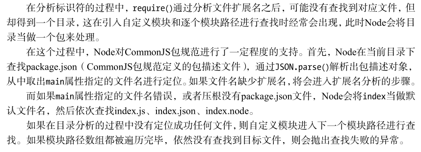

### 模块编译
在 node 中，每个文件都是一个模块，定义如下：
```js
function Module(id, parent) {
    this.id = id;
    this.exports = {};
    this.parent = parent;
    if (parent && parent.children) {
        parent.children.push(this);
    }
    this.filename = null;
    this.loaded = false;
    this.children = [];
}
```
定位到具体的文件后，node 会新建一个模块对象，然后根据路径载入并编译。不同的文件其载入方法也不同：
1. .js 文件，通过 fs 模块同步读取文件后编译执行。
2. .node 文件，这是用 C/C++ 编写的扩展文件，通过 dlopen() 方法加载最后编译生成的文件。
3. json 文件，通过 fs 模块同步读取文件后，用 JSON.parse() 解析返回结果。
4. 其余的扩展名文件都被当成 .js 文件载入。

每一个编译成功的模块都会将其文件路径作为索引缓存在 Module._cache 对象上。不同的文件扩展名，也有不同的读取方式。如 .json 文件的调用如下:
```js
// Native extension for .json
Module._extensions['.json'] = function(module, filename) {
    var content = NativeModule.require('fs').readFileSync(filename, 'utf8');
    try {
        module.exports = JSON.parse(stripBOM(content));
    } catch (err) {
        err.message = filename + ': ' + err.message;
        throw err;
    }
};
```
其中，Module._extensions 会被赋值给 require() 的 extensions 属性。

如果想对自定义的扩展名进行特殊的加载，可以通过类似 require.extensions['.ext'] 的方式实现。

在确定文件的扩展名后，node 将调用具体的编译方式来将文件执行后返回给调用者。

#### JavaSciprt 模块的编译
在编译过程中，node 对 js 的文件内容进行了头尾包装。在头部添加了 `(function (exports, require, module, __filename, __dirname) {\n`，在尾部添加了 `\n});`。示例如下：
```js
(function (exports, require, module, __filename, __dirname) {
    var math = require('math');
    exports.area = function (radius) {
        return Math.PI * radius * radius;
    };
});
```
这样每个模块文件之间都进行了作用域隔离。包装后的代码会通过 vm 原生模块的 runInThisContext() 方法执行（类似 eval，但有明确的上下文，不会污染全局），返回一个具体的 function 对象。最后，将当前模块对象的 exports 属性、require() 方法、module（模块对象自身），以及完整的文件路径和文件目录作为参数传递给这个 function() 执行。

在执行之后，模块的 exports 属性被返回给了调用方。exports 上的属性和方法都可以被外部调用。
不能直接对 exports 进行赋值：
```js
exports = function () {
    // My Class
};
```
由于 exports 是通过形参的方式传入的，直接赋值会改变形参的引用，但并不能改变作用域外的值。测试代码如下：
```js
var change = function (a) {
    a = 100;
    console.log(a); // => 100
};
var a = 10;
change(a);
console.log(a); // => 10
```
所以可以这样使用：
```js
module.exports = function () {
    // My Class
};
```
或者
```js
exports.add = function () {
    // add
};
```

#### C/C++ 模块的编译
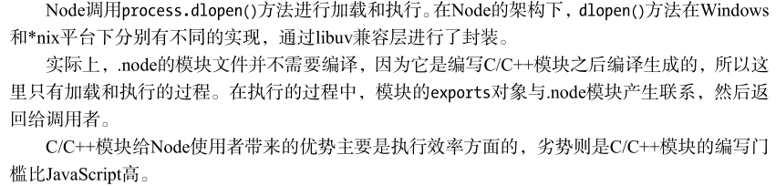

#### JSON 文件的编译
.json 文件的编译是 3 种编译方式中最简单的。node 用 fs 模块同步读取 JSON 文件的内容，然后调用 JOSN.parse() 方法得到对象，然后将它赋值给模块对象的 exports，供外部调用。

## 核心模块
node 的核心模块在编译成可执行文件的过程中被编译进了二进制文件。
node 的核心模块分为 C/C++ 编写的和 JavaScript 编写的两部分。其中 C/C++ 文件存放在 node 项目的 src 目录下，JavaScript 文件存放在 lib 目录下。

### JavaScript 核心模块的编译过程
在编译所有的 C/C++ 文件之前，需要将所有的 JS 模块文件编译为 C/C++ 代码。
#### 1. 转存为 C/C++ 代码
node 将所有内置的 JS 代码（src/node.js 和 lib/*.js）转换成 C++ 的数组，生成 node_natives.h 头文件，相关代码如下：
```py
namespace node {
    const char node_native[] = { 47, 47, ..};
    const char dgram_native[] = { 47, 47, ..};
    const char console_native[] = { 47, 47, ..};
    const char buffer_native[] = { 47, 47, ..};
    const char querystring_native[] = { 47, 47, ..};
    const char punycode_native[] = { 47, 42, ..};
    ...
    struct _native {
        const char* name;
        const char* source;
        size_t source_len;
    };
    static const struct _native natives[] = {
        { "node", node_native, sizeof(node_native)-1 },
        { "dgram", dgram_native, sizeof(dgram_native)-1 },
        ...
    };
}
```
在这个过程中，JS 代码以字符串的形式存储在 node 命名空间中，是不可直接执行的。在启动 node 进程时，再将 JS 代码加载进内存中。
JS 核心模块经过标识符分析后直接定位到内存中，比普通的文件模块要从磁盘中查找要快得多。

#### 2. 编译 JavaScript 核心模块
lib 目录下的模块处理过程和文件模块差不多，区别在于：获取源代码的方式（核心模块是从内存中加载的）以及缓存执行结果的位置。
JS 核心模块编译成功的模块缓存在 NativeModule._cache 对象上，文件模块则缓存在 Module._cache 对象上。

### C/C++ 核心模块的编译过程
在核心模块中，有些模块全部由 C/C++ 编写，有些模块是核心部分由 C/C++ 编写，其他部分则由 JS 实现包装或向外导出。C/C++ 编写的模块称为内建模块。

#### 1. 内建模块的组织形式
内建模块的内部结构如下：
```c++
struct node_module_struct {
    int version;
    void *dso_handle;
    const char *filename;
    void (*register_func) (v8::Handle<v8::Object> target);
    const char *modname;
};
```
NODE_MODULE 宏将所有的内建模块定义到 node 命名空间中，模块的具体初始化方法为结构的 register_func 成员：
```c++
#define NODE_MODULE(modname, regfunc) \
    extern "C" { \
    NODE_MODULE_EXPORT node::node_module_struct modname ## _module = \
    { \
        NODE_STANDARD_MODULE_STUFF, \
        regfunc, \
        NODE_STRINGIFY(modname) \
    }; \
}
```
node_extensions.h 将所有的内建模块放到  node_module_list 数组，这些模块有：
```
node_buffer
node_crypto
node_evals
node_fs
node_http_parser
node_os
node_zlib
node_timer_wrap
node_tcp_wrap
node_udp_wrap
node_pipe_wrap
node_cares_wrap
node_tty_wrap
node_process_wrap
node_fs_event_wrap
node_signal_watcher
```
Node 提供了 get_builtin_module() 方法从 node_module_list 数组中取出这些模块。

内建模块的优势在于：一旦 node 开始执行，它们被直接加载进内存中，无须再次做标识符定位、文件定位、编译等过程，直接就可执行。

#### 2. 内建模块的导出
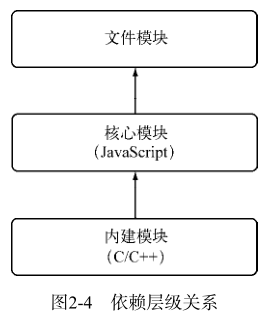

通常不推荐文件模块直接调用内建模块，而是调用核心模块。因为核心模块基本都封装了内建模块。
node 在启动时，会生成一个全局变量 process，并提供 Binding() 方法来协助加载内建模块。Binding() 方法在 src/node.cc 中：
```c++
static Handle<Value> Binding(const Arguments& args) {
    HandleScope scope;
    Local<String> module = args[0]->ToString();
    String::Utf8Value module_v(module);
    node_module_struct* modp;
    if (binding_cache.IsEmpty()) {
        binding_cache = Persistent<Object>::New(Object::New());
    }

    Local<Object> exports;
    if (binding_cache->Has(module)) {
        exports = binding_cache->Get(module)->ToObject();
        return scope.Close(exports);
    }
    
    // Append a string to process.moduleLoadList
    char buf[1024];
    snprintf(buf, 1024, "Binding s", *module_v); %
    uint32_t l = module_load_list->Length();
    module_load_list->Set(l, String::New(buf));
    if ((modp = get_builtin_module(*module_v)) != NULL) {
        exports = Object::New();
        modp->register_func(exports);
        binding_cache->Set(module, exports);
    } else if (!strcmp(*module_v, "constants")) {
        exports = Object::New();
        DefineConstants(exports);
        binding_cache->Set(module, exports);
        #ifdef __POSIX__
    } else if (!strcmp(*module_v, "io_watcher")) {
        exports = Object::New();
        IOWatcher::Initialize(exports);
        binding_cache->Set(module, exports);
        #endif
    } else if (!strcmp(*module_v, "natives")) {
        exports = Object::New();
        DefineJavaScript(exports);
        binding_cache->Set(module, exports);
    } else {
        return ThrowException(Exception::Error(String::New("No such module")));
    }
    return scope.Close(exports);
}
```
在加载内建模块时，先创建一个 exports 空对象，然后调用 get_builtin_module() 方法取出内建模块对象，通过执行 register_func() 填充 exports 对象。
最后将 exports 对象按模块名缓存，并返回给调用方完成导出。

### 核心模块的引入流程
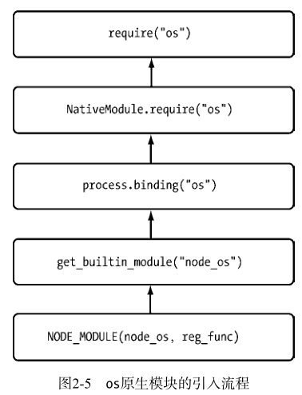

## C/C++ 扩展模块
C/C++ 扩展模块属于文件模块中的一类。为了实现跨平台，dlopen() 方法在内部实现时区分了平台，分别用的是 .so（*nix 平台） 和 .dll（windows 平台） 的方式。

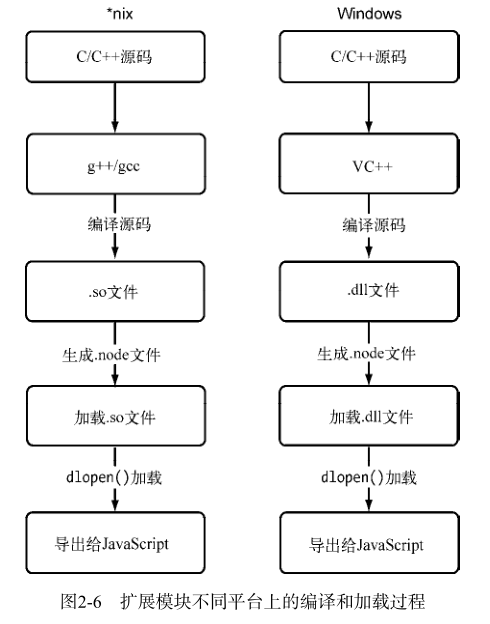

### 前提条件
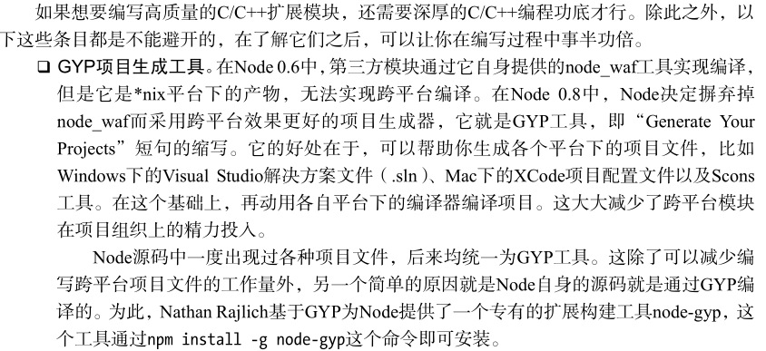

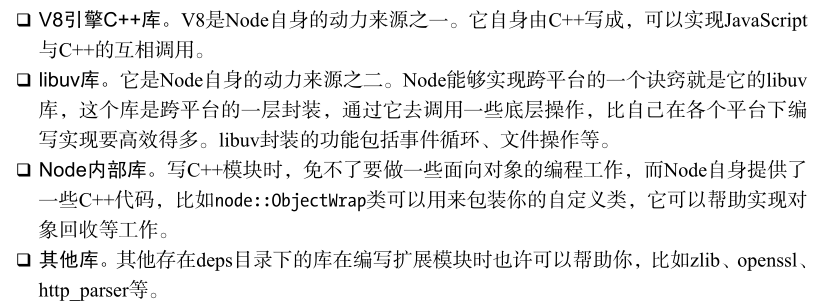

### C/C++ 扩展模块的编写
普通的扩展模块与内建模块的区别在于无须将源代码编译进 node，而是通过 dlopen() 方法动态加载。所以在编写普通的扩展模块时，无须将源代码写进 node 命名空间，也不需要提供头文件。

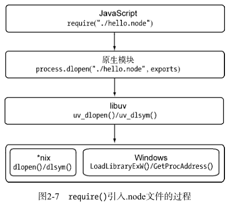

## 模块调用栈
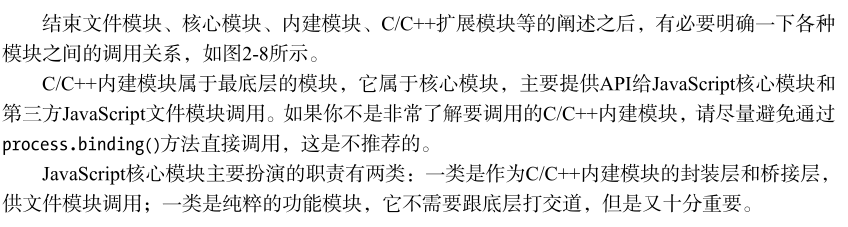

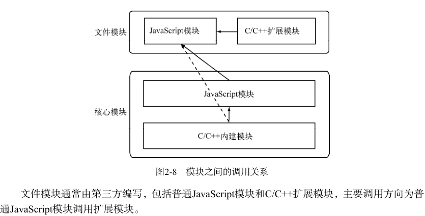

## 包与 NPM
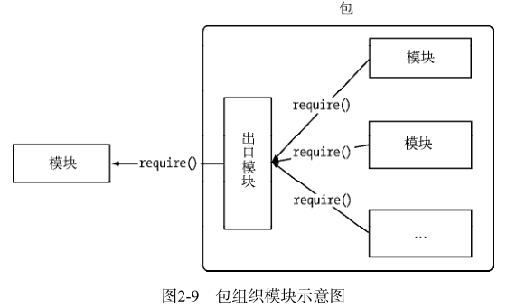

包在模块的的基础上进一步组织 JS 代码。CommonJS 的包规范定义包由包结构和包描述文件两个部分组成，前者用于组织包中的文件，后者用于描述包的相关信息，以供外部读取。

### 包结构
完全符合 CommonJS 规范的包目录应该包含如下文件：
1. package.json：包描述文件。
2. bin：存放可执行二进制文件的目录。
3. lib：存放 JS 代码的目录。
4. doc：存放文档的目录。
5. test：存放单元测试用例的目录。

### 包描述文件与 NPM
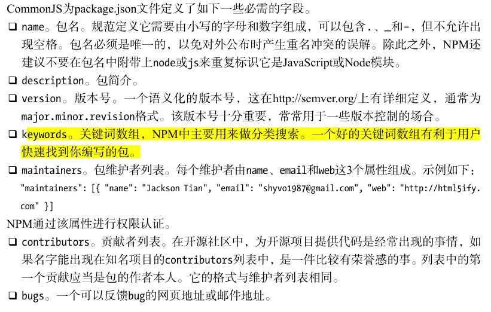

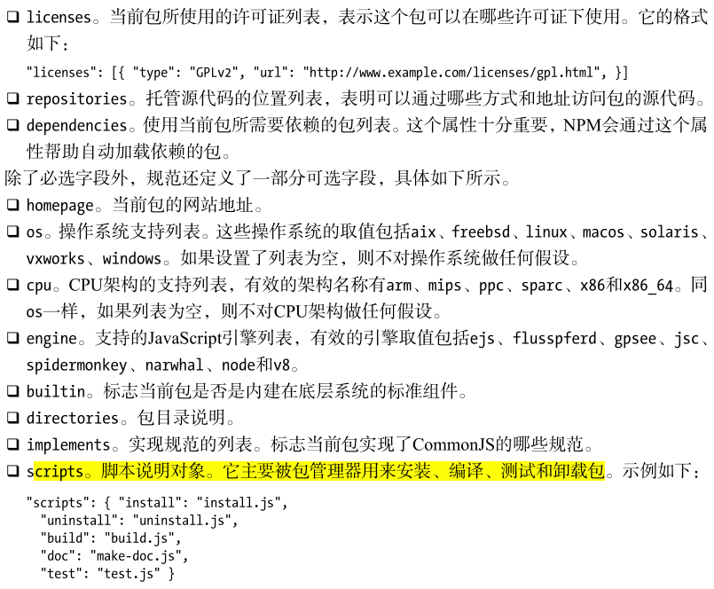

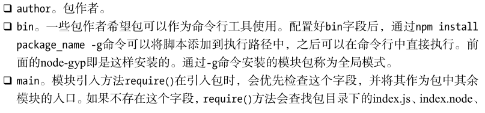

