# 异步 I/O
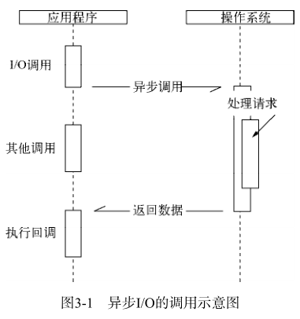

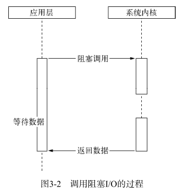

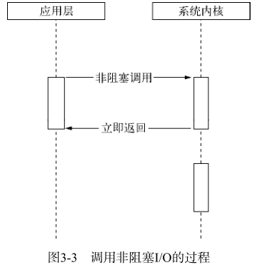

## 异步 I/O 实现现状
### 异步 I/O 与非阻塞 I/O
阻塞 I/O 造成 CPU 等待浪费，非阻塞 I/O 带来的麻烦是需要轮询去确认是否完成数据获取。
轮询技术主要有：read、select、poll、epoll、kqueue。

### 理想的非阻塞异步 I/O
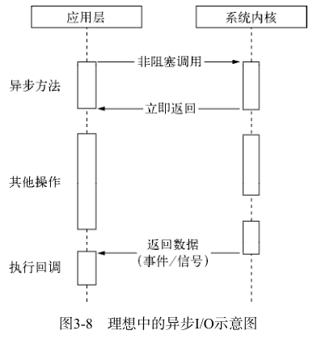

理想的异步 I/O 在应用程序发起调用后，无须等待，可直接处理下一任务。在 I/O 完成后通过信号或回调将数据传递给应用程序。

### 现实的异步 I/O
通过让部分线程进行阻塞 I/O 或者非阻塞 I/O加轮询技术来完成数据获取，让一个线程进行计算处理，通过线程之间的通信将 I/O 得到的数据进行传递，这就实现了异步 I/O（尽管它是模拟的）。

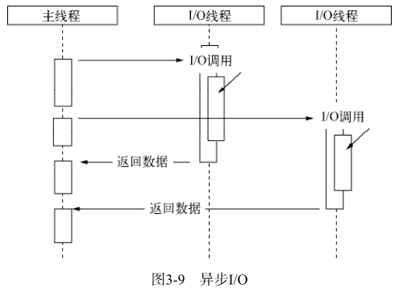

*nix 和 windows 采用了不同的方法来实现异步 I/O。

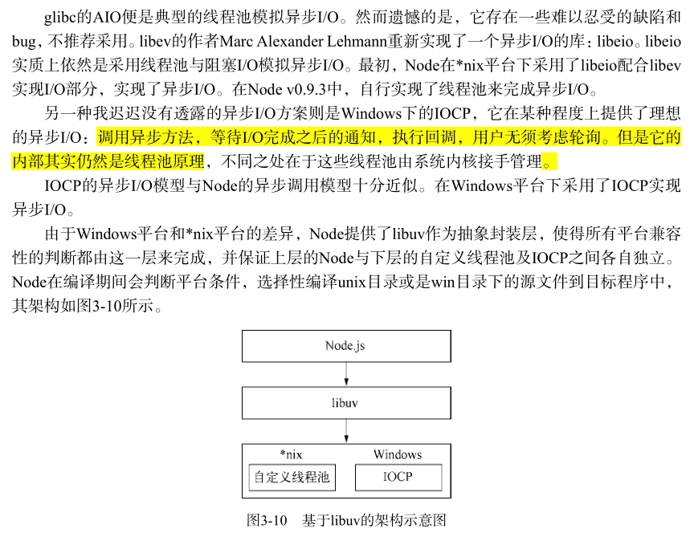

通常说 node 是单线程的，只是指 JS 执行在单线程中。内部完成 I/O 任务的另有线程池。

## Node 的异步 I/O
### 事件循环
[JavaScript 事件循环](https://github.com/woai3c/Front-end-articles/blob/master/eventloop.md)

在进程启动时，node 就会启动一个类似 while(true) 的循环，每执行一次循环体的过程称为 Tick。

在 win 下，这个循环基于 IOCP 创建，而在 *nix 下则基于多线程创建。

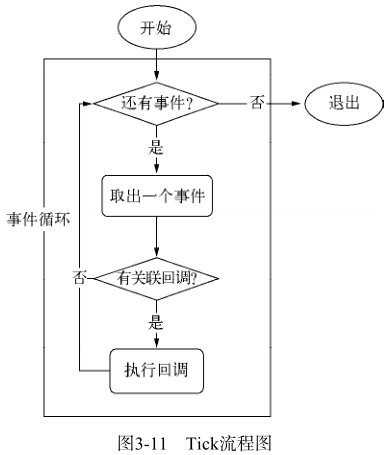

整个异步 I/O 流程如下：

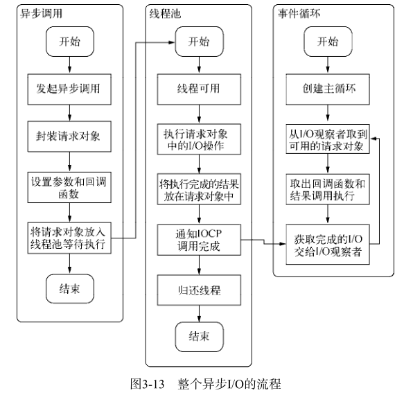

在 node 中，除了用户代码不能并行执行，其他所有的 I/O（网络、磁盘 I/O 等）都是可以并行的。

## 非 I/O 的异步 API
### 定时器
setTimeout() 和 setInterval() 与浏览器中的 API 是一致的。它们的实现原理与异步 I/O 比较类似，只是不需要 I/O 线程池的参与。

调用 setTimeout() 或 setInterval() 创建的定时器会被插入到定时器观察者内部的一个红黑树中。每次 Tick 执行时，会从该红黑树中迭代取出定时器对象，检查是否超过定时时间，如果超过，就形成一个事件，它的回调函数将立即执行。

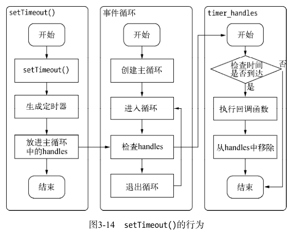

### process.nextTick()
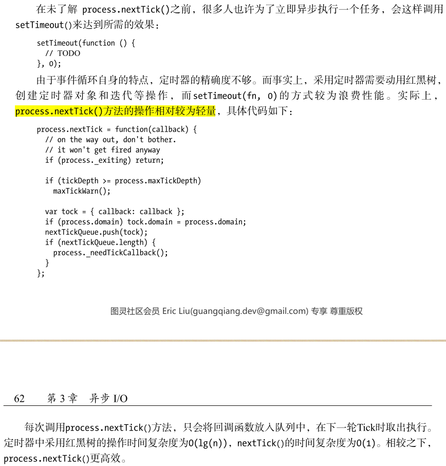

### setImmediate()
setImmediate() 与 process.nextTick() 非常相似，都是将回调函数延迟执行。不过它们也有不同的优先顺序，setImmediate() 属于 check 观察者，
process.nextTick() 属于 idle 观察者。在每一轮循环检查中，优先级如下：idle > I/O > check。

## 事件驱动与高性能服务器
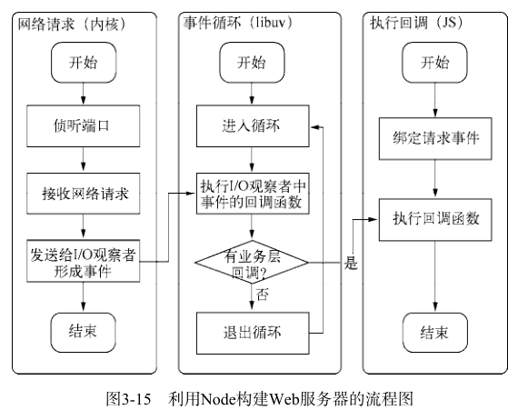

node 通过事件驱动的方式处理请求，无须为每一个请求创建额外的对应线程，可以省掉创建线程和销毁线程的开销。