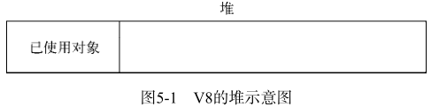
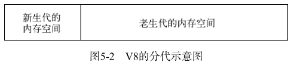
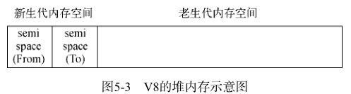
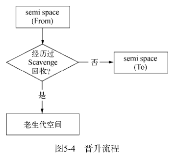
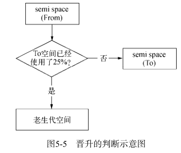
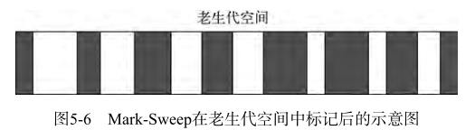
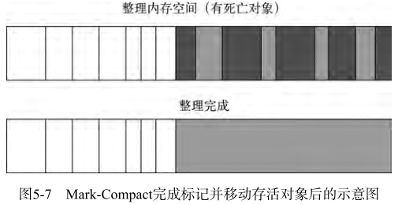
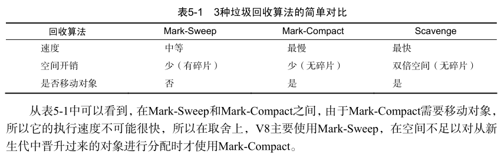
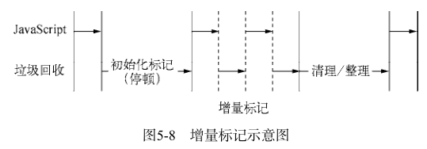

# 内存控制
## V8 的垃圾回收机制与内存限制
在 node 中，只能使用部分内存（64 位系统下约为 1.4G，32 位系统下约为 0.7G），这样将导致 node 无法操作大内存对象。

### V8 的对象分配
在 V8 中，所有的对象都是通过堆来分配的。



按官方的说法，1.5G 的垃圾回收堆内存需要 50 毫秒以上，做一次非增量式的垃圾回收得 1 秒以上。所以这是当时限制堆内存的原因。
这个限制可以通过 --max-old-space-size 或 --max-new-space-size 来调整内存限制的大小：
```js
node --max-old-space-size=1700 test.js // 单位为MB
// 或者
node --max-new-space-size=1024 test.js // 单位为KB
```

### V8 的垃圾回收机制
V8 将内存分为新生代和老生代。新生代中的对象为存活时间较短的对象，老生代中的对象为存活时间较长或常驻内存的对象。



--max-old-space-size 参数用于设置老生代内存空间最大值，--max-new-space-size 参数用于设置新生代内存空间最大值。

#### Scavenge 算法
新生代中的对象通过 Scavenge 算法进行垃圾回收。这个算法将新生代内存空间一分为二，每一部分空间称为 semispace。
在这两个空间中，一个处于使用中，称为 From；一个处于闲置，称为 To。分配对象时，在 From 中分配。
进行垃圾回收时，将 From 空间中的存活对象转移到 To 空间，而非存活对象占用的空间会被释放。完成复制后，From 和 To 空间角色互换。



当一个对象经过多次复制依然存在，它就会被转移到老生代空间。
在一定条件下，需要将存活周期长的对象转移到老生代中，这称为晋升。

对象晋升的条件主要有两个，一是对象是否经历过 Scavenge 回收，一是 To 空间的内存占用比超过限制。





#### Mark-Sweep & Mark-Compact
在老生代中如果还使用 Scavenge 算法，会有两个问题：一是老生代空间存活对象较多，复制存活对象的效率会很低；另一个问题是浪费一半的空间。所以在老生代中主要采用 Mark-Sweep 和 Mark-Compact 相结合的方式进行垃圾回收。

Mark-Sweep 分标记和清除两个阶段。它在标记阶段遍历堆中所有的对象，并标记活着的对象。然后在清除阶段清除掉没有标记的对象。它有个缺点，就是清除回收后，会有不连续的内存空间。

Mark-Compact 是在 Mark-Sweep 的基础上演变而来的。它在整理的过程中，将活着的对象往一边移动，移动完成后，直接清理边界外的内存。







#### Incremental Marking
垃圾回收的 3 种算法在执行的时候需要将应用逻辑停下来。为了降低全堆垃圾回收带来的停顿时间，V8 将标记阶段改为增量标记，每次执行一会就让应用逻辑执行一会，这样交替执行直至标记阶段完成。



V8 后续还引进了延迟清理和增量式整理，让清理和整理动作也变成增量式的。

### 查看垃圾回收日志
在启动时添加 --trace_gc 参数。
```js
node --trace_gc -e "var a = [];for (var i = 0; i < 1000000; i++) a.push(new Array(100));" > gc.log
```

详情请看书

## 高效使用内存
在 JS 中能形成作用域的有函数、全局作用域、with，在 es6 还有块作用域。局部变量随着函数作用域销毁而被释放，全局作用域需要进程退出才能释放或者使用 delete 和赋空值 `null` `undefined`。

在 V8 中用 delete 删除对象可能会干扰 V8 的优化，所以最好通过赋值方式解除引用。

## 内存指标
### 查看内存使用情况
#### 查看进程的内存占用
process.memoryUsage() 可以查看 node 进程内存使用情况。
```js
$ node
> process.memoryUsage()
{ rss: 13852672,
heapTotal: 6131200,
heapUsed: 2757120 }
```
rss 是 resident set size 的缩写，即进程的常驻内存部分。进程的内存有几部分，一部分是 rss，其余部分在交换区（swap）或者文件系统（filesystem）中。
heapTotal 是堆中总共申请的内存量，heapUsed 是目前堆中使用的内存量。这 3 个部分的单位都是字节。

#### 查看系统的内存占用
```js
$ node
> os.totalmem() // 系统内存
8589934592
> os.freemem() // 系统空闲内存
4527833088
>
```

### 堆外内存
不是通过 V8 分配的内存称为堆外内存。

## 内存泄漏
内存泄漏的情况有很多，但其实质就是应当回收的对象出现意外而没有被回收，变成了常驻在老生代中的对象。内存泄漏的原因有：
1. 缓存
2. 队列消费不及时
3. 作用域未释放

## 内存泄漏排查
下面是一些用于定位 node 应用内存泄漏的工具：
1.  v8-profiler
2. node-heapdump
3. node-mtrace
4. dtrace
5. node-memwatch

## 大内存应用
node 提供了 stream 模块用于处理大文件。

由于 V8 内存的限制，我们无法通过 fs.readFile() 和 fs.writeFile() 直接进行大文件的操作，而改用 fs.createReadStream() 和 fs.createWriteStream() 方法通过流的方式实现对大文件的操作。
```js
var reader = fs.createReadStream('in.txt');
var writer = fs.createWriteStream('out.txt');
reader.pipe(writer);
```