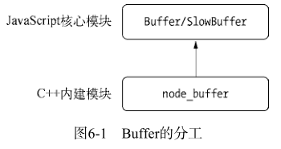
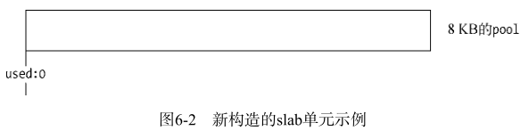
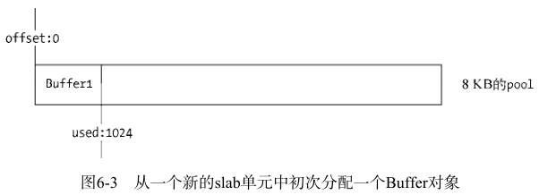
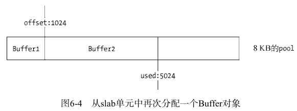
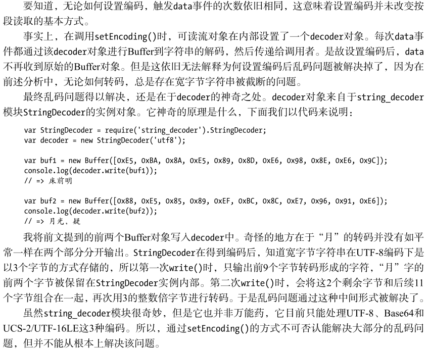

# 理解 Buffer
## Buffer 结构
Buffer 是一个类似 Array 的对象，主要用于操作字节。
### 模块结构
Buffer 是一个 JS 和 C++ 结合的模块，性能部分由 C++ 实现，非性能部分由 JS 实现。



Buffer 所占用的内存属于堆外内存，它在 node 进程启动时就已经加载了，并放在全局对象下。所以使用 Buffer 时，无须用 require() 加载，可直接使用。

### Buffer 对象
Buffer 有 length 属性，也可通过下标访问。
```js
var buf = new Buffer(100);
console.log(buf.length); // => 100

buf[20] = -100;
console.log(buf[20]); // 156
buf[21] = 300;
console.log(buf[21]); // 44
buf[22] = 3.1415;
console.log(buf[22]); // 3
```
给元素的赋值如果小于 0，就将该值逐次加 256，直到得到一个 0~255 之间的整数。如果是小数，就舍弃小数部分，保留整数部分。

### Buffer 内存分配
Buffer 内存分配是在 node 的 C++ 层面实现内存申请的。即采用在 C++ 层面申请内存、在 JS 中分配内存的策略。

为了高效地使用申请来的内存，node 采用了 slab 分配机制。它具有 3 种状态：
1. full: 完全分配状态。
2. partial: 部分分配状态。
3. empty: 未分配状态。

可通过以下方式来分配指定大小的 Buffer 对象：
```js
new Buffer(size);
```
node 以 8KB 的界限来区分 Buffer 是大对象还是小对象。8KB 也就是每个 slab 的大小值，在 JS 层面，以它作为单位进行内存的分配。

#### 分配小 Buffer 对象
如果指定的 Buffer 对象大小小于 8KB，node 会按照小对象的方式分配内存。
```js
var pool;
function allocPool() {
    pool = new SlowBuffer(Buffer.poolSize);
    pool.used = 0;
}
```







同一个 slab 可能分配给多个 Buffer 对象使用，只有这些小对象在作用域释放并都可以回收时，slab 的 8KB 空间才会被回收。

#### 分配大 Buffer 对象
如果需要超过 8KB 的 Buffer 对象，将会直接分配一个 SlowBuffer 对象作为 slab 单元，这个 slab 单元将会被这个大 Buffer 独占。
```js
// Big buffer, just alloc one
this.parent = new SlowBuffer(this.length);
this.offset = 0;
```
SlowBuffer 类是在 C++ 中定义的，虽然引用 buffer 模块可以访问它，但不推荐直接操作它，而是用 Buffer 替代。

## Buffer 的转换
Buffer 对象可以与字符串之间互相转换，目前支持的字符串编码类型如下：
1. ASCII
2. UTF-8
3. UTF-16LE/UCS-2
4. Base64
5. Binary
6. Hex

### 字符串转 Buffer
```js
new Buffer(str, [encoding]);
```
encoding 参数不传递时，默认为 utf-8。

一个 Buffer 对象可以存储不同编码类型的字符串转码的值，通过 write() 方法实现：
```js
buf.write(string, [offset], [length], [encoding])
```
每种编码所用的字节长度不同，将 Buffer 反转回字符串时需要谨慎处理。

### Buffer 转字符串
```js
buf.toString([encoding], [start], [end])
```

### Buffer 不支持的编码类型
使用 isEncoding() 判断编码是否支持转换：
```js
Buffer.isEncoding(encoding)
```
iconv 和 iconv-lite 两个模块可以支持更多的编码类型转换。
```js
var iconv = require('iconv-lite');
// Buffer转字符串
var str = iconv.decode(buf, 'win1251');
// 字符串转Buffer
var buf = iconv.encode("Sample input string", 'win1251');
```

## Buffer 的拼接
Buffer 在使用场景中，通常是以一段一段的方式传输的。
```js
var fs = require('fs');
var rs = fs.createReadStream('test.md');
var data = '';
rs.on("data", function (chunk){
    data += chunk;
});
rs.on("end", function () {
    console.log(data);
});
```
其中 `data += chunk;` 代码的隐藏操作为 `data = data.toString() + chunk.toString();`，对于传输英文文本，toString() 不会造成问题。
但对于宽字节的中文，就有可能造成乱码。utf-8 中文是占 3 字节的，以上的操作有可能会对一个中文的 3 字节进行截断，导致乱码。

### setEncoding() 与 string_decoder()
可读流有一个设置编码的方法 setEncoding()：
```js
readable.setEncoding(encoding)
```
该方法的作用是让 data 事件中传递的不再是 Buffer 对象，而是编码后的字符串：
```js
var rs = fs.createReadStream('test.md', { highWaterMark: 11});
rs.setEncoding('utf8');
```


### 正确拼接 Buffer
除了 setEncoding() 方法外，还可以将多个小 Buffer 对象拼接到一起再解析。
```js
var chunks = [];
var size = 0;
res.on('data', function (chunk) {
    chunks.push(chunk);
    size += chunk.length;
});
res.on('end', function () {
    var buf = Buffer.concat(chunks, size);
    var str = iconv.decode(buf, 'utf8');
    console.log(str);
});
```
Buffer.concat() 方法封装了从小 Buffer 对象向大 Buffer 对象的复制过程：
```js
Buffer.concat = function(list, length) {
    if (!Array.isArray(list)) {
        throw new Error('Usage: Buffer.concat(list, [length])');
    }

    if (list.length === 0) {
        return new Buffer(0);
    } else if (list.length === 1) {
        return list[0];
    }

    if (typeof length !== 'number') {
        length = 0;
        for (var i = 0; i < list.length; i++) {
            var buf = list[i];
            length += buf.length;
        }
    }

    var buffer = new Buffer(length);
    var pos = 0;
    for (var i = 0; i < list.length; i++) {
        var buf = list[i];
        buf.copy(buffer, pos);
        pos += buf.length;
    }

    return buffer;
};
```

## Buffer 与性能
Buffer 在网络 I/O 和文件 I/O 中使用广泛，通常在网络传输中，字符串都需要转换为 Buffer，这样能提升性能。