# 网络编程
node 提供了 net、dgram、http、https 这 4 个模块，用于分别处理 TCP、UDP、HTTP、HTTPS，适用于服务器和客户端。
## 构建 TCP 服务
### 创建 TCP 服务器端
可通过 net.createServer() 创建一个 TCP 服务器端：
```js
var net = require('net');
var server = net.createServer(function (socket) {
    socket.on('data', function (data) {
        socket.write('你好')
    });

    socket.on('end', function () {
        console.log('连接断开');
    });

    socket.write('欢迎光临《深入浅出 Node.js》\n');
});
server.listen(8124, function () {
    console.log('server bound');
});
```
接下来可以通过 telnet 访问：
```
telnet 127.0.0.1 8124
```
或创建一个客户端来访问：
```js
var net = require('net');
var client = net.connect({port: 8124}, function () { //'connect' listener
    console.log('client connected');
    client.write('world!\r\n');
});

client.on('data', function (data) {
    console.log(data.toString());
    client.end();
});

client.on('end', function () {
    console.log('client disconnected');
});
```
### TCP 服务的事件
在上述的示例中，代码分为服务器事件和连接事件。

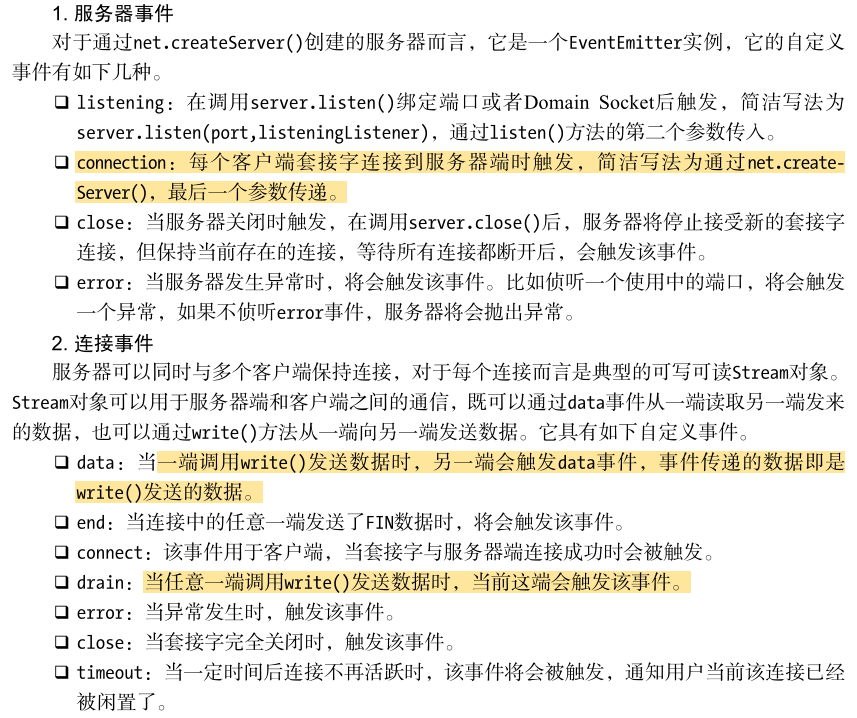

由于 TCP 套接字是可读可写的 Stream 对象，所以可以使用 pipe() 方法实现管道操作：
```js
var net = require('net');

var server = net.createServer(function (socket) {
    socket.write('Echo server\r\n');
    socket.pipe(socket);
});

server.listen(1337, '127.0.0.1');
```
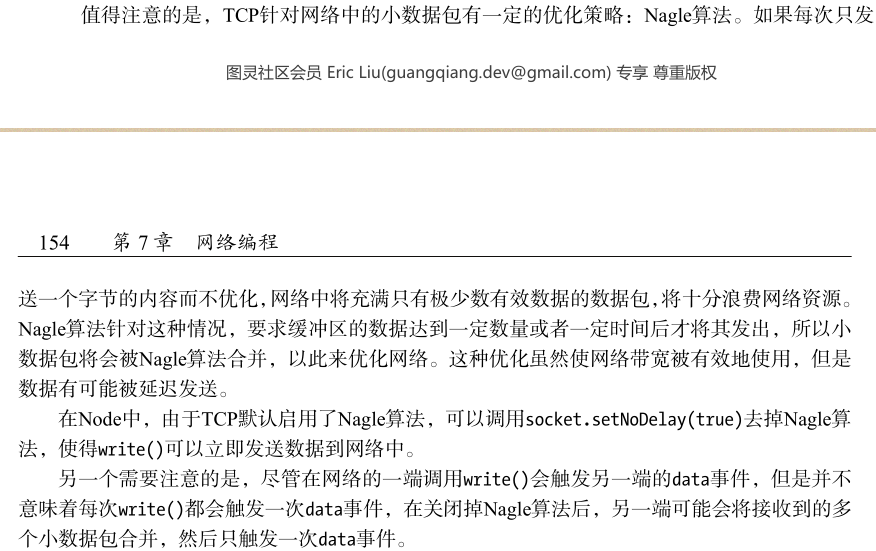

## 构建 UDP 服务
### 创建 UDP 套接字
在 UDP 中一个套接字可以与多个 UDP 服务通信。UDP 套接字一旦创建，既可以作为客户端发送数据，也可作为服务器端接收数据：
```js
var dgram = require('dgram');
var socket = dgram.createSocket("udp4");
```
### 创建 UDP 服务器端
若想让 UDP 套接字接收网络消息，只要调用 dgram.bind(port, [address]) 方法对网卡和端口进行绑定即可：
```js
var dgram = require("dgram");
var server = dgram.createSocket("udp4");

server.on("message", function (msg, rinfo) {
    console.log("server got: " + msg + " from " +
    rinfo.address + ":" + rinfo.port);
});

server.on("listening", function () {
    var address = server.address();
    console.log("server listening " +
    address.address + ":" + address.port);
});

server.bind(41234);
```
### 创建 UDP 客户端
```js
var dgram = require('dgram');
var message = new Buffer("test");
var client = dgram.createSocket("udp4");

client.send(message, 0, message.length, 41234, "localhost", function(err, bytes) {
    client.close();
});
```
套接字在客户端时，可以调用 send() 方法发送消息到网络中：
```js
socket.send(buf, offset, length, port, address, [callback])
```
### UDP 套接字事件
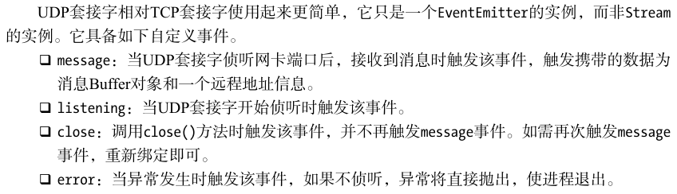

## 构建 HTTP 服务
在 node 中，HTTP 服务继承自 TCP 服务器（net 模块）。TCP 服务以 connection 为单位进行服务，HTTP 服务以 request 为单位进行服务。
http 模块将 connection 到 request 的过程进行了封装。

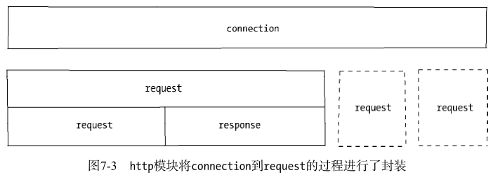

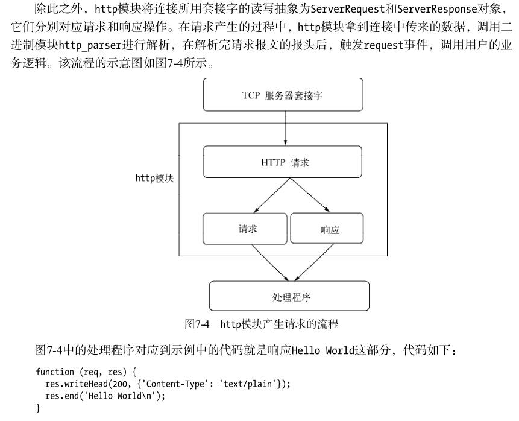

### HTTP 响应
报文体部分通过 res.wirte() 和 res.end() 方法实现，这两者的区别在于 res.end() 先调用 res.wirte() 发送数据，然后发送信号告知服务器这次响应结束。
注意，报文头是在报文体前发送的，一旦开始了数据的发送， writeHead() 和 setHeader() 将不再生效。这是由协议的特性决定的。

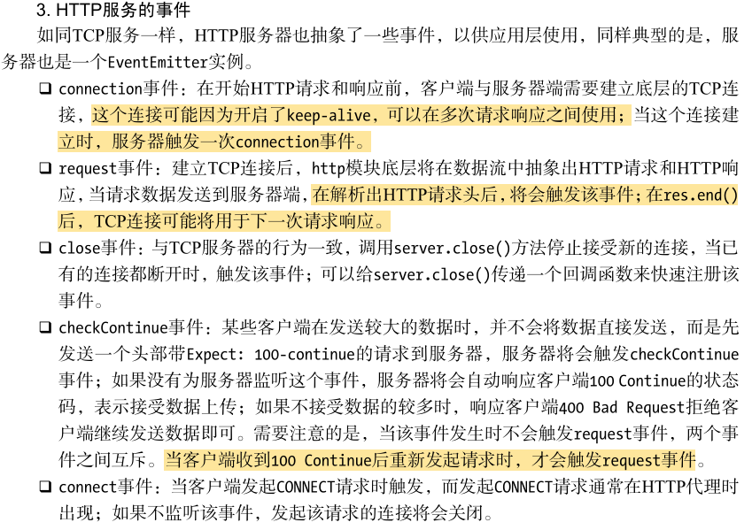

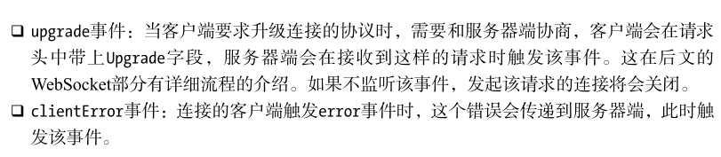

### HTTP 客户端
http 模块提供了一个底层 API: http.request(options, connect) 来构造客户端：
```js
var options = {
    hostname: '127.0.0.1',
    port: 1334,
    path: '/',
    method: 'GET'
};

var req = http.request(options, function(res) {
    console.log('STATUS: ' + res.statusCode);
    console.log('HEADERS: ' + JSON.stringify(res.headers));
    res.setEncoding('utf8');
    res.on('data', function (chunk) {
        console.log(chunk);
    });
});

req.end();
```
执行上述代码得到以下输出：
```
$ node client.js
STATUS: 200
HEADERS: {"date":"Sat, 06 Apr 2013 11:08:01
GMT","connection":"keep-alive","transfer-encoding":"chunked"}
Hello World
```
http 提供的 ClientRequest 对象也是基于 TCP 实现的，在 keepalive 的情况下，一个底层会话可用于多次请求。为了重用 TCP 连接，http 模块提供了一个默认的客户端代理对象 http.globalAgent。它对每个服务器端（host + port）创建的连接进行了管理，默认情况下，通过 ClientRequest 对象对同一服务器端发起的 HTTP 请求最多可以创建 5 个连接。它的实质是一个连接池。

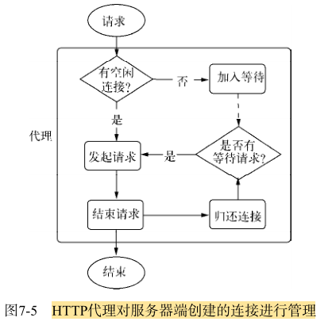

## 构建 WebSocket 服务
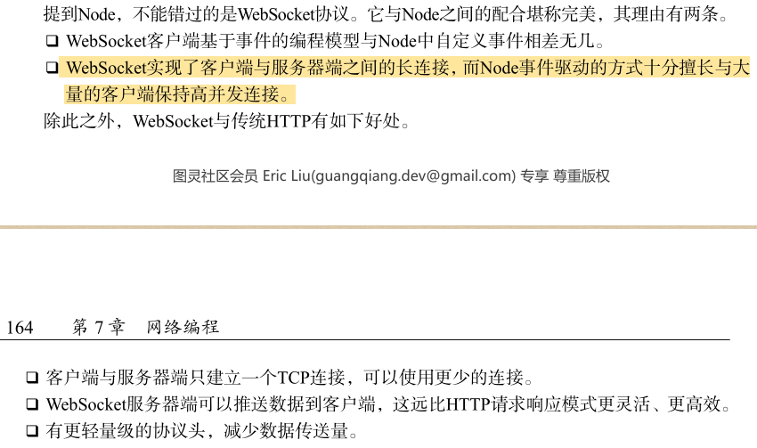

建立 websocket，服务器端的响应行为：
```js
var server = http.createServer(function (req, res) {
    res.writeHead(200, {'Content-Type': 'text/plain'});
    res.end('Hello World\n');
});

server.listen(12010);
// 在收到 upgrade 请求后，告知客户端允许切换协议
server.on('upgrade', function (req, socket, upgradeHead) {
    var head = new Buffer(upgradeHead.length);
    upgradeHead.copy(head);
    var key = req.headers['sec-websocket-key'];
    var shasum = crypto.createHash('sha1');
    key = shasum.update(key + "258EAFA5-E914-47DA-95CA-C5AB0DC85B11").digest('base64');
    var headers = [
        'HTTP/1.1 101 Switching Protocols',
        'Upgrade: websocket',
        'Connection: Upgrade',
        'Sec-WebSocket-Accept: ' + key,
        'Sec-WebSocket-Protocol: ' + protocol
    ];
    // 让数据立即发送
    socket.setNoDelay(true);
    socket.write(headers.concat('', '').join('\r\n'));
    // 建立服务器端WebSocket连接
    var websocket = new WebSocket();
    websocket.setSocket(socket);
});
```
### WebSocket 数据传输
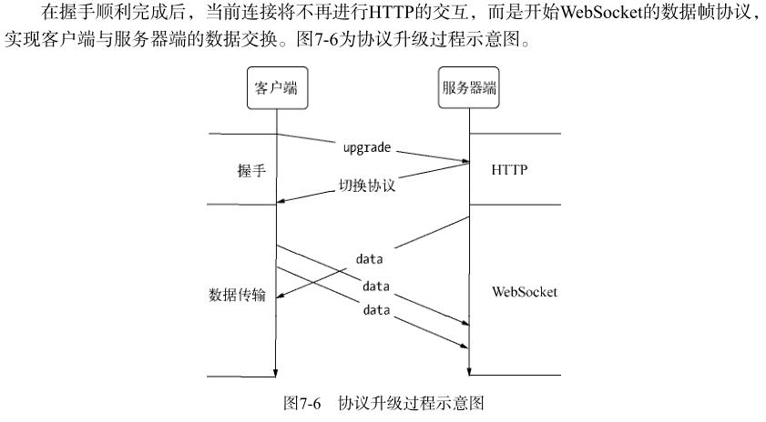

为了完成 TCP 套接字事件到 websocket 事件的封装，需要在接收数据时进行处理，websocket 的数据帧协议是在底层 data 事件上封装完成的：
```js
WebSocket.prototype.setSocket = function (socket) {
    this.socket = socket;
    this.socket.on('data', this.receiver);
};
```
数据发送时，也需要做封装操作：
```js
WebSocket.prototype.send = function (data) {
    this._send(data);
};
```
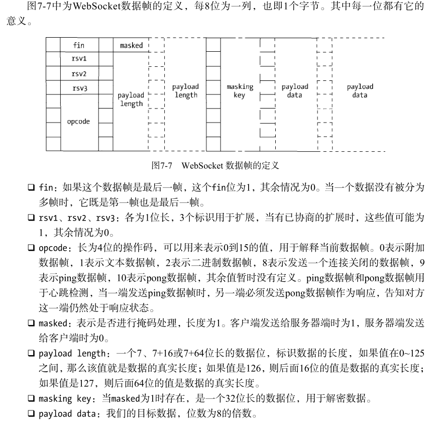

## 网络服务与安全
node 在网络安全上提供了 3 个模块，分别为 crypto、tls、https。其中 crypto 用于加密解密，tls 模块提供了与 net 模块类似的功能，区别在于它建立在 TLS/SSL 加密的 TCP 连接上。https 模块与 http 模块功能一样，只是它建立于安全的连接之上。

### TLS/SSL
node 在底层采用 openssl 来实现 TLS/SSL，为此要生成公钥和私钥可以通过 openssl 完成。
```js
// 生成服务器端私钥
$ openssl genrsa -out server.key 1024
// 生成客户端私钥
$ openssl genrsa -out client.key 1024
```
上述命令生成了两个 1024 位长的 RSA 私钥文件，我们可以通过它继续生成公钥：
```js
$ openssl rsa -in server.key -pubout -out server.pem
$ openssl rsa -in client.key -pubout -out client.pem
```
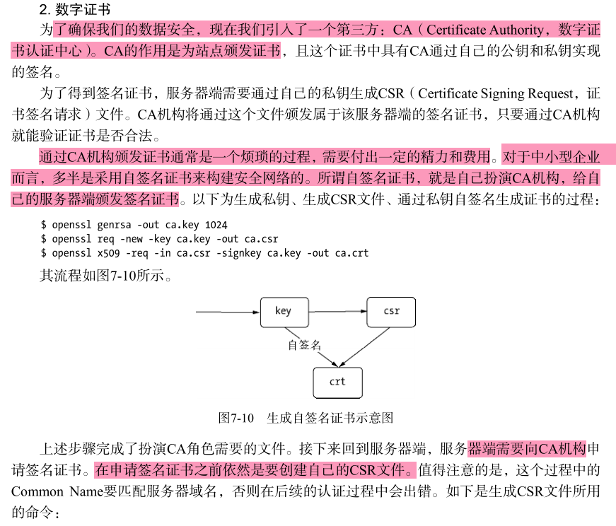

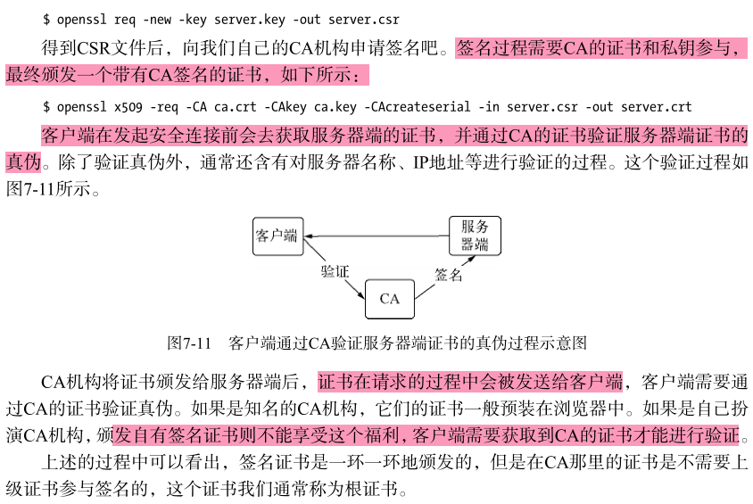