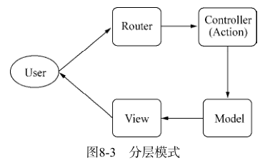
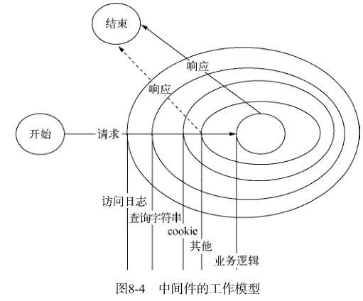

# 构建 Web 应用
## 基础功能
在一个 web 应用中，具体的业务可能包含：
1. 请求方法的判断。
2. URL 的路径解析。
3. URL 中查询字符串解析。
4. Cookie 的解析。
5. Basic 认证。
6. 表单数据的解析。
7. 任意格式文件的上传处理。
8. Session 会话。

## 路由解析
### 文件路径型
#### 静态文件
URL 的路径与网站目录的路径一致，处理起来非常方便。
#### 动态文件
服务器根据 URL 路径找到对应的文件，再根据文件名后缀找到对应的脚本解析器，并传入 HTTP 请求的上下文。解析器执行脚本，并输出响应报文，达到完成服务的目的。

### MVC
MVC 模型的主要思想是将业务逻辑按职责分享：
1. 控制器（Controller），一组行为的集合；
2. 模型（Model），数据相关的操作和封装；
3. 视图（View），视图的渲染。

MVC 工作模式如下：
1. 路由解析，根据 URL 寻找到对应的控制器和行为。
2. 行为调用相关的模型，进行数据操作。
3. 数据操作结束后，调用视图和相关数据进行页面渲染，输出到客户端。

根据 URL 做路由映射，有两种方式实现：一是通过手工关联映射，一种是自然映射。前者有一个对应的路由文件来将 URL 映射到对应的控制器，后者没有。

### RESTful
需要注意的是，REST是设计风格而不是标准。REST通常基于使用HTTP、URI、XML以及HTML这些现有的广泛流行的协议和标准。
* 资源是由URI来指定。
* 对资源的操作包括获取、创建、修改和删除，这些操作正好对应HTTP协议提供的GET、POST、PUT和DELETE方法。
* 通过操作资源的表现形式来操作资源。
* 资源的表现形式则是XML或者HTML，取决于读者是机器还是人、是消费Web服务的客户软件还是Web浏览器。当然也可以是任何其他的格式，例如JSON。

[表现层状态转换 REST](https://zh.wikipedia.org/wiki/%E8%A1%A8%E7%8E%B0%E5%B1%82%E7%8A%B6%E6%80%81%E8%BD%AC%E6%8D%A2)

## 中间件
中间件的含义：封装底层细节，为上层提供更方便的服务。

## 页面渲染
### 内容响应
####  Content-Disposition
在常规的HTTP应答中，Content-Disposition 响应头指示回复的内容该以何种形式展示，是以内联的形式（即网页或者页面的一部分），还是以附件的形式下载并保存到本地。