# 玩转进程
## 多进程架构
面对单进程单线程对多核使用不足的问题，前人的经验是启动多进程即可。Node 提供了 child_process 模块，并且也提供了 child_process.fork() 方法来实现进程的复制。
```js
// worker.js
var http = require('http');
http.createServer(function (req, res) {
    res.writeHead(200, {'Content-Type': 'text/plain'});
    res.end('Hello World\n');
}).listen(Math.round((1 + Math.random()) * 1000), '127.0.0.1');
```

```js
// master.js
var fork = require('child_process').fork;
var cpus = require('os').cpus();
for (var i = 0; i < cpus.length; i++) {
    fork('./worker.js');
}
```


通过 fork() 复制的进程是一个独立的进程，这个进程有独立而全新的 V8 实例。它需要至少 30 毫秒的启动时间和至少 10M 的内存。
fork() 进程是昂贵的，node 通过事件驱动的方式在单线程上解决了大并发的问题。这里启动多个进程只是为了将 CPU 资源充分利用起来，而不是为了解决并发问题。

### 创建子进程
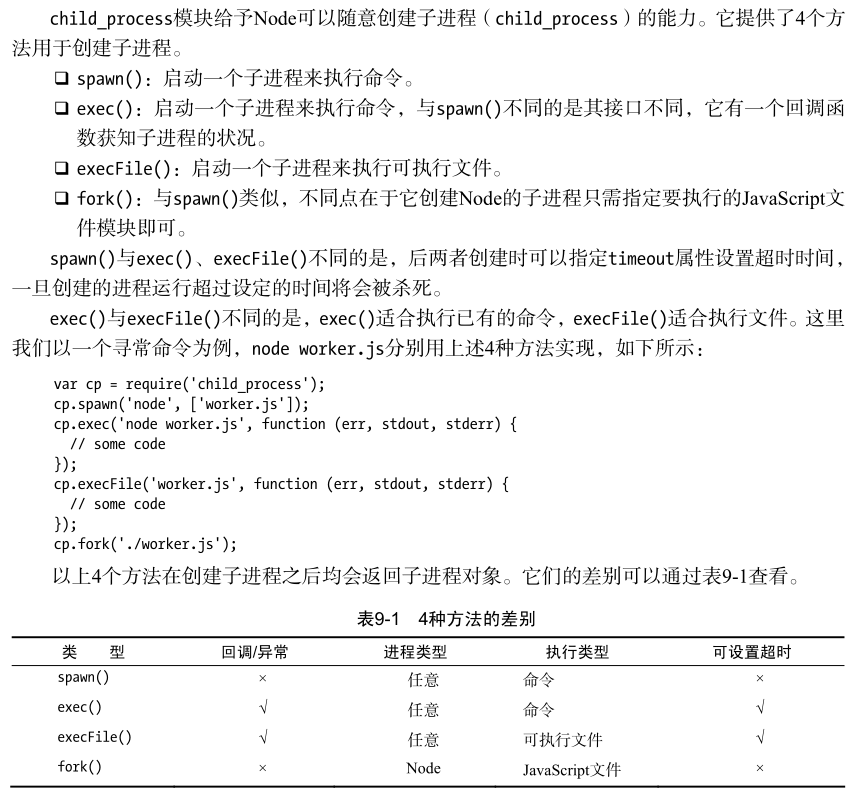

这里的可执行文件是指可以直接执行的文件，如果是 JS 文件通过 execFile() 运行，它的首先必须添加以下代码：
```js
#!/usr/bin/env node
```
尽管 4 种创建子进程的方式有些差别，但事实上后面 3 种都是 spawn() 的延伸应用。

### 进程间通信
```js
// parent.js
var cp = require('child_process');
var n = cp.fork(__dirname + '/sub.js');

n.on('message', function (m) {
    console.log('PARENT got message:', m);
});

n.send({hello: 'world'});
```
```js
// sub.js
process.on('message', function (m) {
    console.log('CHILD got message:', m);
});

process.send({foo: 'bar'});
```
通过 for() 或其他方法创建子进程后，父子进程之间会创建 IPC 通道。通过 IPC 通道，父子进程之间才能通过 message 和 send() 传递消息。


在 node 中，IPC 通道被抽象为 Stream 对象，在调用 send() 时发送数据（类似于 write()），接收到的消息会通过 message 事件（类似于 data）触发给应用层。


### 句柄传递
send() 方法除了能通过 IPC 发送数据外，还能发送句柄。
```js
child.send(message, [sendHandle])
```
句柄是一种可以用来标识资源的引用，它的内部包含了指向对象的文件描述符。例如句柄可以标识一个服务器端 socket 对象、一个客户端 socket 对象、一个 UDP 套接字、一个管道等。

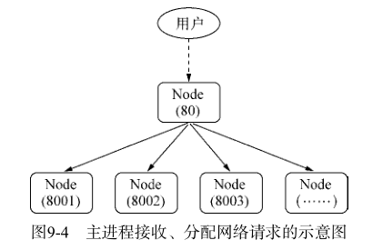

主进程可以在接收到 socket 请求后，将这个 socket 直接发送给工作进程，而不是重新与工作进程之间建立新的 socket 连接来转发数据，避免浪费文件描述符（连接到工作进程的过程需要消耗一个文件描述符）。
```js
// 主进程
var child = require('child_process').fork('child.js');
// Open up the server object and send the handle
var server = require('net').createServer();

server.on('connection', function (socket) {
    socket.end('handled by parent\n');
});

server.listen(1337, function () {
    child.send('server', server);
});
```
```js
// 子进程
process.on('message', function (m, server) {
    if (m === 'server') {
        server.on('connection', function (socket) {
            socket.end('handled by child\n');
        });
    }
});
```
父进程也可以将服务发送给多个子进程。
```js
// parent.js
var cp = require('child_process');
var child1 = cp.fork('child.js');
var child2 = cp.fork('child.js');
// Open up the server object and send the handle
var server = require('net').createServer();

server.on('connection', function (socket) {
    socket.end('handled by parent\n');
});

server.listen(1337, function () {
    child1.send('server', server);
    child2.send('server', server);
    // 关掉
    server.close();
});
```
```js
// child.js
var http = require('http');
var server = http.createServer(function (req, res) {
    res.writeHead(200, {'Content-Type': 'text/plain'});
    res.end('handled by child, pid is ' + process.pid + '\n');
});

process.on('message', function (m, tcp) {
    if (m === 'server') {
        tcp.on('connection', function (socket) {
            server.emit('connection', socket);
        });
    }
});
```

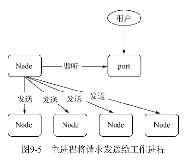

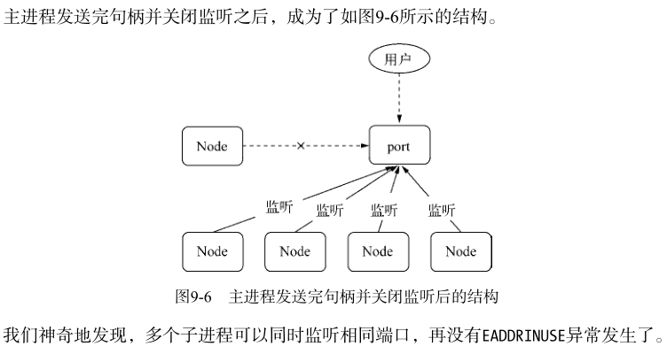

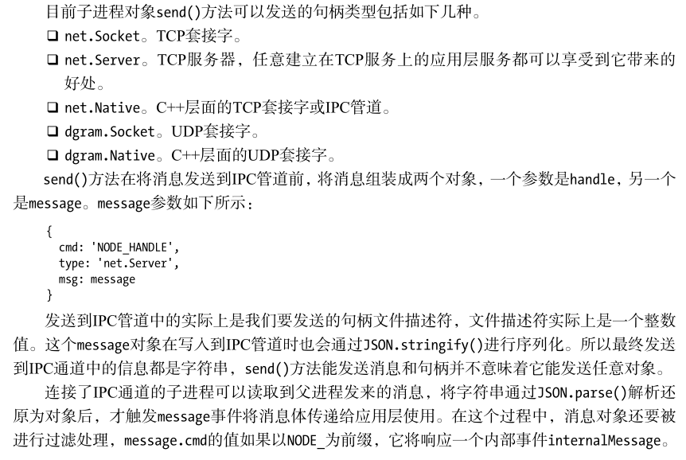

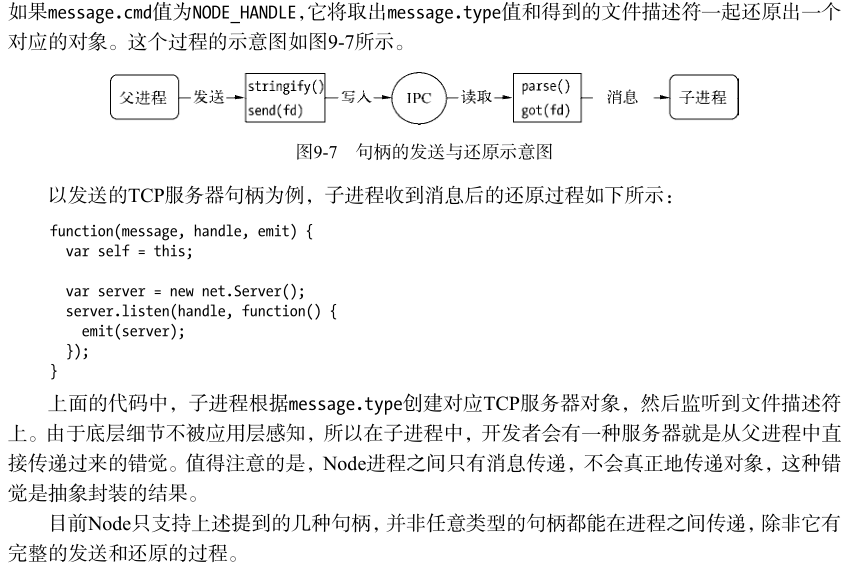

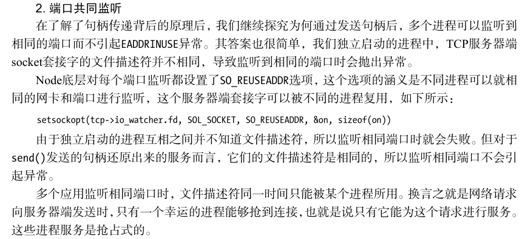

## 集群稳定之路
### 进程事件
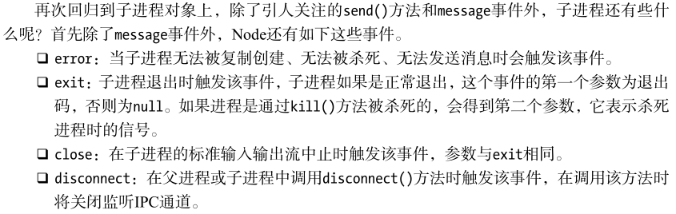

### 自动重启
父进程可以通过监听子进程的 exit 事件来获知其退出的信息。

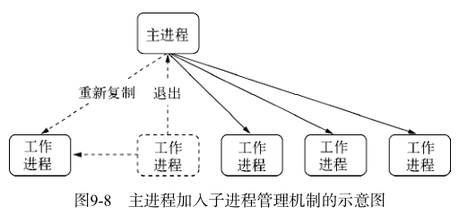

```js
// master.js
var fork = require('child_process').fork;
var cpus = require('os').cpus();
var server = require('net').createServer();
server.listen(1337);

var workers = {};
var createWorker = function () {
    var worker = fork(__dirname + '/worker.js');
    // 启动新的进程
    worker.on('message', function (message) {
        if (message.act === 'suicide') {
            createWorker();
        }
    });
    // 退出时重新启动新的进程
    worker.on('exit', function () {
        console.log('Worker ' + worker.pid + ' exited.');
        delete workers[worker.pid];
        createWorker();
    });
    // 句柄转发
    worker.send('server', server);
    workers[worker.pid] = worker;
    console.log('Create worker. pid: ' + worker.pid);
};

for (var i = 0; i < cpus.length; i++) {
    createWorker();
}

// 进程自己退出，让所有工作进程退出
process.on('exit', function () {
    for (var pid in workers) {
        workers[pid].kill();
    }
});
```
```js
// worker.js
var http = require('http');
var server = http.createServer(function (req, res) {
    res.writeHead(200, {'Content-Type': 'text/plain'});
    res.end('handled by child, pid is ' + process.pid + '\n');
});

var worker;
process.on('message', function (m, tcp) {
    if (m === 'server') {
        worker = tcp;
        worker.on('connection', function (socket) {
            server.emit('connection', socket);
        });
    }
});
process.on('uncaughtException', function () {
    process.send({act: 'suicide'});
    // 停止接收新的连接
    worker.close(function () {
        // 所有已有连接断开后，退出进程
        process.exit(1);
    });
});
```
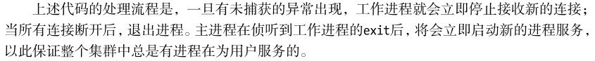

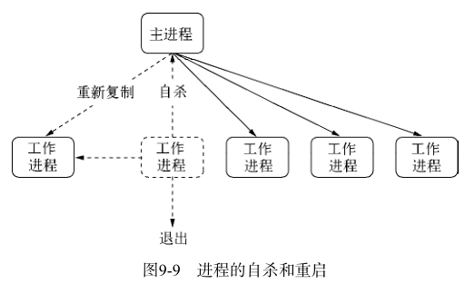

### 负载均衡
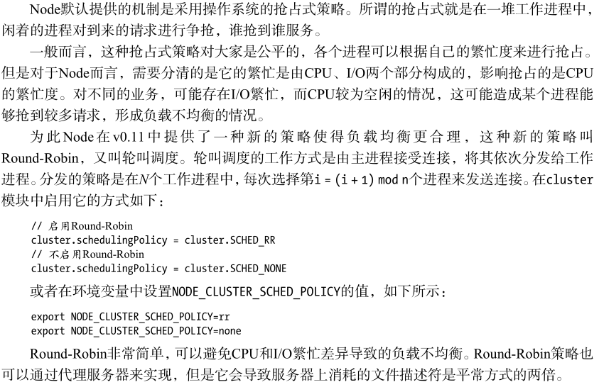

### 状态共享
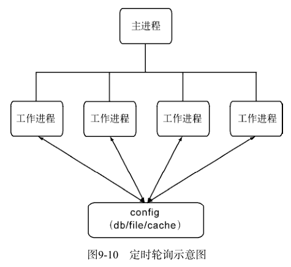

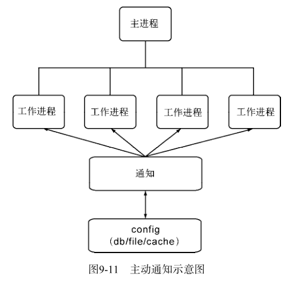

## Cluster 模块
### Cluster 工作原理
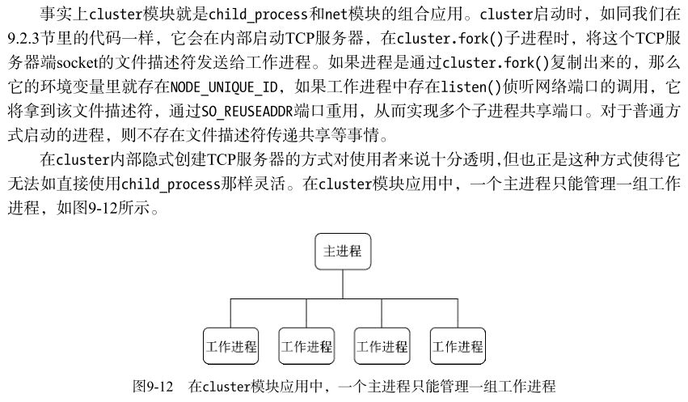

### Cluster 事件
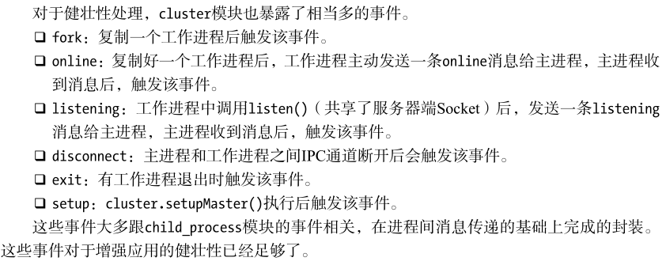