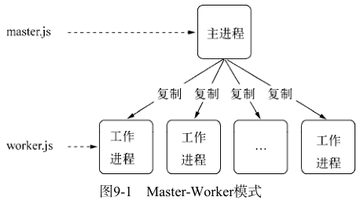

# 玩转进程
## 多进程架构
面对单进程单线程对多核使用不足的问题，前人的经验是启动多进程即可。Node 提供了 child_process 模块，并且也提供了 child_process.fork() 方法来实现进程的复制。
```js
// worker.js
var http = require('http');
http.createServer(function (req, res) {
    res.writeHead(200, {'Content-Type': 'text/plain'});
    res.end('Hello World\n');
}).listen(Math.round((1 + Math.random()) * 1000), '127.0.0.1');
```

```js
// master.js
var fork = require('child_process').fork;
var cpus = require('os').cpus();
for (var i = 0; i < cpus.length; i++) {
    fork('./worker.js');
}
```



通过 fork() 复制的进程是一个独立的进程，这个进程有独立而全新的 V8 实例。它需要至少 30 毫秒的启动时间和至少 10M 的内存。
fork() 进程是昂贵的，node 通过事件驱动的方式在单线程上解决了大并发的问题。这里启动多个进程只是为了将 CPU 资源充分利用起来，而不是为了解决并发问题。

### 创建子进程
child_process() 提供了 4 个方法用于创建子进程：
1. spawn(): 启动一个子进程来执行命令。
2. exec(): 启动一个子进程来执行命令，与 spawn() 不同的是其接口不同，它有一个回调函数获知子进程的状况。
3. execFile(): 启动一个子进程来执行可执行文件。
4. fork(): 与 spawn() 类似，不同点在于它创建 node 的子进程只需指定要执行的 JS 文件模块即可。