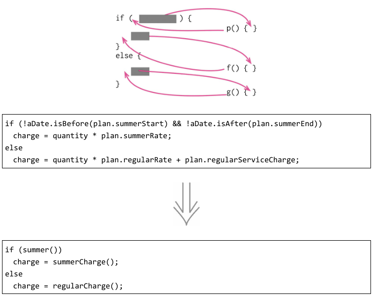
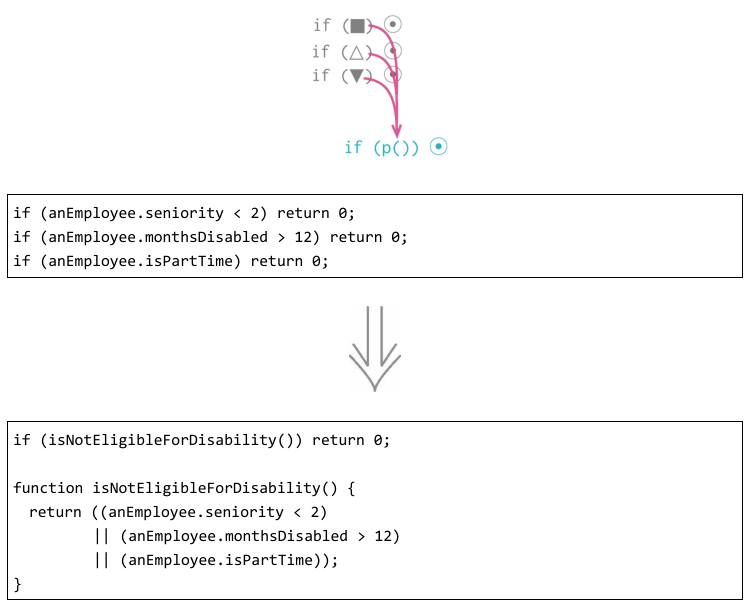
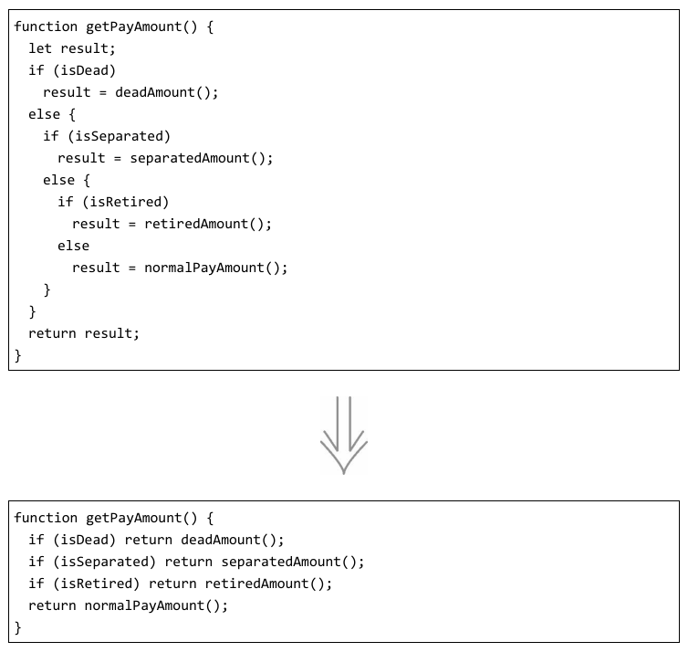
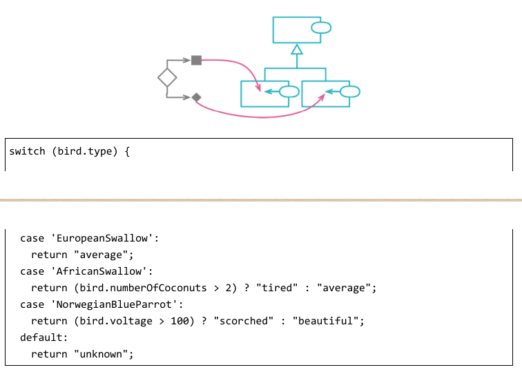
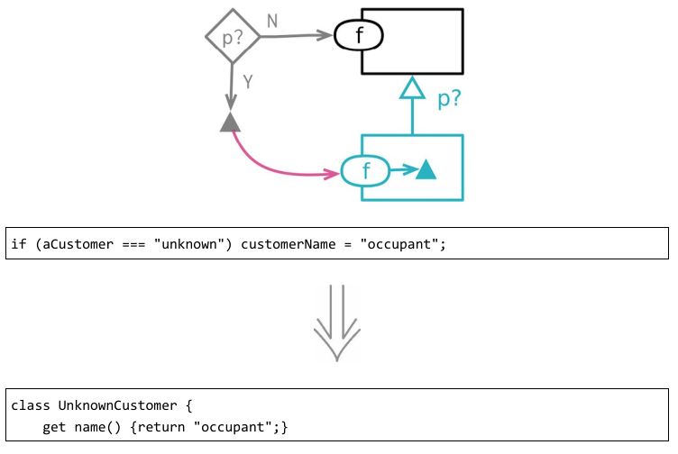
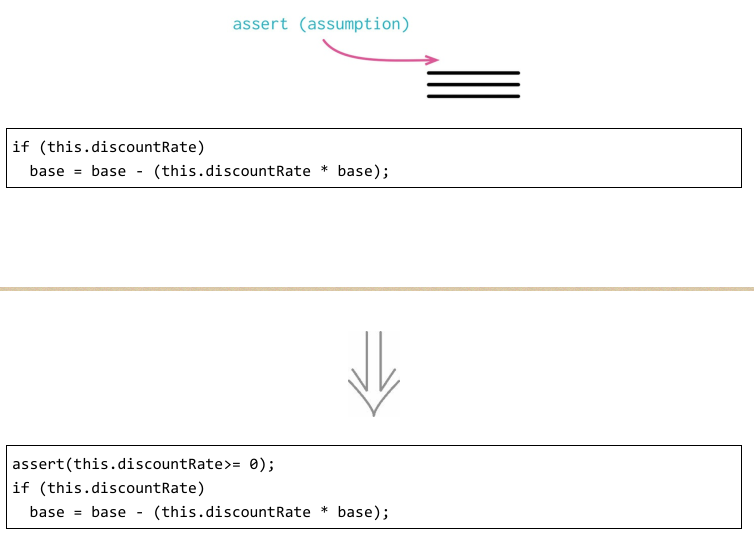

# 简化条件逻辑
### 1. 分解条件表达式

程序之中，复杂的条件逻辑是最常导致复杂度上升的地点之一。我必须编写代码来检查不同的条件分支，根据不同的条件做不同的事，然后，我很快就会得到一个相当长的函数。大型函数本身就会使代码的可读性下降，而条件逻辑则会使代码更难阅读。在带有复杂条件逻辑的函数中，代码（包括检查条件分支的代码和真正实现功能的代码）会告诉
我发生的事，但常常让我弄不清楚为什么会发生这样的事，这就说明代码的可读性的确大大降低了。

### 2. 合并条件表达式

有时我会发现这样一串条件检查：检查条件各不相同，最终行为却一致。如果发现这种情况，就应该使用“逻辑或”和“逻辑与”将它们合并为一个条件表达式。

### 3. 以卫语句取代嵌套条件表达式

以卫语句取代嵌套条件表达式的精髓就是：给某一条分支以特别的重视。如果使用 if-then-else 结构，你对 if 分支和 else 分支的重视是同等的。这样的代码结构传递给阅读者的消息就是：各个分支有同样的重要性。卫语句就不同了，它告诉阅读者：“这种情况不是本函数的核心逻辑所关心的，如果它真发生了，请做一些必要的整理工作，然后退出。”

### 4. 以多态取代条件表达式

复杂的条件逻辑是编程中最难理解的东西之一，因此我一直在寻求给条件逻辑添加结构。很多时候，我发现可以将条件逻辑拆分到不同的场景（或者叫高阶用例），从而拆解复杂的条件逻辑。这种拆分有时用条件逻辑本身的结构就足以表达，但使用类和多态能把逻辑的拆分表述得更清晰。

### 5. 引入特例

一种常见的重复代码是这种情况：一个数据结构的使用者都在检查某个特殊的值，并且当这个特殊值出现时所做的处理也都相同。如果我发现代码库中有多处以同样方式应对
同一个特殊值，我就会想要把这个处理逻辑收拢到一处。处理这种情况的一个好办法是使用“特例”（SpecialCase）模式：创建一个特例元素，用以表达对这种特例的共用行为的处理。这样我就可以用一个函数调用取代大部分特例检查逻辑。

### 6. 引入断言

断言是一个条件表达式，应该总是为真。如果它失败，表示程序员犯了错误。断言的失败不应该被系统任何地方捕捉。整个程序的行为在有没有断言出现的时候都应该完全一样。实际上，有些编程语言中的断言可以在编译期用一个开关完全禁用掉。