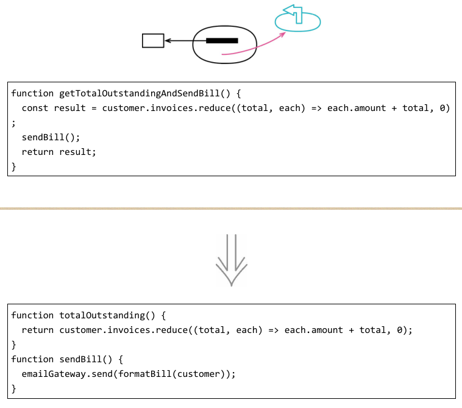
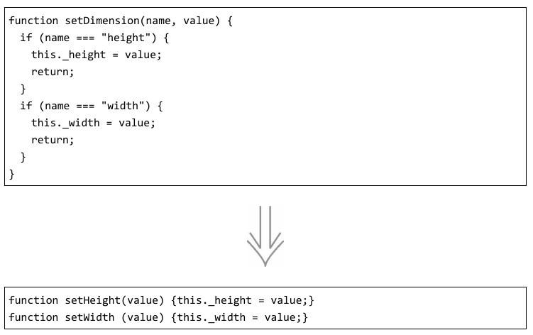
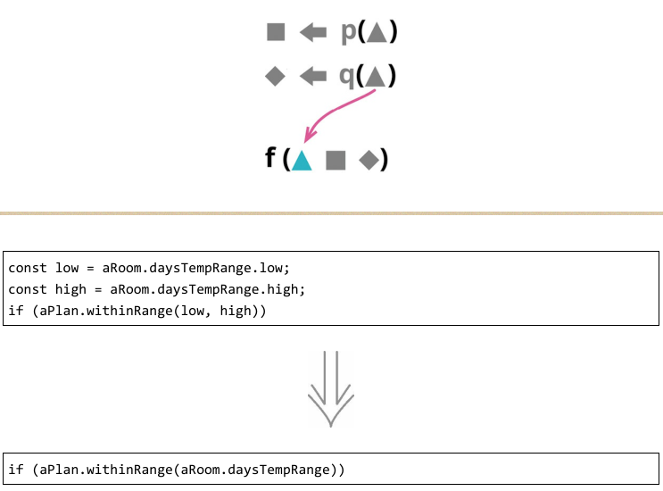
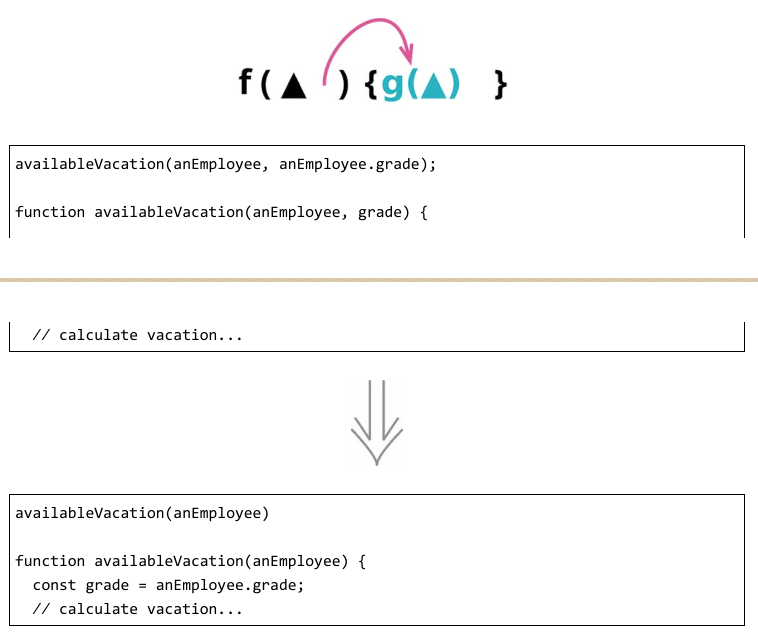
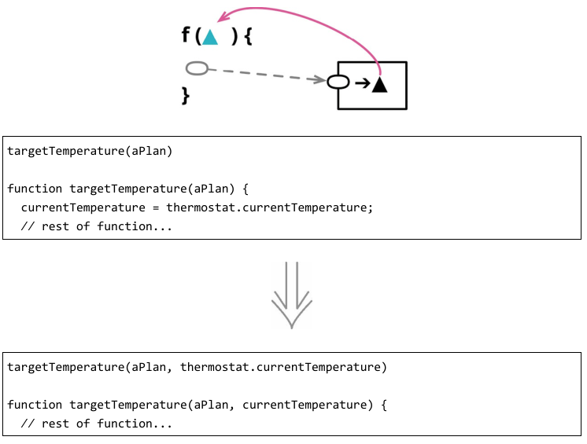
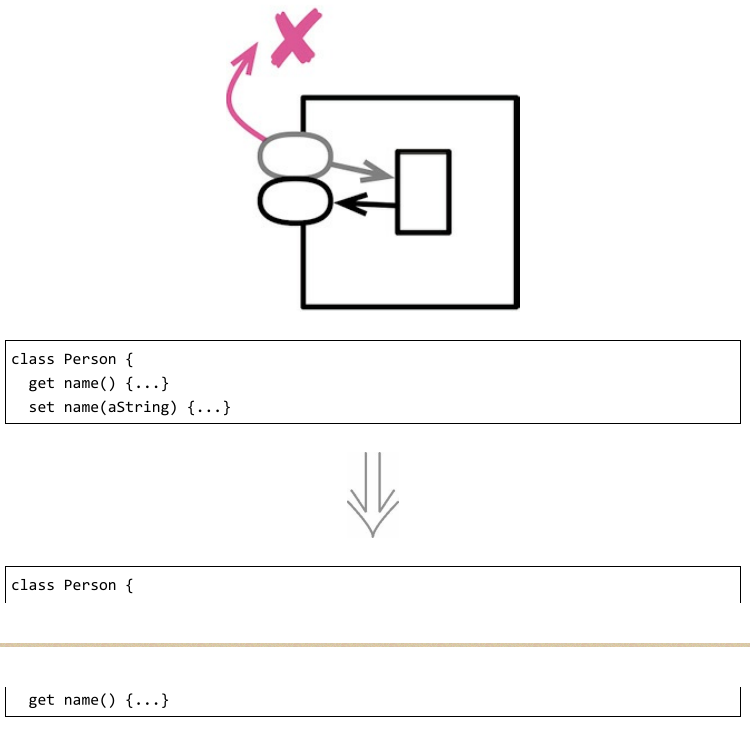
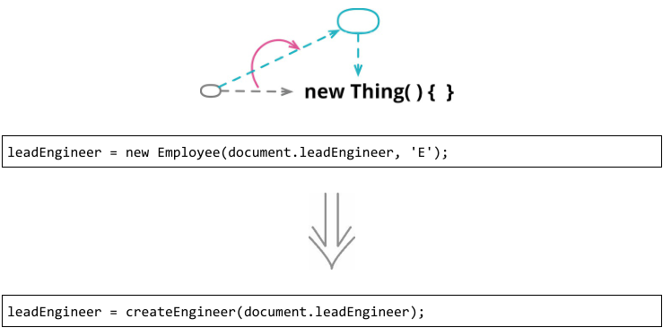
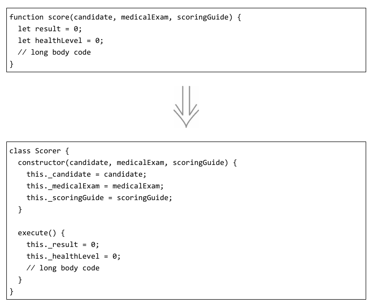
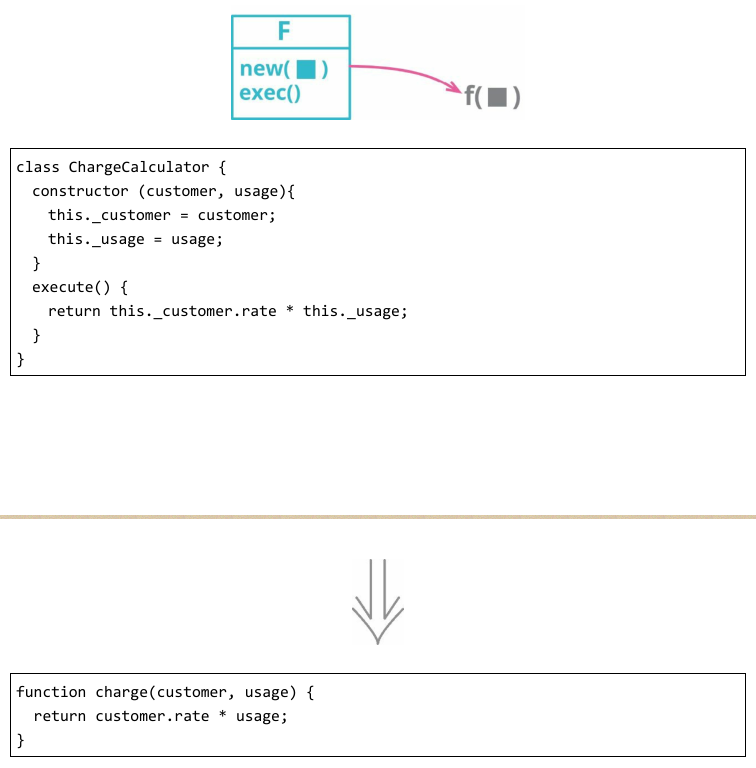

# 重构 API
### 1. 将查询函数和修改函数分离

任何有返回值的函数，都不应该有看得到的副作用——命令与查询分离（Command-Query Separation）。
有些程序员甚至将此作为一条必须遵守的规则。就像对待任何东西一样，我并不绝对遵守它，不过我总是尽量遵守，而它也回报我很好的效果。
如果遇到一个“既有返回值又有副作用”的函数，我就会试着将查询动作从修改动作中分离出来。

### 2. 函数参数化

如果我发现两个函数逻辑非常相似，只有一些字面量值不同，可以将其合并成一个函数，以参数的形式传入不同的值，从而消除重复。
这个重构可以使函数更有用，因为重构后的函数还可以用于处理其他的值。

### 3. 移除标记参数

我不喜欢标记参数，因为它们让人难以理解到底有哪些函数可以调用、应该怎么调用。拿到一份API以后，我首先看到的是一系列可供调用的函数，但标记参数却隐藏了函数调用中存在的差异性。使用这样的函数，我还得弄清标记参数有哪些可用的值。
布尔型的标记尤其糟糕，因为它们不能清晰地传达其含义——在调用一个函数时，我很难弄清 true到底是什么意思。如果明确用一个函数来完成一项单独的任务，其含义会清晰得多。

### 4. 保持对象完整

如果我看见代码从一个记录结构中导出几个值，然后又把这几个值一起传递给一个函数，我会更愿意把整个记录传给这个函数，在函数体内部导出所需的值。

“传递整个记录”的方式能更好地应对变化：如果将来被调的函数需要从记录中导出更多的数据，我就不用为此修改参数列表。并且传递整个记录也能缩短参数列表，让函数调用更容易看懂。如果有很多函数都在使用记录中的同一组数据，处理这部分数据的逻辑常会重复，此时可以把这些处理逻辑搬移到完整对象中去。

### 5. 以查询取代参数
反向重构：以参数取代查询

函数的参数列表应该总结该函数的可变性，标示出函数可能体现出行为差异的主要方式。和任何代码中的语句一样，参数列表应该尽量避免重复，并且参数列表越短就越容易理解。

如果调用函数时传入了一个值，而这个值由函数自己来获得也是同样容易，这就是重复。这个本不必要的参数会增加调用者的难度，因为它不得不找出正确的参数值，其实原本调用者是不需要费这个力气的。

### 6. 以参数取代查询

在浏览函数实现时，我有时会发现一些令人不快的引用关系，例如，引用一个全局变量，或者引用另一个我想要移除的元素。为了解决这些令人不快的引用，我需要将其替换为函数参数，从而将处理引用关系的责任转交给函数的调用者。

需要使用本重构的情况大多源于我想要改变代码的依赖关系——为了让目标函数不再依赖于某个元素，我把这个元素的值以参数形式传递给该函数。这里需要注意权衡：如果把所有依赖关系都变成参数，会导致参数列表冗长重复；如果作用域之间的共享太多，又会导致函数间依赖过度。我一向不善于微妙的权衡，所以“能够可靠地改变决定”就显得尤为重要，这样随着我的理解加深，程序也能从中受益。

### 7. 移除设值函数

如果为某个字段提供了设值函数，这就暗示这个字段可以被改变。如果不希望在对象创建之后此字段还有机会被改变，那就不要为它提供设值函数（同时将该字段声明为不可变）。
这样一来，该字段就只能在构造函数中赋值，我“不想让它被修改”的意图会更加清晰，并且可以排除其值被修改的可能性——这种可能性往往是非常大的。

### 8. 以工厂函数取代构造函数

很多面向对象语言都有特别的构造函数，专门用于对象的初始化。需要新建一个对象时，客户端通常会调用构造函数。但与一般的函数相比，构造函数又常有一些丑陋的局限性。

例如，Java的构造函数只能返回当前所调用类的实例，也就是说，我无法根据环境或参数信息返回子类实例或代理对象；构造函数的名字是固定的，因此无法使用比默认名字更清晰的函数名；构造函数需要通过特殊的操作符来调用（在很多语言中是 new 关键字），所以在要求普通函数的场合就难以使用。

工厂函数就不受这些限制。工厂函数的实现内部可以调用构造函数，但也可以换成别的方式实现。

### 9. 以命令取代函数
反向重构：以函数取代命令

函数，不管是独立函数，还是以方法（method）形式附着在对象上的函数，是程序设计的基本构造块。不过，将函数封装成自己的对象，有时也是一种有用的办法。这样的对象我称之为“命令对象”（command object），或者简称“命令”（command）。这种对象大多只服务于单一函数，获得对该函数的请求，执行该函数，就是这种对象存在的意义。

与普通的函数相比，命令对象提供了更大的控制灵活性和更强的表达能力。除了函数调用本身，命令对象还可以支持附加的操作，例如撤销操作。我可以通过命令对象提供的方法来设值命令的参数值，从而支持更丰富的生命周期管理能力。我可以借助继承和钩子对函数行为加以定制。如果我所使用的编程语言支持对象但不支持函数作为一等公民，通过命令对象就可以给函数提供大部分相当于一等公民的能力。

同样，即便编程语言本身并不支持嵌套函数，我也可以借助命令对象的方法和字段把复杂的函数拆解开，而且在测试和调试过程中可以直接调用这些方法。所有这些都是使用命令对象的好理由，所以我要做好准备，一旦有需要，就能把函数重构成命令。

不过我们不能忘记，命令对象的灵活性也是以复杂性作为代价的。所以，如果要在作为一等公民的函数和命令对象之间做个选择，95%的时候我都会选函数。只有当我特别需要命令对象提供的某种能力而普通的函数无法提供这种能力时，我才会考虑使用命令对象。

### 10. 以函数取代命令
反向重构：以命令取代函数

命令对象为处理复杂计算提供了强大的机制。借助命令对象，可以轻松地将原本复杂的函数拆解为多个方法，彼此之间通过字段共享状态；拆解后的方法可以分别调用；开始调用之前的数据状态也可以逐步构建。但这种强大是有代价的。
大多数时候，我只是想调用一个函数，让它完成自己的工作就好。如果这个函数不是太复杂，那么命令对象可能显得费而不惠，我就应该考虑将其变回普通的函数。