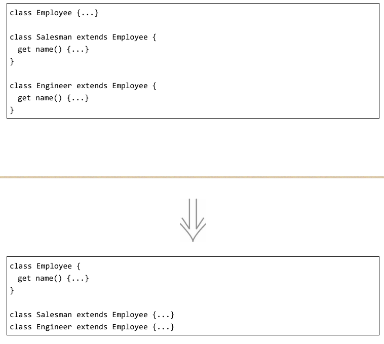
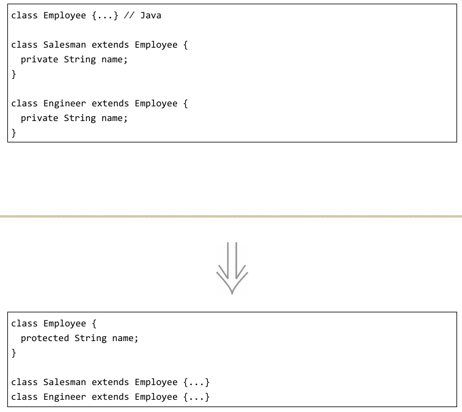
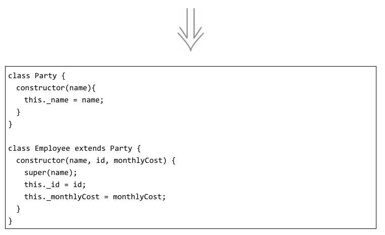
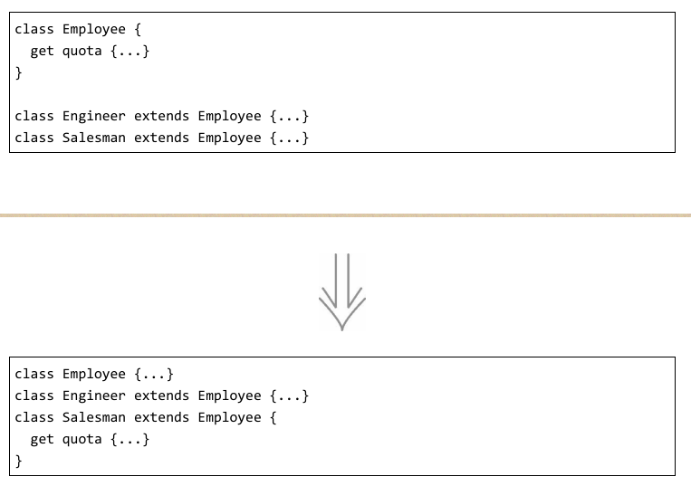
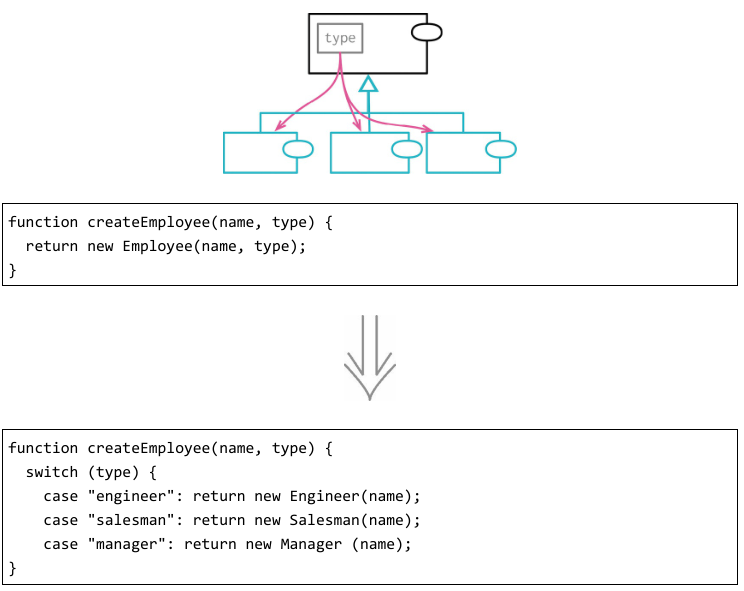
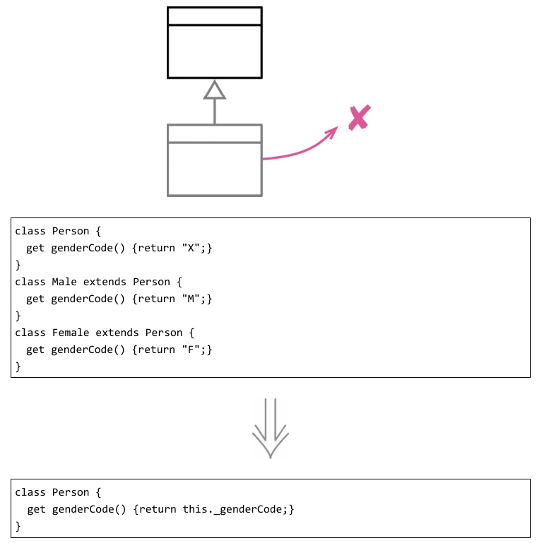
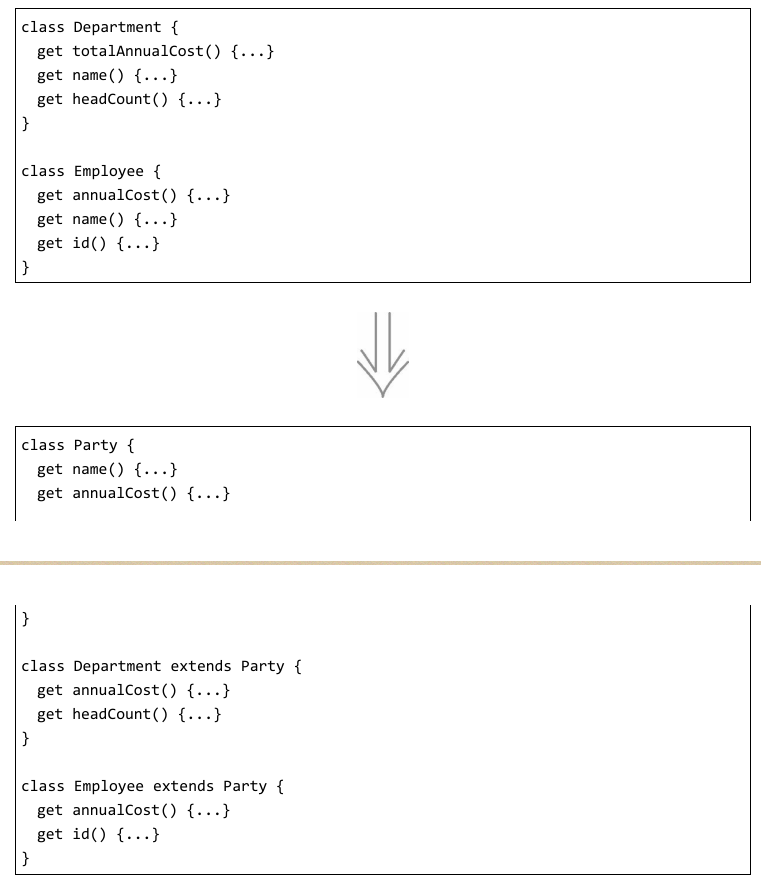
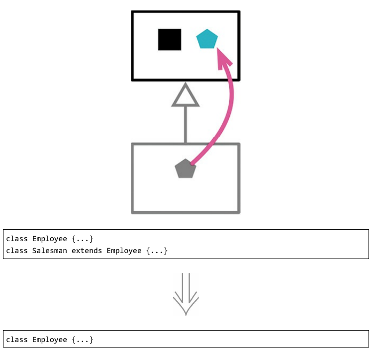
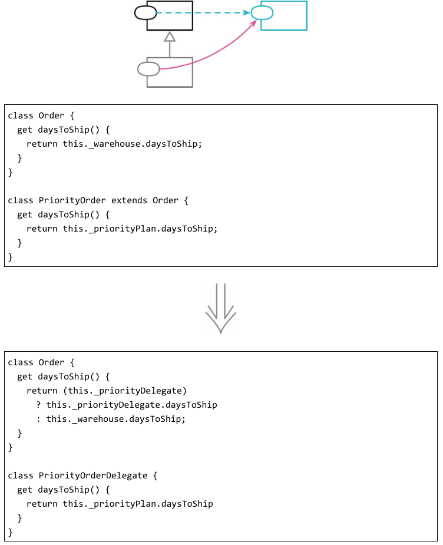
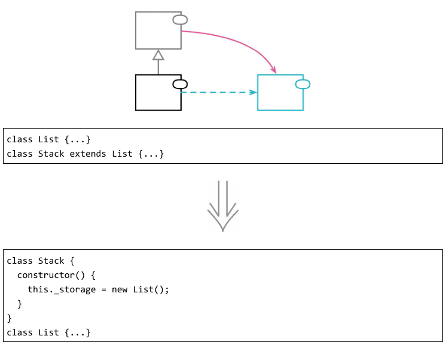

# 处理继承关系
### 1. 函数上移
反向重构：函数下移

如果某个函数在各个子类中的函数体都相同（它们很可能是通过复制粘贴得到的），这就是最显而易见的函数上移适用场合。

函数上移过程中最麻烦的一点就是，被提升的函数可能会引用只出现于子类而不出现于超类的特性。此时，我就得用字段上移和函数上移先将这些特性（类或者函数）提升到超类。

### 2. 字段上移

如果各子类是分别开发的，或者是在重构过程中组合起来的，你常会发现它们拥有重复特性，特别是字段更容易重复。这样的字段有时拥有近似的名字，但也并非绝对如此。判断若干字段是否重复，唯一的办法就是观察函数如何使用它们。如果它们被使用的方式很相似，我就可以将它们提升到超类中去。

### 3. 构造函数本体上移

构造函数是很奇妙的东西。它们不是普通函数，使用它们比使用普通函数受到更多的限制。

如果我看见各个子类中的函数有共同行为，我的第一个念头就是使用提炼函数（106）将它们提炼到一个独立函数中，然后使用函数上移（350）将这个函数提升至超类。
但构造函数的出现打乱了我的算盘，因为它们附加了特殊的规则，对一些做法与函数的调用次序有所限制。要对付它们，我需要略微不同的做法。
如果重构过程过于复杂，我会考虑转而使用以工厂函数取代构造函数（334）。

### 4. 函数下移
反向重构：函数上移

如果超类中的某个函数只与一个（或少数几个）子类有关，那么最好将其从超类中挪走，放到真正关心它的子类中去。这项重构手法只有在超类明确知道哪些子类需要这个函数时适用。

### 5. 字段下移
反向重构：字段上移

如果某个字段只被一个子类（或者一小部分子类）用到，就将其搬移到需要该字段的子类中。

### 6. 以子类取代类型码
反向重构：移除子类

软件系统经常需要表现“相似但又不同的东西”，比如员工可以按职位分类（工程师、经理、销售），订单可以按优先级分类（加急、常规）。
表现分类关系的第一种工具是类型码字段——根据具体的编程语言，可能实现为枚举、符号、字符串或者数字。类型码的取值经常来自给系统提供数据的外部服务。

大多数时候，有这样的类型码就够了。但也有些时候，我可以再多往前一步，引入子类。继承有两个诱人之处。首先，你可以用多态来处理条件逻辑。如果有几个函数都在根据类型码的取值采取不同的行为，多态就显得特别有用。引入子类之后，我可以用以多态取代条件表达式（272）来处理这些函数。

### 7. 移除子类
反向重构：以子类取代类型码

子类很有用，它们为数据结构的多样和行为的多态提供支持，它们是针对差异编程的好工具。但随着软件的演化，子类所支持的变化可能会被搬移到别处，甚至完全去除，这时子类就失去了价值。有时添加子类是为了应对未来的功能，结果构想中的功能压根没被构造出来，或者用了另一种方式构造，使该子类不再被需要了。

### 8. 提炼超类

如果我看见两个类在做相似的事，可以利用基本的继承机制把它们的相似之处提炼到超类。我可以用字段上移把相同的数据搬到超类，用函数上移搬移相同的行为。

### 9. 折叠继承体系

在重构类继承体系时，我经常把函数和字段上下移动。随着继承体系的演化，我有时会发现一个类与其超类已经没多大差别，不值得再作为独立的类存在。此时我就会把超类和子类合并起来。

### 10. 以委托取代子类

如果一个对象的行为有明显的类别之分，继承是很自然的表达方式。我可以把共用的数据和行为放在超类中，每个子类根据需要覆写部分特性。在面向对象语言中，继承很容易实现，因此也是程序员熟悉的机制。

但继承也有其短板。最明显的是，继承这张牌只能打一次。导致行为不同的原因可能有多种，但继承只能用于处理一个方向上的变化。比如说，我可能希望“人”的行为根据“年龄段”不同，并且根据“收入水平”不同。使用继承的话，子类可以是“年轻人”和“老人”，也可以是“富人”和“穷人”，但不能同时采用两种继承方式。

更大的问题在于，继承给类之间引入了非常紧密的关系。在超类上做任何修改，都很可能破坏子类，所以我必须非常小心，并且充分理解子类如何从超类派生。如果两个类的逻辑分处不同的模块、由不同的团队负责，问题就会更麻烦。

这两个问题用委托都能解决。对于不同的变化原因，我可以委托给不同的类。委托是对象之间常规的关系。与继承关系相比，使用委托关系时接口更清晰、耦合更少。因此，继承关系遇到问题时运用以委托取代子类是常见的情况。

### 11. 以委托取代超类

在面向对象程序中，通过继承来复用现有功能，是一种既强大又便捷的手段。我只要继承一个已有的类，覆写一些功能，再添加一些功能，就能达成目的。但继承也有可能造成困扰和混乱。

在对象技术发展早期，有一个经典的误用继承的例子：让栈（stack）继承列表（list）。这个想法的出发点是想复用列表类的数据存储和操作能力。虽说复用是一件好事，但这个继承关系有问题：列表类的所有操作都会出现在栈类的接口上，然而其中大部分操作对一个栈来说并不适用。更好的做法应该是把列表作为栈的字段，把必要的操作委派给列表就行了。

这就是一个用得上以委托取代超类手法的例子——如果超类的一些函数对子类并不适用，就说明我不应该通过继承来获得超类的功能。