# 第一组重构

### 1. 提炼函数
反向重构：内联函数

提炼的关键就在于命名，随着理解的加深，可能需要经常改名。

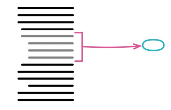

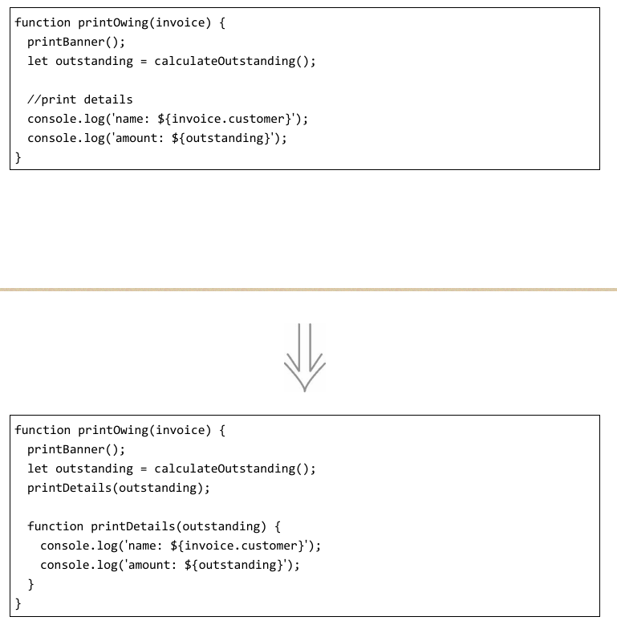

作者认为最合理的观点是“将意图与实现分开”：如果你需要花时间浏览一段代码才能弄清它到底在干什么，那么就应该将其提炼到一个函数中，并根据它所做的事为其命名。
以后再读到这段代码时，你一眼就能看到函数的用途，大多数时候根本不需要关心函数如何达成其用途（这是函数体内干的事）。

作者提倡写小函数，并且要起个好名字。

创造一个新函数，根据这个函数的意图来对它命名（以它“做什么”来命名，而不是以它“怎样做”命名）。

### 2. 内联函数
反向重构：提炼函数

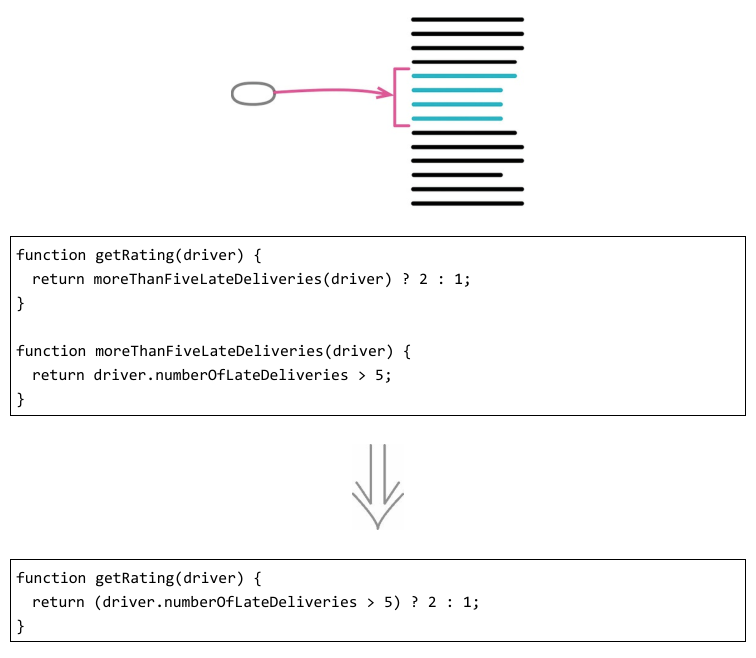

如果有某些函数，其内部的代码和函数名称同样清晰，那就去掉这个函数，直接使用代码。

### 3. 提炼变量
反向重构：内联变量

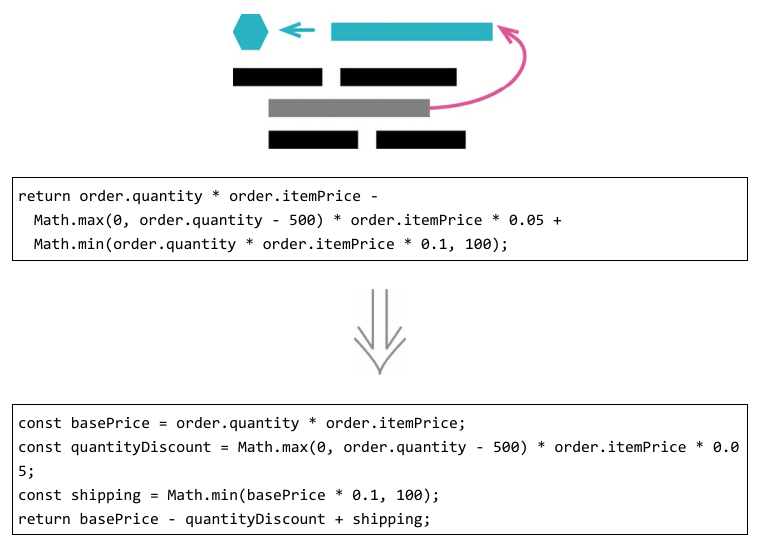

表达式有时会因变量太多导致非常复杂而难以阅读。这时，就可以使用提炼变量了。
将其中一些表达式提炼成新的局部变量，再代替原来的表达式。当然，要给新的局部变量起一个好名字。

### 4. 内联变量
反向重构：提炼变量

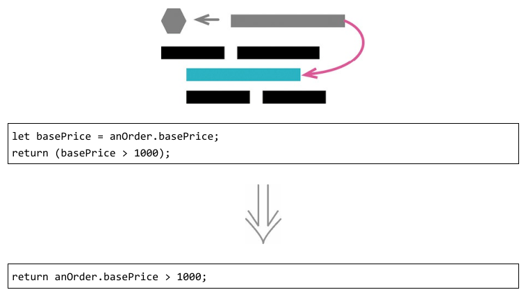

在一个函数内部，变量能给表达式提供有意义的名字，因此通常变量是好东西。但有时候，这个名字并不比表达式本身更具表现力。

一般访问对象的属性，如果这个属性会在多个地方使用，我就会提炼成一个变量。
如果这个变量只在一个或两个地方使用，那就可以直接使用这个属性，没必要建一个新的变量。

### 5. 改变函数声明
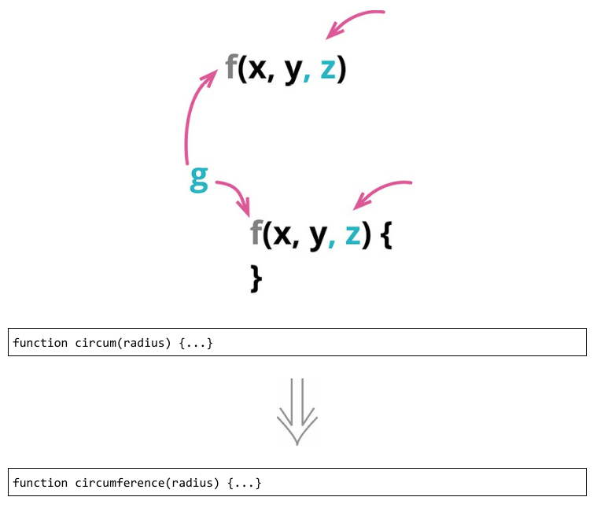

尽量让你的函数名称更有意义。

### 6. 封装变量
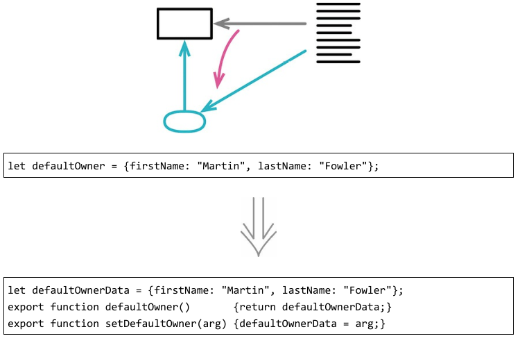

如果想要搬移一处被广泛使用的数据，最好的办法往往是先以函数形式封装所有对该数据的访问。这样，我就能把“重新组织数据”的困难任务转化为“重新组织函数”这个相对简单的任务。封装数据的价值还不止于此。封装能提供一个清晰的观测点，可以由此监控数据的变化和使用情况；我还可以轻松地添加数据被修改时的验证或后续逻辑。

### 7. 变量改名
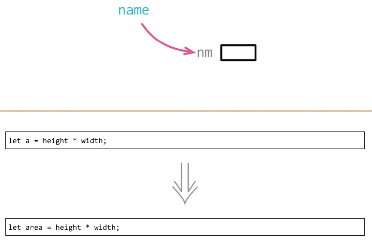

好的命名是整洁编程的核心。变量可以很好地解释一段程序在干什么——如果变量名起得好的话。

使用范围越广，名字的好坏就越重要。只在一行的lambda表达式中使用的变量，跟踪起来很容易——像这样的变量，我经常只用一个字母命名，因为变量的用途在这个上下文中很清晰。

如果变量的作用域不止于单个函数，在全局很多地方使用，那可以使用封装变量，这样如果要改名就很方便了。

### 8. 引入参数对象
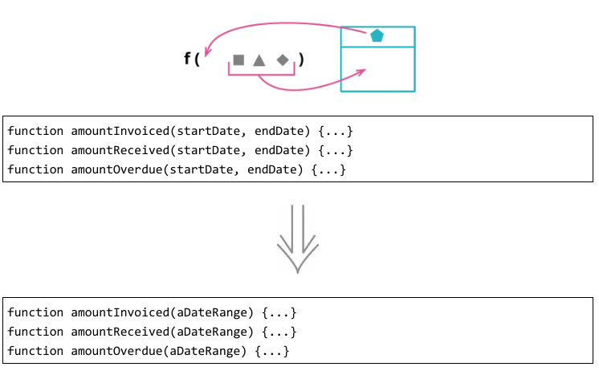

如果一组数据项总是结伴同行，出没于一个又一个函数。那就可以用一个数据结构来代替它们。

### 9. 函数组合成类
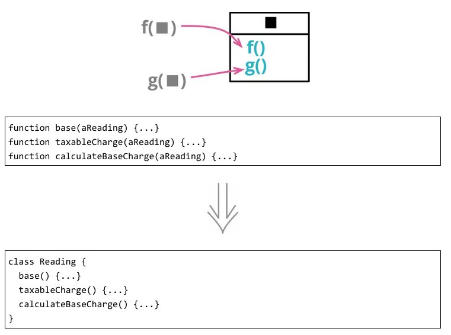

如果发现一组函数形影不离地操作同一块数据（通常是将这块数据作为参数传递给函数），那就可以认为，是时候组建一个类了。类能明确地给这些函数提供一个共用的环境，在对象内部调用这些函数可以少传许多参数，从而简化函数调用，并且这样一个对象也可以更方便地传递给系统的其他部分。

### 10. 函数组合成变换
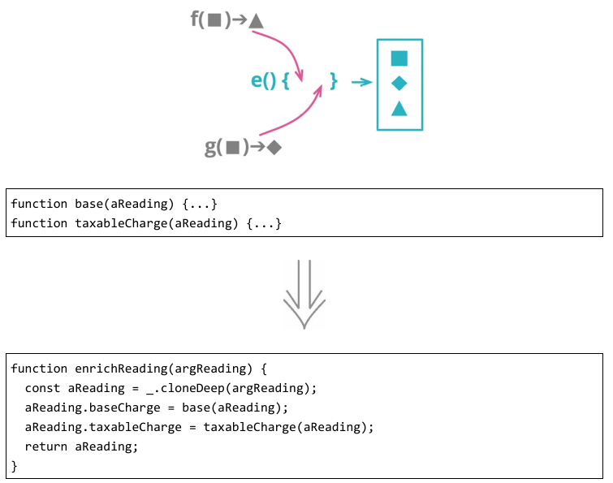

在软件中，经常需要把数据“喂”给一个程序，让它再计算出各种派生信息。这些派生数值可能会在几个不同地方用到，因此这些计算逻辑也常会在用到派生数据的地方重复。我更愿意把所有计算派生数据的逻辑收拢到一处，这样始终可以在固定的地方找到和更新这些逻辑，避免到处重复。

### 11. 拆分阶段
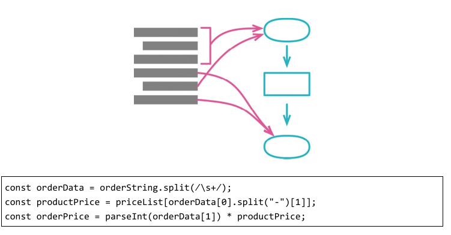

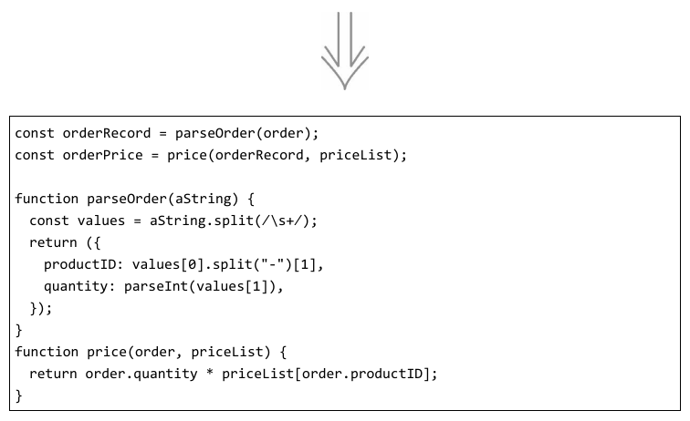

每当看见一段代码在同时处理两件不同的事，我就想把它拆分成各自独立的模块，因为这样到了需要修改的时候，我就可以单独处理每个主题，而不必同时在脑子里考虑两个不同的主题。最简洁的拆分方法之一，就是把一大段行为分成顺序执行的两个阶段。

编译器是最典型的例子。编译器的任务很直观：接受文本（用某种编程语言编写的代码）作为输入，将其转换成某种可执行的格式（例如针对某种特定硬件的目标码）。
随着经验加深，我们发现把这项大任务拆分成一系列阶段会很有帮助：首先对文本做词法分析，然后把token解析成语法树，然后再对语法树做几步转换（如优化），最后生成目标码。每一步都有边界明确的范围，我可以聚焦思考其中一步，而不用理解其他步骤的细节。