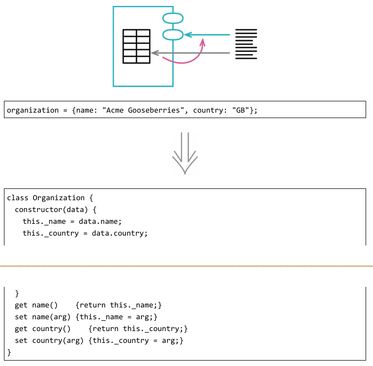
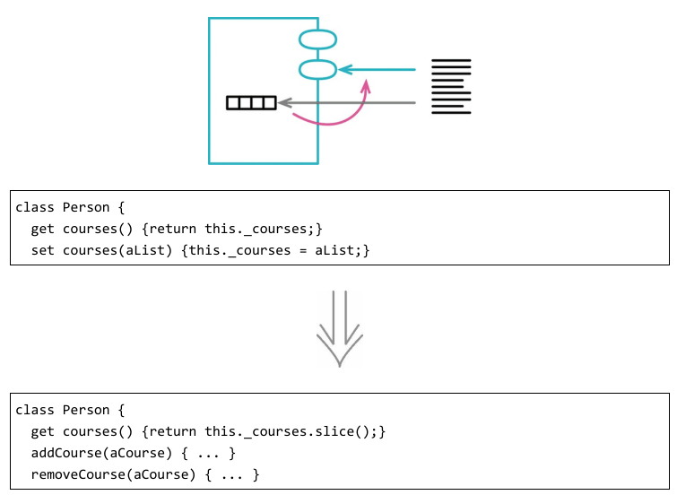
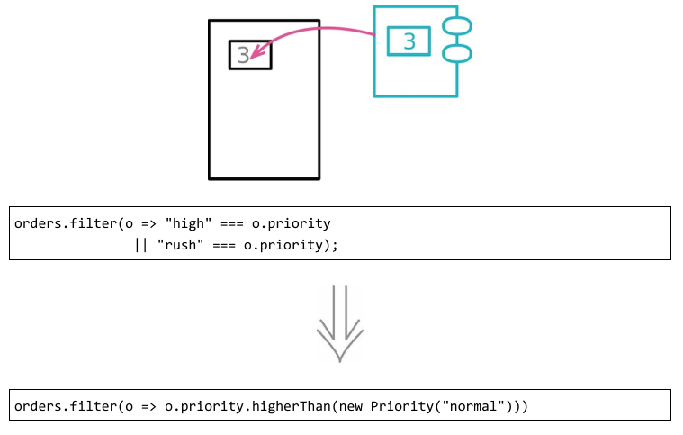
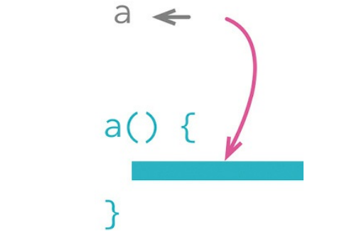
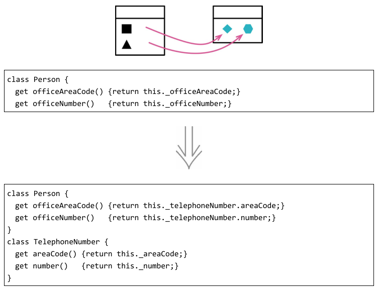
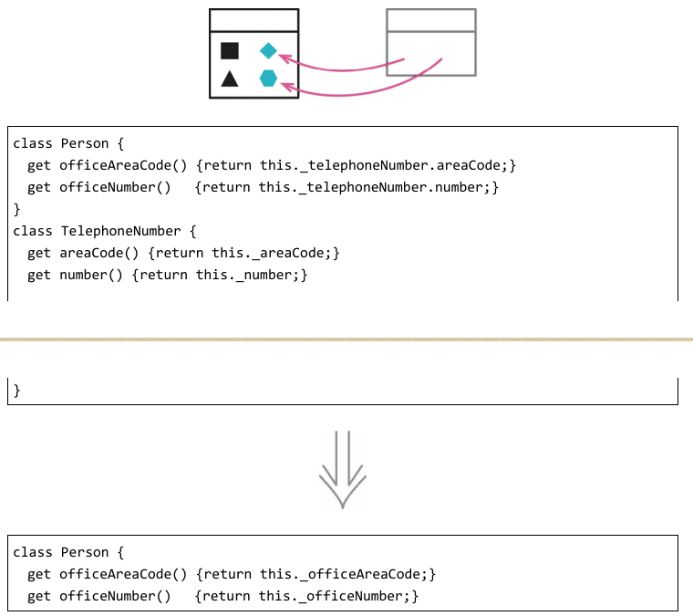
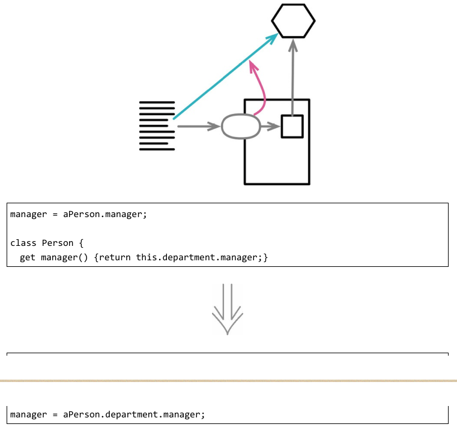
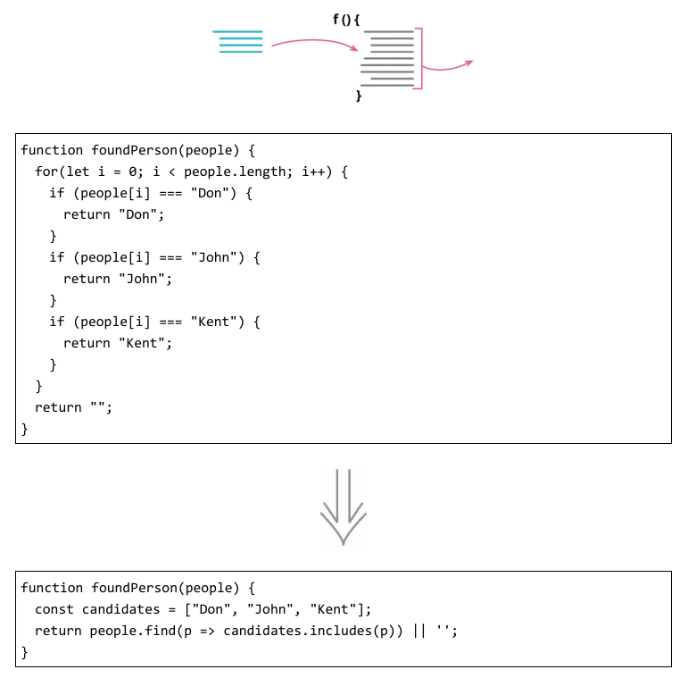

# 封装
分解模块时最重要的标准，也许就是识别出那些模块应该对外界隐藏的小秘密了。数据结构无疑是最常见的一种秘密，我可以用封装记录或封装集合手法来隐藏它们的细节。即便是基本类型的数据，也能通过以对象取代基本类型进行封装——这样做后续所带来的巨大收益通常令人惊喜。

类是为隐藏信息而生的。

### 1. 封装记录

记录型结构是多数编程语言提供的一种常见特性。它们能直观地组织起存在关联的数据，让我可以将数据作为有意义的单元传递，而不仅是一堆数据的拼凑。

### 2. 封装集合

封装集合时人们常常犯一个错误：只对集合变量的访问进行了封装，但依然让取值函数返回集合本身。这使得集合的成员变量可以直接被修改，而封装它的类则全然不知，无法介入。为避免此种情况，我会在类上提供一些修改集合的方法——通常是“添加”和“移除”方法。这样就可使对集合的修改必须经过类，当程序演化变大时，我依然能轻易找出修改点。

### 3. 以对象取代基本类型

开发初期，你往往决定以简单的数据项表示简单的情况，比如使用数字或字符串等。但随着开发的进行，你可能会发现，这些简单数据项不再那么简单了。
比如说，一开始你可能会用一个字符串来表示“电话号码”的概念，但是随后它又需要“格式化”“抽取区号”之类的特殊行为。这类逻辑很快便会占领代码库，制造出许多重复代码，增加使用时的成本。

### 4. 以查询取代临时变量

如果我正在分解一个冗长的函数，那么将变量抽取到函数里能使函数的分解过程更简单，因为我就不再需要将变量作为参数传递给提炼出来的小函数。将变量的计算逻辑放到函数中，也有助于在提炼得到的函数与原函数之间设立清晰的边界，这能帮我发现并避免难缠的依赖及副作用。改用函数还让我避免了在多个函数中重复编写计算逻辑。每当我在不同的地方看见同一段变量的计算逻辑，我就会想方设法将它们挪到同一个函数里。

以查询取代临时变量（178）手法只适用于处理某些类型的临时变量：那些只被计算一次且之后不再被修改的变量。
最简单的情况是，这个临时变量只被赋值一次，但在更复杂的代码片段里，变量也可能被多次赋值——此时应该将这些计算代码一并提炼到查询函数中。并且，待提炼的逻辑多次计算同样的变量时，应该能得到相同的结果。因此，对于那些做快照用途的临时变量（从变量名往往可见端倪，比如 oldAddress 这样的名字），就不能使用本手法。

### 5. 提炼类
反向重构：内联类

一个类应该是一个清晰的抽象，只处理一些明确的责任，等等。但是在实际工作中，类会不断成长扩展。你会在这儿加入一些功能，在那儿加入一些数据。给某个类添加一项新责任时，你会觉得不值得为这项责任分离出一个独立的类。于是，随着责任不断增加，这个类会变得过分复杂。很快，你的类就会变成一团乱麻。此时你需要考虑哪些部分可以分离出去，并将它们分离到一个独立的类中。

### 6. 内联类
反向重构：提炼类

内联类正好与提炼类（182）相反。如果一个类不再承担足够责任，不再有单独存在的理由（这通常是因为此前的重构动作移走了这个类的责任），我就会挑选这一“萎缩类”的最频繁用户（也是一个类），以本手法将“萎缩类”塞进另一个类中。

### 7. 隐藏委托关系
反向重构：移除中间人

一个好的模块化的设计，“封装”即使不是其最关键特征，也是最关键特征之一。“封装”意味着每个模块都应该尽可能少了解系统的其他部分。如此一来，一旦发生变化，需要了解这一变化的模块就会比较少——这会使变化比较容易进行。

### 8. 移除中间人
反向重构：隐藏委托关系

在隐藏委托关系（189）的“动机”一节中，我谈到了“封装受托对象”的好处。但是这层封装也是有代价的。每当客户端要使用受托类的新特性时，你就必须在服务端添加一个简单委托函数。随着受托类的特性（功能）越来越多，更多的转发函数就会使人烦躁。服务类完全变成了一个中间人（81），此时就应该让客户直接调用受托类。（这个味道通常在人们狂热地遵循迪米特法则时悄然出现。我总觉得，如果这条法则当初叫作“偶尔有用的迪米特建议”，如今能少很多烦恼。）

### 9. 替换算法

我从没试过给猫剥皮，听说有好几种方法，我敢肯定，其中某些方法会比另一些简单。算法也是如此。如果我发现做一件事可以有更清晰的方式，我就会用比较清晰的方式取代复杂的方式。“重构”可以把一些复杂的东西分解为较简单的小块，但有时你就必须壮士断腕，删掉整个算法，代之以较简单的算法。随着对问题有了更多理解，我往往会发现，在原先的做法之外，有更简单的解决方案，此时我就需要改变原先的算法。如果我开始使用程序库，而其中提供的某些功能/特性与我自己的代码重复，那么我也需要改变原先的算法。