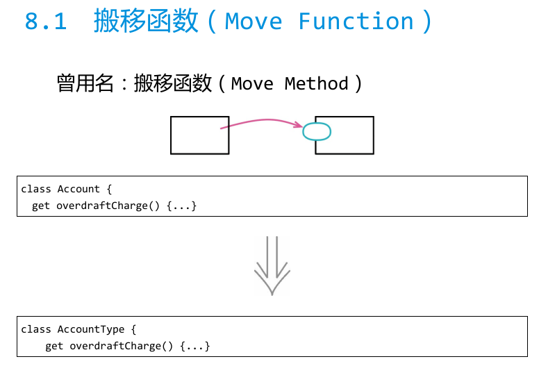
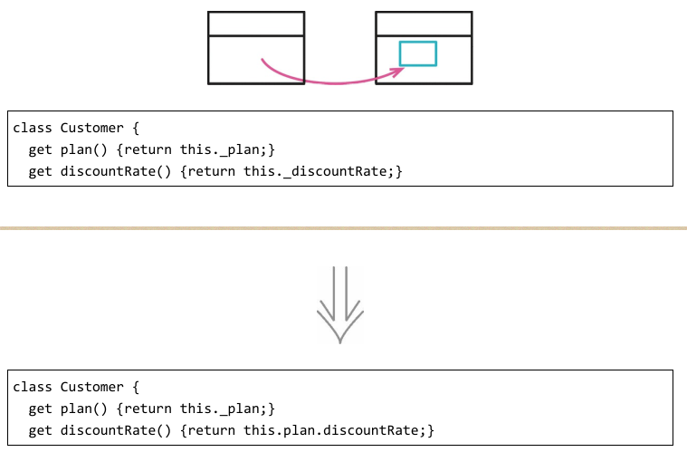
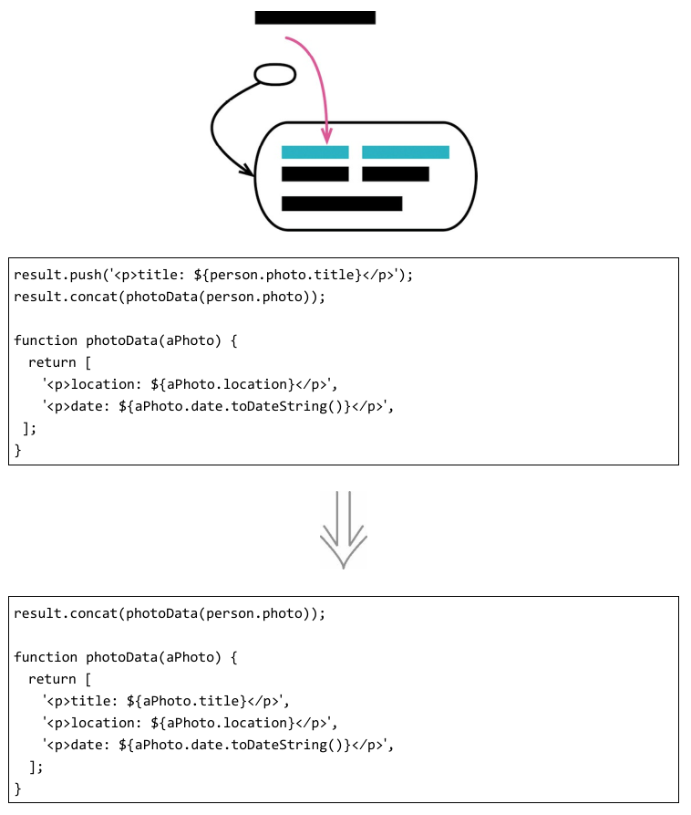
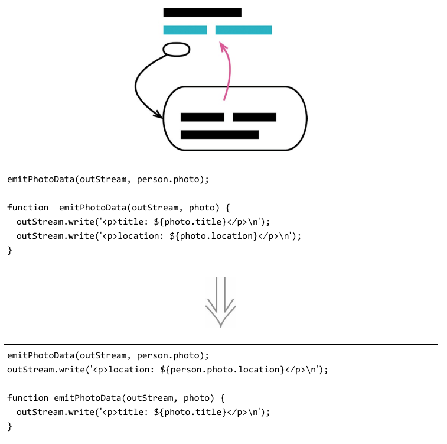
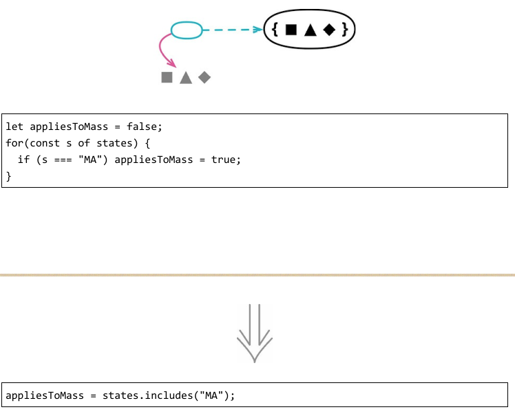
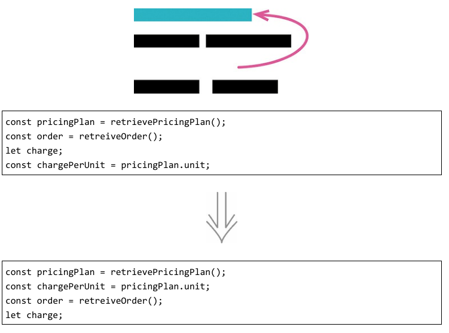
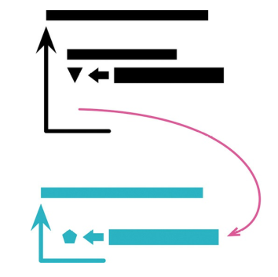
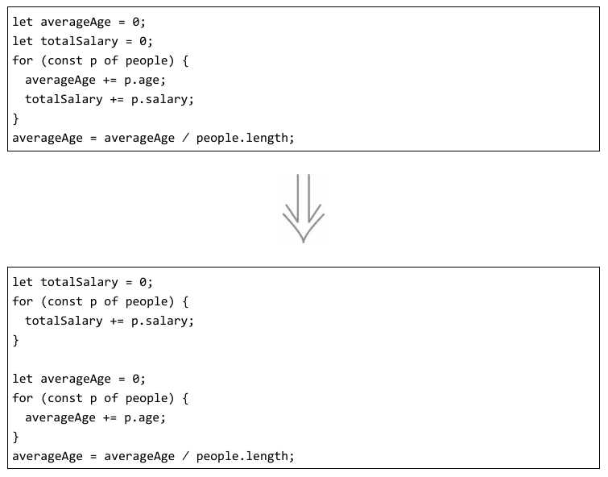
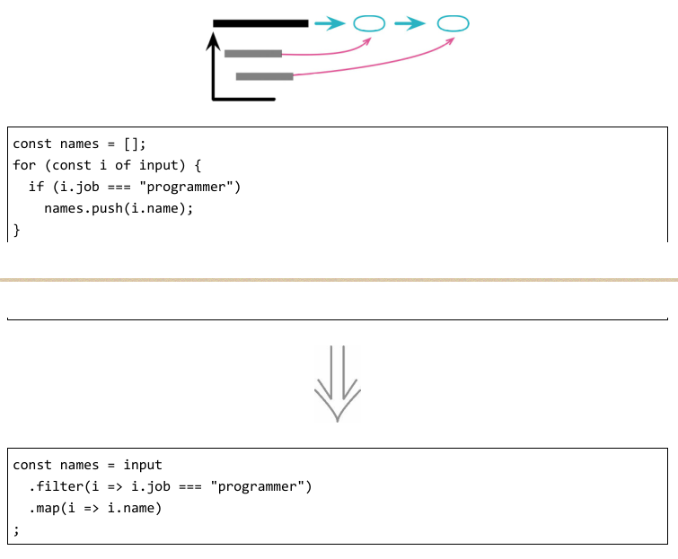

# 搬移特性
### 1. 搬移函数

搬移函数最直接的一个动因是，它频繁引用其他上下文中的元素，而对自身上下文中的元素却关心甚少。此时，让它去与那些更亲密的元素相会，通常能取得更好的封装效果，因为系统别处就可以减少对当前模块的依赖。

有时你在函数内部定义了一个帮助函数，而该帮助函数可能在别的地方也有用处，此时就可以将它搬移到某些更通用的地方。

### 2. 搬移字段

我开始寻思搬移数据，可能是因为我发现每当调用某个函数时，除了传入一个记录参数，还总是需要同时传入另一条记录的某个字段一起作为参数。总是一同出现、一同作为函数参数传递的数据，最好是规整到同一条记录中，以体现它们之间的联系。修改的难度也是引起我注意的一个原因，如果修改一条记录时，总是需要同时改动另一条记录，那么说明很可能有字段放错了位置。此外，如果我更新一个字段时，需要同时在多个结构中做出修改，那也是一个征兆，表明该字段需要被搬移到一个集中的地点，这样每次只需修改一处地方。

### 3. 搬移语句到函数
反向重构：搬移语句到调用者

要维护代码库的健康发展，需要遵守几条黄金守则，其中最重要的一条当属“消除重复”。如果我发现调用某个函数时，总有一些相同的代码也需要每次执行，那么我会考虑将此段代码合并到函数里头。

如果某些语句与一个函数放在一起更像一个整体，并且更有助于理解，那我就会毫不犹豫地将语句搬移到函数里去。

### 4. 搬移语句到调用者
反向重构：搬移语句到函数

作为程序员，我们的职责就是设计出结构一致、抽象合宜的程序，而程序抽象能力的源泉正是来自函数。与其他抽象机制的设计一样，我们并非总能平衡好抽象的边界。
随着系统能力发生演进（通常只要是有用的系统，功能都会演进），原先设定的抽象边界总会悄无声息地发生偏移。对于函数来说，这样的边界偏移意味着曾经视为一个整体、一个单元的行为，如今可能已经分化出两个甚至是多个不同的关注点。

函数边界发生偏移的一个征兆是，以往在多个地方共用的行为，如今需要在某些调用点面前表现出不同的行为。于是，我们得把表现不同的行为从函数里挪出，并搬移到其调用处。

### 5. 以函数调用取代内联代码

如果我见到一些内联代码，它们做的事情仅仅是已有函数的重复，我通常会以一个函数调用取代内联代码。但有一种情况需要特殊对待，那就是当内联代码与函数之间只是外表相似但其实并无本质联系时。

### 6. 移动语句

让存在关联的东西一起出现，可以使代码更容易理解。如果有几行代码取用了同一个数据结构，那么最好是让它们在一起出现，而不是夹杂在取用其他数据结构的代码中间。
最简单的情况下，我只需使用移动语句就可以让它们聚集起来。

### 7. 拆分循环

你常常能见到一些身兼多职的循环，它们一次做了两三件事情，不为别的，就因为这样可以只循环一次。但如果你在一次循环中做了两件不同的事，那么每当需要修改循环时，你都得同时理解这两件事情。如果能够将循环拆分，让一个循环只做一件事情，那就能确保每次修改时你只需要理解要修改的那块代码的行为就可以了。

### 8. 以管道取代循环

### 9. 移除死代码