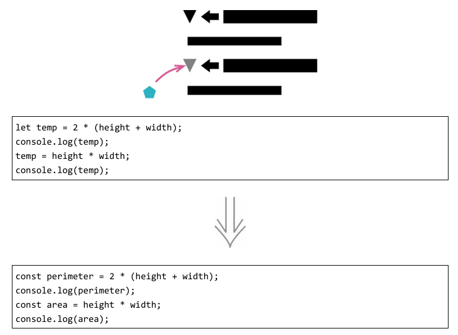
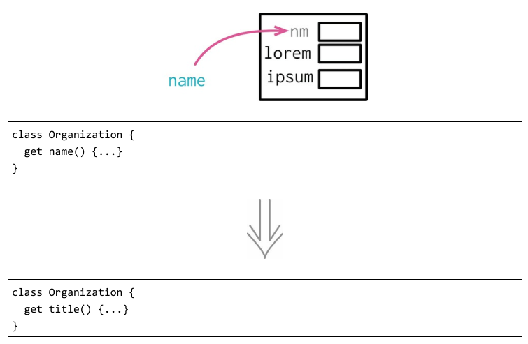
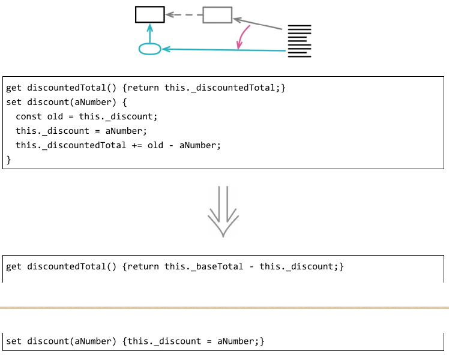
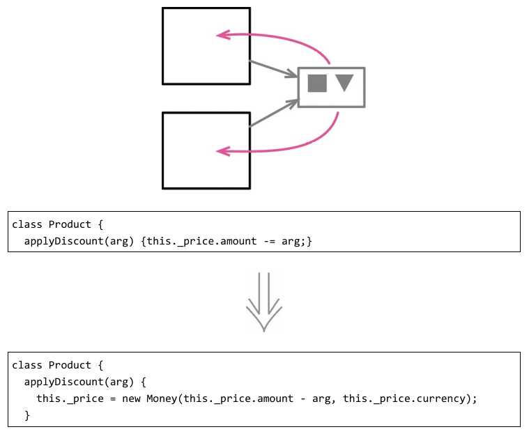
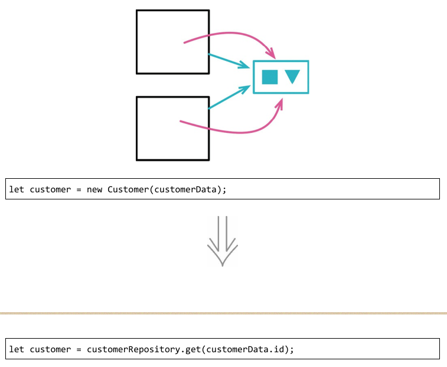

# 重新组织数据
### 1. 拆分变量

变量有各种不同的用途，其中某些用途会很自然地导致临时变量被多次赋值。“循环变量”和“结果收集变量”就是两个典型例子。

除了这两种情况，还有很多变量用于保存一段冗长代码的运算结果，以便稍后使用。这种变量应该只被赋值一次。
如果它们被赋值超过一次，就意味它们在函数中承担了一个以上的责任。如果变量承担多个责任，它就应该被替换（分解）为多个变量，每个变量只承担一个责任。同一个变量承担两件不同的事情，会令代码阅读者糊涂。

### 2. 字段改名

命名很重要，对于程序中广泛使用的记录结构，其中字段的命名格外重要。数据结构对于帮助阅读者理解特别重要。

### 3. 以查询取代派生变量

### 4. 将引用对象改为值对象
反向重构：将值对象改为引用对象

### 5. 将值对象改为引用对象
反向重构：将引用对象改为值对象

