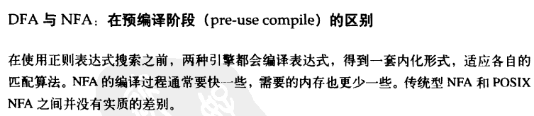
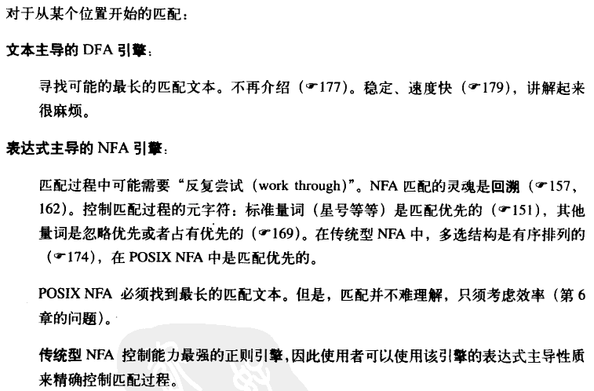

# 表达式的匹配原理
正则引擎分为两类：DFA（确定有限状态自动机）和 NFA（非确定有限状态自动机）。

#### DFA
在计算理论中，确定有限状态自动机或确定有限自动机（英语：deterministic finite automaton, DFA）是一个能实现状态转移的自动机。对于一个给定的属于该自动机的状态和一个属于该自动机字母表 Σ 的字符，它都能根据事先给定的转移函数转移到下一个状态（这个状态可以是先前那个状态）。

确定有限状态自动机从起始状态开始，一个字符接一个字符地读入一个字符串，并根据给定的转移函数一步一步地转移至下一个状态。在读完该字符串后，如果该自动机停在一个属于 F 的接受状态，那么它就接受该字符串，反之则拒绝该字符串。

#### NFA
NFA同DFA一样，消耗输入符号的字符串。对每个输入符号它变换到一个新状态直到所有输入符号到被耗尽。

不像DFA，非确定意味着对于任何输入符号，它的下一个状态不是唯一确定的，可以是多个可能状态中的任何一个。因此在形式定义中，一般都谈论状态幂集的子集：转移函数不提供一个单一状态，而是提供所有可能状态的某个子集。

## 匹配优先和忽略优先
* 匹配优先：尽可能多的匹配，匹配优先量词：*、+、?、{min,max}
* 忽略优先：尽可能少的匹配，忽略优先量词：*?、+?、??、{min,max}?

注意：DFA 不支持忽略优先。

匹配优先示例：用 `/\w+s/` 匹配字符串 `abs`。`/\w+/` 是匹配优先的，它可以匹配整个字符串 `abs`。但正则中的 `/s/` 就没法匹配了。
所以为了完成匹配，`/s/` 会强迫 `/\w+/` 把 `s` 字符交还只匹配 `ab`。这样正则中的 `/s/` 就能匹配字符串中的 `s` 了。

忽略优先示例：用 `/\w+?s/` 匹配字符串 `abs`。`/\w+?/` 是忽略优先的（从第二次匹配开始是忽略优先，因为 `+` 号表示至少要匹配一个字符），它在匹配过程中总是先忽略，让它后面的正则部分去匹配，在匹配不上的时候，自己才去进行匹配。由于 `/s/` 不能匹配 `b`，所以这时 `/\w+?/` 会去匹配 `b`。如此重复直到完成匹配。

## 表达式主导与文本主导
NFA 是表达式主导，DFA 是文本主导。NFA 引擎最重要的性质是，它会依次处理各个子表达式或组成元素，遇到需要在两个可能成功的表达式中进行选择的时候，它会选择其一，同时记住另一个，以备稍后可能的需要。

## 回溯

## 占有优化量词与固化分组
### 固化分组 (?>...)

### 占有优先量词 ?+ *+ ++ {m,n}++

## DFA 与 NFA 的比较

