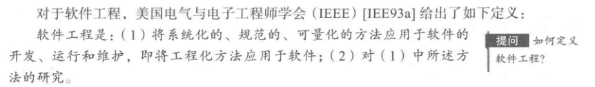
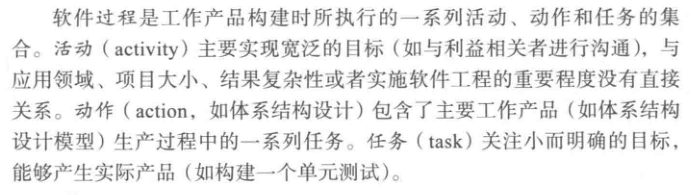
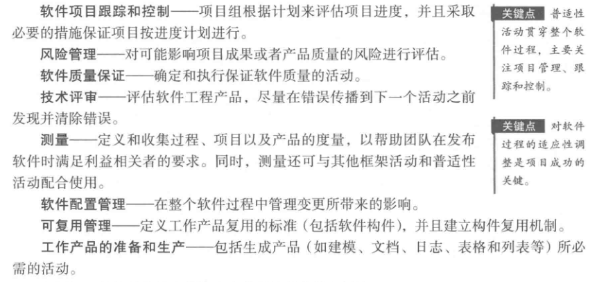
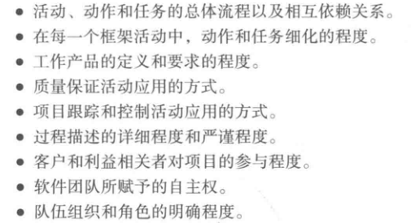

# 软件工程

## 定义软件工程学科

## 软件过程

### 过程框架
过程框架定义了若干个框架活动，为实现完整的软件工程过程建立了基础。过程框架通常包含以下 5 个活动：
1. 沟通，与利益相关者进行沟通，理解需求。
2. 策划，为项目计划建立一个“地图”，以指导团队的项目过程。包括要执行的技术任务、可能的风险、资源需求、工作产品和工作进度计划。
3. 建模，为项目建模（体系结构、不同的构件如何配合），利用模型来理解软件需求，并完成符合需求的软件设计。
4. 构建，包含编码和测试等。
5. 部署，发布软件，交付给用户。用户对其进行评测并反馈意见。

在项目的多次迭代过程中，上面 5 个活动也会不停的重复。

### 普适性活动
软件工程过程框架活动由很多普适性活动来补充实现。一般普适性活动包括如下活动：

软件工程过程并不是教条的法则，而是灵活可适应的。不同的项目所采用的项目过程可能大不相同。这些不同主要体现在以下几个方面：

## 软件工程的实践
### 实践的精髓
软件工程实践的精髓：
1. 理解问题（沟通和分析）
2. 策划解决方案（建模和软件设计）
3. 实施计划（代码生成）
4. 检查结果的正确性（测试和质量保证）

#### 理解问题
1. 谁是利益相关者？
2. 哪些是未知的？哪些数据、功能和特性是解决问题所必需的？
3. 问题是否还能分解为更小、更容易理解的问题？
4. 问题可以用图形化描述吗？可以建立分析模型吗？

#### 策划解决方案
1. 是否见过类似的问题？是否有软件已经实现了所需要的数据、功能和特性？
2. 类似问题是否解决过？是否可复用？
3. 可以定义子问题吗？子问题是否有解决方案？
4. 能否用某种很快实现的方式来描述解决方案？能构建出设计模型吗？

#### 实施计划
1. 解决方案和计划一致吗？源码是否可追溯到设计模型？
2. 解决方案的每个组成部分是否可以证明正确？设计和代码是否经过评审？算法是否经过正确性证明？

#### 检查结果
1. 能否测试解决方案的的每个部分？是否实现了合理的测试策略？
2. 解决方案是否产生了与所要求的数据、功能和特性一致的结果？是否按照项目利益相关者的需求进行了确认？

### 通用原则
1. **存在价值**，软件因为能为用户提供价值而具有存在价值，所有的决策都应该基于这个思想。
2. **保持简洁**，软件所有的设计都应该尽可能简洁，但不是过于简化。这有助于构建更易于理解和维护的系统。记住，简洁不意味着“快速和粗糙”，也不意味着有些特性要以“简洁”为借口而取消。
3. **保持愿景**，清晰的愿景是软件项目成功的基础。保证系统实现始终与愿景一致，这对项目开发的成功至关重要。
4. **关注使用者**，在需求说明、设计和实现过程中，牢记要让别人理解你所做的事情。需求说明应时刻想到用户，设计中始终想到实现，编码时想着那些要维护和扩展系统的人，尽可能地使他们的工作简单化。
5. **面向未来**，生命周期持久的系统具有更高的价值。系统必须能够适应各种变化，能成功做到这一点的系统都是那些一开始就以这种路线设计的系统。经常问问“如果出现...怎样应对”，构建可以解决通用问题的系统，为各种方案做准备，这可以提高整个系统的复用性。
6. **提前计划复用**，提前做好复用计划将降低开发费用，并增加可复用构件以及构件化系统的价值。
7. **认真思考**，在行动之前清晰定位、完整思考通常能产生更好的结果。使用前六条原则需要认真思考，这将带来巨大的潜在回报。