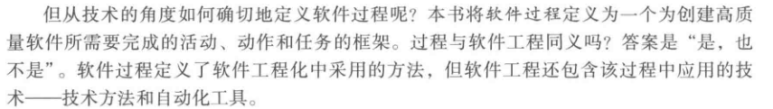
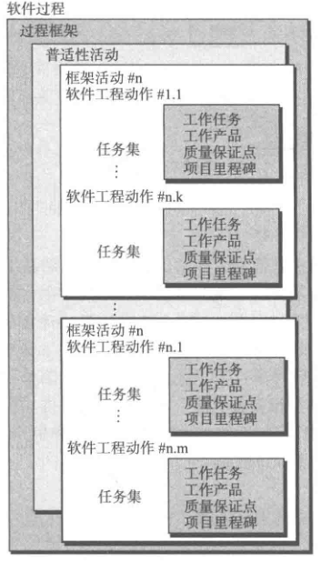
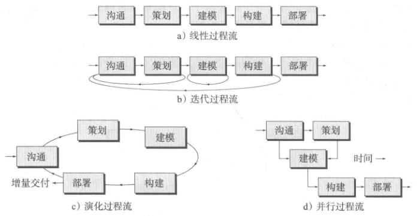

# 软件过程结构

## 通用过程模型

#### 过程流
过程流描述了在执行顺序和执行时间上如何组织框架中的活动、动作和任务。
1. 线性过程流：从沟通到部署顺序执行五个框架活动。
2. 迭代过程流：在执行下一个活动前重复执行之前的一个或多个活动。
3. 演化过程流：采用循环的方式执行各个活动，每次循环都能产生更为完善的软件版本。
4. 并行过程流：多个活动并行执行。

## 过程模式
过程模式描述了软件工程工作中遇到的过程相关的问题，明确了问题环境并给出了针对该问题的一种或几种可证明的解决方案。
通俗地讲，过程模式提供了一个模板——一种在软件过程的背景下统一描述问题解决方案的方法。通过模式组合，软件团队可以解决问题并定义最符合项目需求的开发过程。