# 过程模型
## 惯用过程模型
惯用过程模型是指其活动和任务都是按照过程的特定指引顺序进行的。

### 瀑布模型
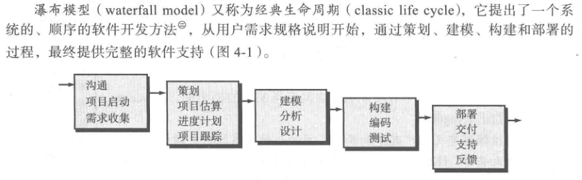

瀑布模型也有一个变体，称为 V 模型。

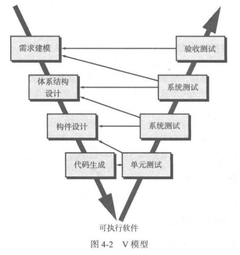

瀑布模型要求所有的需求都必须清晰明确，但很少有客户能够清楚地描述所有的需求，甚至连自己想要什么都不清楚。所以瀑布模型很难在生产环境中使用。

如果在需求已确定的情况下，且工作采用线性的方式完成的时候，瀑布模型是一个很有用的过程模型。

### 增量过程模型
增量模型可以为用户迅速提供一套有限的软件产品，然后在后续版本中再进行细化和扩展功能。例如先为用户提供功能 a，后续再提供功能 b...

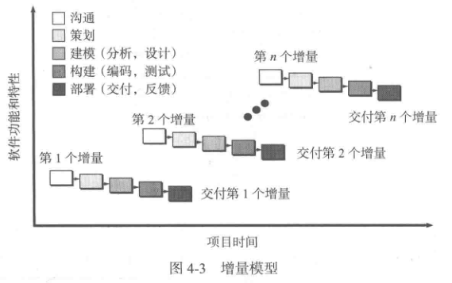

增量模型的第一个增量往往是核心产品。也就是满足了用户的基本需求，但许多附加特性没有提供。用户需要对核心产品进行评估，再根据评估结果制定下一个增量计划。

### 演化过程模型
演化过程有两种常用的模型：原型开发和螺旋模型。
#### 原型开发
在经过初始的沟通后，软件开发人员定义出软件的整体目标，明确已知的需求。然后迅速策划一个原型开发迭代并进行建模。利益相关者可以对原型进行评估，软件开发者根据利益相关者的反馈信息再精炼软件的需求。

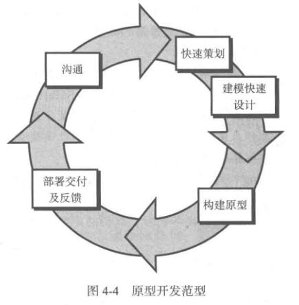

#### 螺旋模型
螺旋模型结合了原型的迭代性质和瀑布模型的可控性和系统性特点。它有两个显著的特点：
1. 采用循环的方式逐步加深系统定义和实现的深度，同时降低风险。
2. 确定一系列的里程碑作为支撑点，确保利益相关者认可该解决方案。

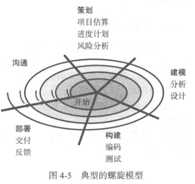

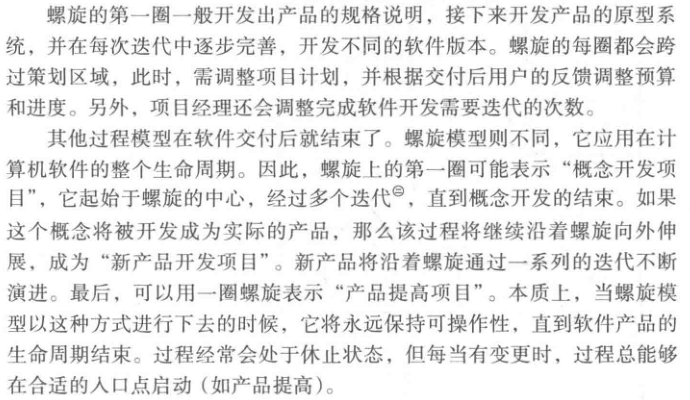

### 并发模型
并发开发模型也叫并发工程，是指所有的软件工程活动可以同时处于不同的状态。

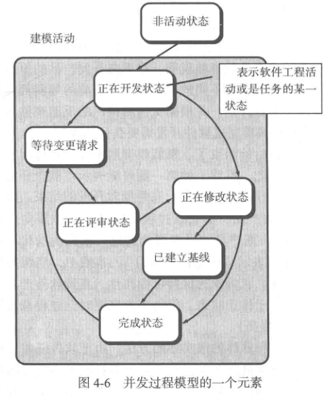

## 专用过程模型
专用过程模型具有一些前面提到的传统过程模型的特点。但是专用过程模型往往应用面比较狭窄，只适用于某些特定的软件工程方法。

### 基于构件的开发
构件类似于软件模块或者说是面向对象的的类或类包，这些构件能够集成到正在构建的软件当中。基于构件的开发模型由以下步骤组成（采用演化方法）：

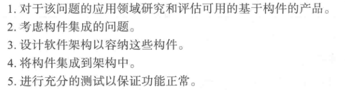

基于构件的开发能够使软件复用，极大的提升开发效率。

### 形式化方法模型
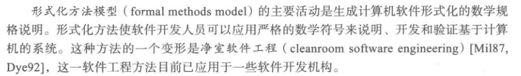

形式化方法可以使歧义性问题、不完整问题、不一致问题能够更容易地被发现和改正——不是依靠特定评审，而是应用数据分析的方法。不过它的缺点是很难掌握，对软件开发人员要求过高。对于技术水平不高的用户来说，也很难让他们理解。

## 统一过程
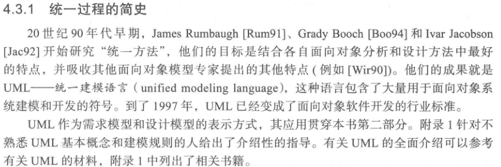

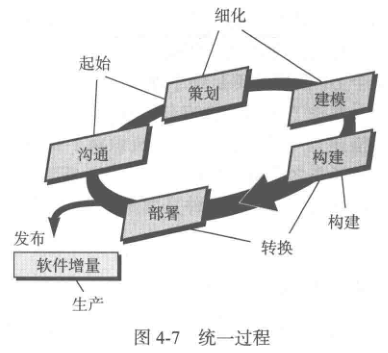