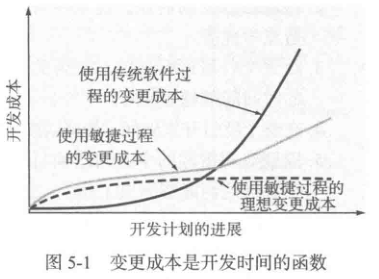
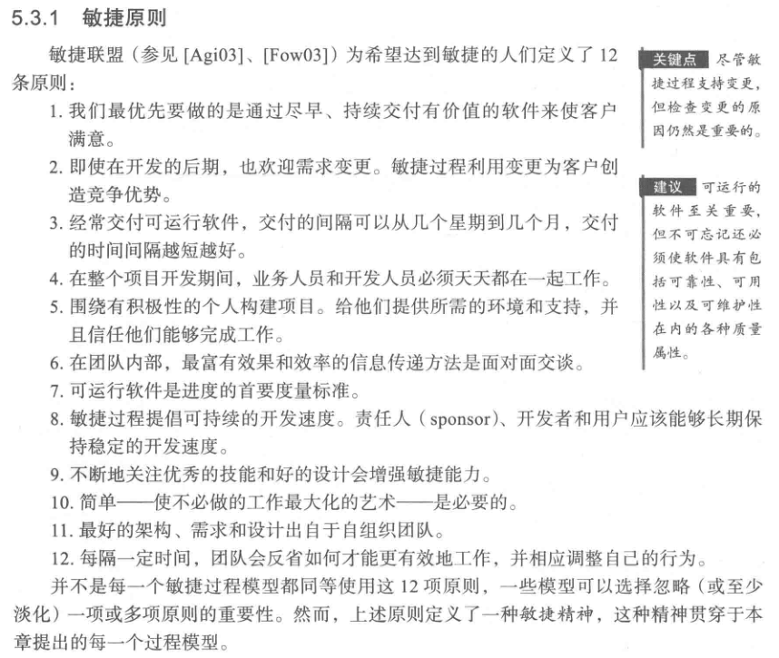
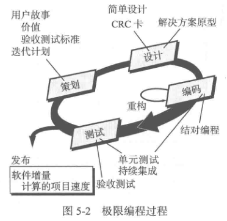

# 敏捷开发
敏捷软件工程是指：让客户满意且尽早的增量发布；小而高度自主的项目团队；非正式的方法；最小化软件工程工作产品以及整体精简开发。开发的指导方针强调超越分析和设计的发布，以及开发人员和客户之间主动和持续的沟通。

敏捷可以应用于任何软件过程。

## 极限编程
极限编程（XP）是敏捷软件开发中广泛使用的一个方法。XP 包含了：
* 策划
* 设计
* 编码
* 测试

4 个框架活动的规则和实践。

每几个小时修改一些小问题，要比在最后截止期之前修正大问题要节省时间。